# Crewship -- Architecture Diagrams (Mermaid)

## 1. System Overview (Two-Process Architecture)

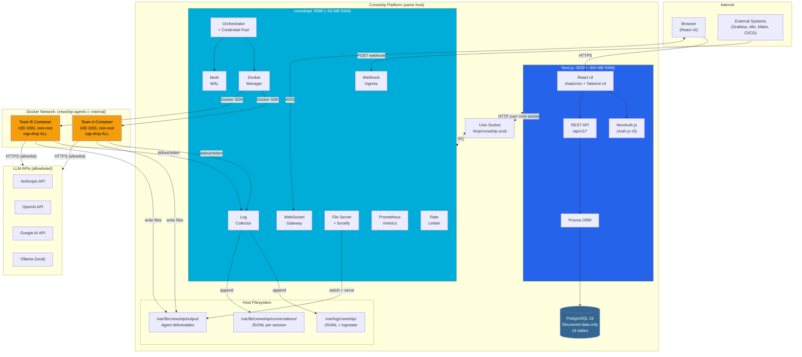

## 2. Data Model (Entity Relationships)

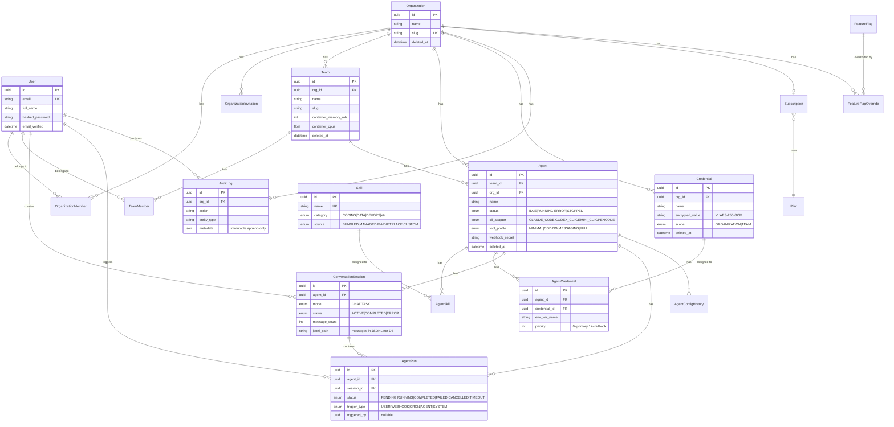

## 3. Request Flow: User Chat Message

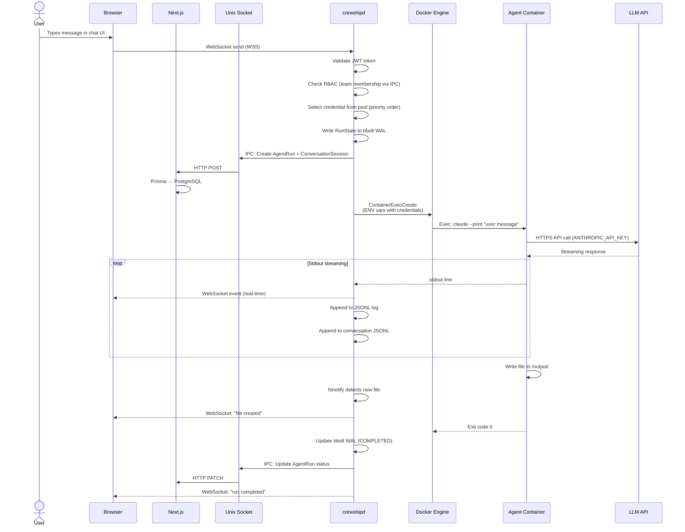

## 4. Request Flow: Webhook Trigger

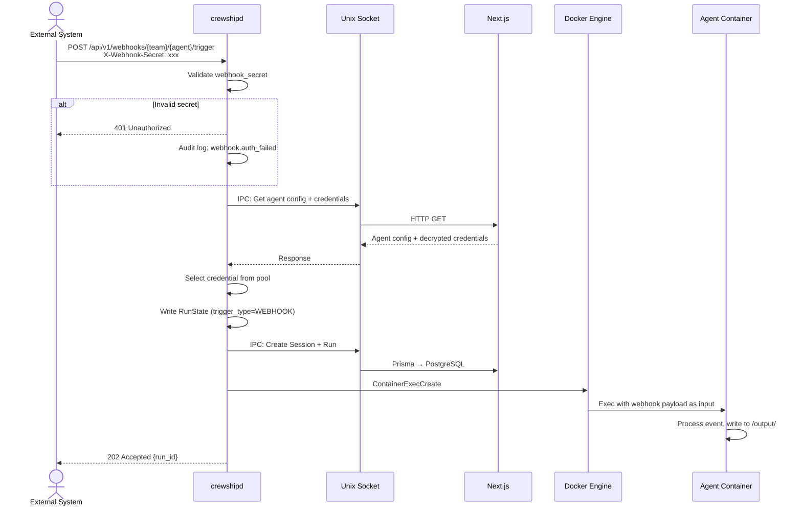

## 5. Credential Pool & Failover

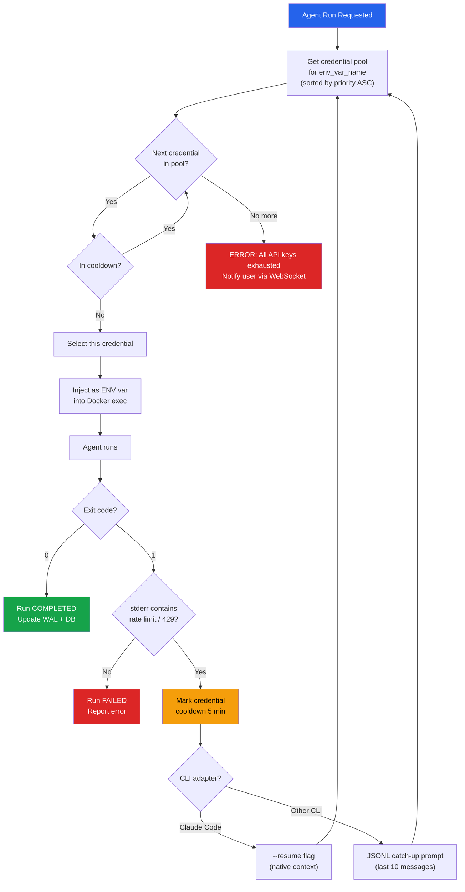

## 6. Container Isolation & Security

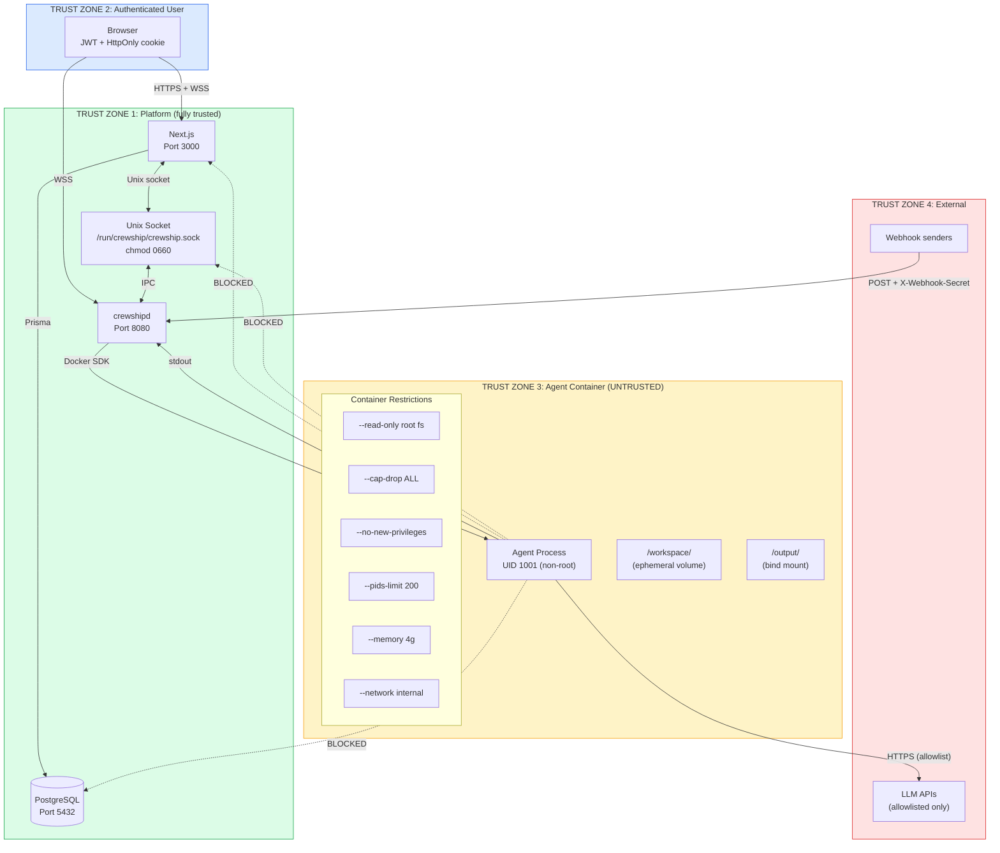

## 7. Storage Architecture

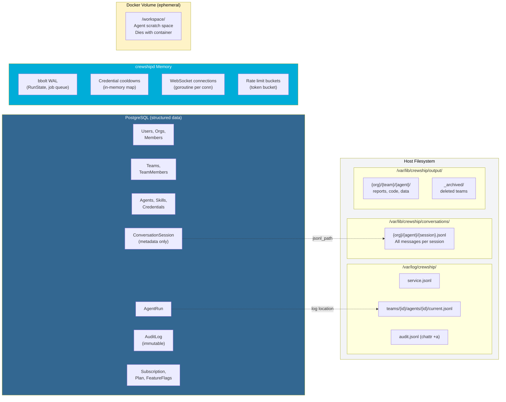

## 8. RBAC Flow

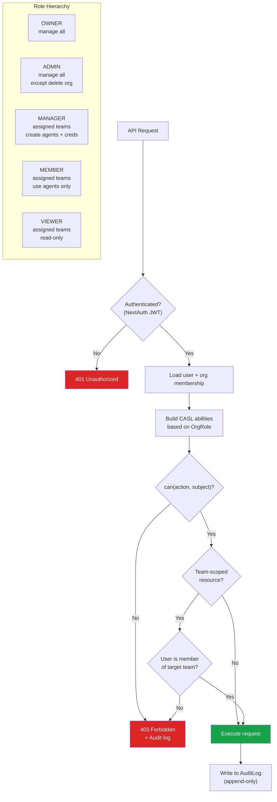

## 9. Provider Pattern (K8s Readiness)

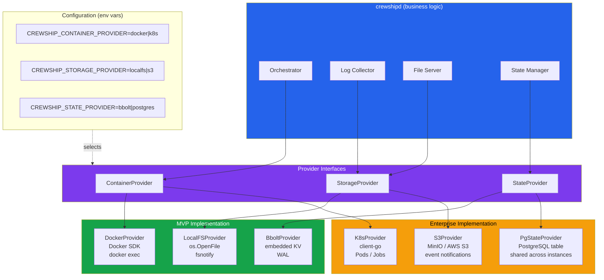

## 10. K8s Deployment Architecture (Enterprise)

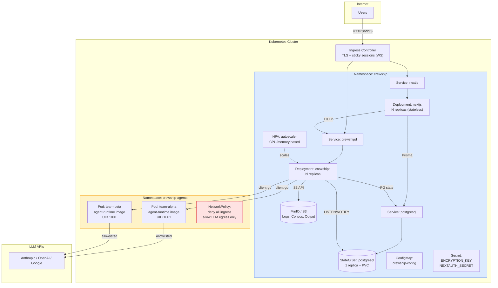

## 11. Deployment Architecture (Coolify / MVP)

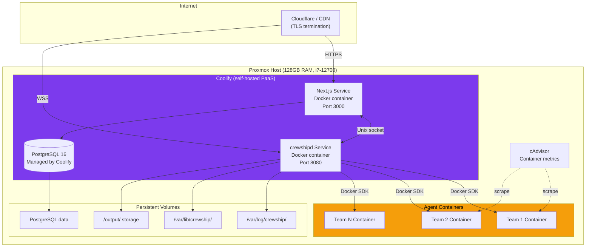
