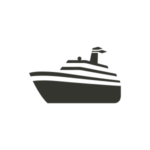

<p align="center">
  
</p>

<h1 align="center">Crewship</h1>

<p align="center">
  <strong>Self-hosted runtime for AI coding agents.</strong><br/>
  Real Linux containers. Your hardware. Your keys. Your data.
</p>

<p align="center">
  <a href="https://github.com/crewship-ai/crewship/actions/workflows/ci.yml"></a>
  <a href="https://github.com/crewship-ai/crewship/actions/workflows/security.yml"></a>
  <a href="https://github.com/crewship-ai/crewship/blob/main/LICENSE"></a>
  <a href="https://golang.org/doc/devel/release.html"></a>
</p>

> **Status: v0.1 beta — open beta.** APIs and data models are still
> moving; pin a tag (or commit SHA) if you ship to production. The
> [Beta status & limitations](#beta-status--limitations) section below
> spells out what's ready, what's WIP, and what's not yet wired up. See
> also [CHANGELOG.md](CHANGELOG.md) and [RELEASING.md](RELEASING.md).

---

## What is Crewship?

Crewship turns a [Claude Code](https://claude.com/claude-code) session
into a fleet of agents that share a workspace, talk to each other, and
keep state between runs. Adapter scaffolds for Codex CLI, Gemini CLI,
OpenCode, Cursor CLI, and Factory Droid are in the tree but
**not production-ready in this beta** — see
[Beta status & limitations](#beta-status--limitations).

Each crew gets its own Linux container — a real machine where its
agents can install services, run databases, mount volumes, and build a
working system together. The whole environment — code, data,
conversations, audit trail — runs on your hardware and packs into
portable encrypted backups.

You bring the API keys. Crewship keeps them off disk, off the wire,
and out of agent processes.

## What's in the box

Labels: ✅ **stable** in v0.1 beta · 🟡 **early** (works but contract
may shift) · 🚧 **WIP** (scaffolded, not yet usable end-to-end).

- ✅ **Real Linux containers** — one per crew, isolated network,
  non-root UID, read-only root, cap-drop ALL. Agents can install,
  build, and run anything Linux supports.
- ✅ **Claude Code adapter** — Anthropic's `claude` CLI, both
  Max-subscription and API-key auth paths. The production-tested
  runtime for v0.1 beta.
- 🚧 **Other CLI adapters** — Codex, Gemini, OpenCode, Cursor, Factory
  Droid have adapter scaffolds in `internal/orchestrator/adapter_*.go`,
  but only Claude Code is exercised across the full feature set. Other
  adapters may run but lack the parity testing required for beta sign-off.
- ✅ **Encrypted credential vault** — AES-256-GCM at rest, piped over a
  Unix socket to a sidecar (UID 1002) that injects per-request, never
  to the agent process directly.
- ✅ **Outbound scrubber** — 13+ credential patterns redacted from
  agent stdout before it leaves the container.
- ✅ **Skills as portable playbooks** — author or import a `SKILL.md`,
  attach to one agent or a whole crew. Tested with the Claude Code
  adapter.
- 🟡 **Routines** — JSON DSL for AI-authored workflows. Six step types
  (`agent_run`, `call_pipeline`, `http`, `code`, `wait`, `transform`),
  DAG parallelism via `needs[]`, cron + HMAC-signed webhooks,
  human-in-the-loop waitpoints, immutable version history. The schema
  may evolve in beta — see
  [`docs/guides/routines.mdx`](docs/guides/routines.mdx).
- ✅ **Harbormaster (approvals)** — risky tool calls pause for human
  sign-off; the agent waits. `crewship approvals` CLI + web UI.
- ✅ **Paymaster (cost ledger)** — every LLM call recorded with token
  counts and dollar cost; per-workspace budgets enforced. `crewship cost`
  + `/api/v1/paymaster/*`.
- ✅ **Lookout (input guard)** — argument injection and prompt-injection
  guardrails on LLM inputs.
- ✅ **Keeper (credential gatekeeper)** — optional rule-based gate on
  which credentials a given agent can pull from the sidecar.
- ✅ **Crew Journal** — append-only event stream: every LLM call, tool
  use, prompt, response, decision. Searchable (FTS5), exportable.
- ✅ **Backup & restore** — Age-encrypted bundles capture an entire
  workspace or crew (code, data, conversations, journal) so nothing
  agents create disappears.
- 🟡 **Episodic memory & Consolidate** — packages exist; full
  auto-wiring lands in v0.2.
- ✅ **Single binary** — Next.js static export embedded into the Go
  server. No Node.js at runtime, no separate services to deploy.

## Beta status & limitations

This is an **open beta**. The pieces marked ✅ above have been used by
the maintainer in production-shaped workloads; the pieces marked 🟡 and
🚧 are still being shaped. Specifically for v0.1 beta:

- **Only the Claude Code (Anthropic) adapter is recommended for real
  work.** Codex / Gemini / OpenCode / Cursor / Factory Droid have
  adapter implementations but not yet the integration tests, prompt
  tuning, or scrubber rules to call them production-ready. They will
  load and may run, but expect rough edges — file issues with logs.
- **PostgreSQL is on the v0.2 roadmap.** Beta runs on SQLite via
  `modernc.org/sqlite` (single-binary, WAL mode, no extra services).
- **Telemetry defaults ON only in prerelease builds.** Beta/RC and dev
  builds send anonymous crash reports to the maintainer's Sentry to
  give a solo team enough signal to fix bugs; stable release versions
  keep telemetry OFF until you opt in. The onboarding wizard (web and
  `crewship setup`) asks explicitly either way, and your answer is
  sticky — change it anytime with `crewship telemetry on|off`, or
  redirect to your own Sentry with `CREWSHIP_SENTRY_DSN=...`. Full
  details in [docs/guides/telemetry](docs/guides/telemetry.mdx).
- **APIs may break across minor bumps** (v0.1 → v0.2). Patch bumps
  inside a minor (v0.1.0 → v0.1.1) are backwards-compatible.
- **No multi-host clustering.** One Crewship instance manages many
  crews on its own host; the architecture allows a future scheduler
  layer but it is not in beta.

Found a beta-blocker? [Open an issue][issues] — the
`beta-blocker` label gets priority triage.

[issues]: https://github.com/crewship-ai/crewship/issues/new/choose

## Install

Three supported paths — pick whichever fits your machine. Full details
in [docs/guides/install](docs/guides/install.mdx).

```bash
# macOS / Linux — Homebrew
brew install crewship-ai/tap/crewship

# Any Unix — signed installer (fetch the script direct from the repo)
curl -fsSL https://raw.githubusercontent.com/crewship-ai/crewship/main/scripts/install.sh | bash

# Self-hosted — Docker
# `:latest` auto-tracks the most recent stable release. Pin a specific tag
# (e.g. `:v0.1.0-beta.1`) once you've validated it in your environment.
docker pull ghcr.io/crewship-ai/crewship:latest
```

> The short `crewship.ai/install` redirect lands once the project website
> goes live; until then, fetch the script straight from the repo as
> shown above.

Then bring it up:

```bash
crewship start
```

Defaults: HTTP on `:8080`, SQLite at `~/.crewship/crewship.db`.
Override with `CREWSHIP_PORT` / `--db file:/path`. Container runtime
required (Docker, Podman, Colima, OrbStack, or Apple Containers) —
`crewship doctor` autodetects and tells you what's missing.

On first load the web UI walks a 6-step onboarding wizard (workspace
→ crew → agent → credentials → done). Demo data: `crewship seed`.

## After install — what now?

The first thing to run after a fresh install:

```bash
crewship doctor      # checks container runtime, ports, data dir, deps
crewship start       # boots the daemon on :8080
open http://localhost:8080
```

`crewship doctor` is the friendly diagnostic — it tells you which
container runtime it found (Docker / Podman / OrbStack / Colima /
Apple Containers), whether port 8080 is free, and what to install if
something is missing. Run it first; it never starts the server.

`crewship start` boots the daemon in the foreground (Ctrl-C stops
it). Run with `--background` on macOS/Linux to detach. The
six-step onboarding wizard in the browser walks you through
workspace → crew → agent → credentials → done.

Stuck? Common patterns by platform:

```bash
# macOS — Gatekeeper "app can't be opened"
# (only if you bypass Homebrew and double-click a downloaded binary)
xattr -d com.apple.quarantine "$(command -v crewship)"

# Linux — daemon won't start on boot
loginctl enable-linger "$USER"
systemctl --user enable --now crewship

# Windows — SmartScreen "Don't run"
# Right-click crewship.exe → Properties → check "Unblock" → OK
# (one-time per binary; we sign Windows builds later in the beta)

# Anywhere — "no container runtime found"
crewship doctor      # tells you which runtime, exact install command
```

Full onboarding walkthrough, including the equivalent CLI flow for
the wizard, lives in
[docs/guides/onboarding](docs/guides/onboarding.mdx).

## First crew — CLI walkthrough

The web UI's onboarding wizard is the easy path. If you'd rather wire
the same setup from your terminal — to script it, dotfile it, or run
Crewship headless — every step has a `crewship` subcommand:

```bash
crewship init --email you@example.com --name "You"   # creates the first admin on an empty DB; returns a CLI token
crewship login --token <token-from-init>             # persists to ~/.crewship/cli-config.yaml
crewship crew create --name "Engineering" --slug eng --icon code --color blue
read -rs -p "Anthropic API key: " KEY && \
  printf '%s' "$KEY" | crewship credential create \
    --name anthropic-key --type API_KEY --provider ANTHROPIC --value-stdin && \
  unset KEY
crewship agent create --name "Viktor" --crew eng --role LEAD \
  --cli-adapter CLAUDE_CODE --tool-profile CODING --system-prompt @prompts/lead.md
crewship doctor                                       # verifies Docker, ports, DB, sidecar reachability
```

Then talk to the agent from the same shell:

```bash
crewship ask viktor "scaffold a Go HTTP service with a /health endpoint"
```

Full CLI reference: [docs/cli/overview.mdx](docs/cli/overview.mdx)
(or [docs.crewship.ai/cli](https://docs.crewship.ai/cli) once the docs
site is live). Pair an already-running server with a fresh CLI install
via [docs/guides/cli-pairing.mdx](docs/guides/cli-pairing.mdx) — same
device-code flow Claude Code itself uses.

## Build from source (developers)

```bash
git clone https://github.com/crewship-ai/crewship.git
cd crewship
pnpm install                            # frontend deps (pnpm required)
./dev.sh start                          # SQLite, hot-reload, both ports
```

`./dev.sh start` runs `crewship start`, which auto-generates
`NEXTAUTH_SECRET` and `ENCRYPTION_KEY` into `~/.crewship/secrets.env`
on first boot. No `.env.local` editing is needed for the happy path;
copy from `.env.example` only when you want to override individual
values (custom ports, alternate DB URL, third-party API keys, …).

The dev server splits the Go binary (`:8080`) from Next.js (`:3001`)
for fast iteration. Other `./dev.sh` subcommands: `stop`, `restart`,
`status`, `seed`, `nuke`, `logs`, `logs:go`, `logs:next`.

### Single-binary production build

```bash
make build      # pnpm build → cp -r out web/out → go build -o crewship
./crewship start
```

`make build` is end-to-end. **Don't** run `pnpm build` followed
directly by `go build` — the `cp -r out web/out` step in between is
required, otherwise the embedded UI drifts out of sync with the
Next.js output.

## Stack

| Layer | Technology |
|---|---|
| UI | Next.js 16 (static export), React 19, Tailwind 4, shadcn/ui |
| Auth | NextAuth.js v5 (Auth.js), JWT + refresh tokens |
| Database | SQLite via `modernc.org/sqlite`, Go-side migrations (no Prisma at runtime) |
| Backend | Go 1.26 (`crewship`) — REST + WebSocket, Docker orchestration |
| Agent runtime | Docker containers, Claude Code adapter (plus scaffolds for 5 more — see [Beta status](#beta-status--limitations)) |
| IPC | HTTP-over-Unix-socket on `/tmp/crewship.sock` (X-Internal-Token auth) |

> **Prisma is TypeScript-types only.** All schema changes go through
> `internal/database/migrate.go`. Never run `prisma migrate`.

## How the code is organised

```
app/                   Next.js frontend (static-export)
components/            UI components — shadcn/ui + feature folders
hooks/  lib/  stores/  Frontend hooks, utilities, Zustand stores
docs/                  Mintlify-rendered user docs (docs.crewship.ai)

cmd/crewship/          Main binary (subcommands: start, seed, doctor,
                       skill, crew, routine, paymaster, …)
cmd/crewship-sidecar/  In-container sidecar (credentials, MCP, memory)

internal/api/          HTTP + WebSocket handlers (~50 REST endpoints)
internal/orchestrator/ Agent run loop — dispatch, exec, handoff
internal/orchestrator/adapter_*.go
                       Per-CLI adapters (claude ✅, codex/gemini/
                       cursor/opencode/droid 🚧 scaffolded)
internal/sidecar/      Sidecar coordinator + bridges (keeper, MCP, memory)
internal/database/     SQLite schema + Go migrations
internal/journal/      Append-only event stream (canonical source of truth)
internal/keeper/       Credential gatekeeping (optional Ollama-backed)
internal/harbormaster/ Human-in-the-loop approval queue
internal/scrubber/     Outbound text secret redaction
internal/paymaster/    LLM cost ledger + budget enforcement primitives
internal/lookout/      Argument injection + prompt-injection guardrails
internal/backup/       Age-encrypted bundle export / restore
internal/provider/     Pluggable container / storage / state backends
internal/connectors/   MCP/OAuth integration manifests (🟡 early)
internal/episodic/     Long-term episodic memory (🟡 early, full wiring in v0.2)
internal/crashreport/  Opt-out Sentry crash reporting in v0.1 beta
internal/update/       GitHub-Releases version check + update banner

ee/                    Enterprise add-ons (separate license, empty today)
dev.sh                 Local dev orchestration
scripts/               Release + dev tooling (install.sh, sentry-bootstrap.sh, …)
prisma/                Prisma schema (TypeScript types only — do NOT migrate)
```

## Verify a change

```bash
go test ./... && go vet ./...        # backend
pnpm test && pnpm exec tsc --noEmit  # frontend
```

## Contributing

PRs welcome — see [CONTRIBUTING.md](CONTRIBUTING.md) for workflow,
house rules, and commit conventions. Open an issue first to discuss
larger changes.

Security: see [SECURITY.md](SECURITY.md). Do not file public issues
for vulnerabilities.

Community: [CODE_OF_CONDUCT.md](CODE_OF_CONDUCT.md) — Contributor
Covenant 2.1 applies in every project space.

## Community & links

- **Docs:** [docs.crewship.ai](https://docs.crewship.ai)
- **Discord:** community help + showcase (invite link on
  [crewship.ai](https://crewship.ai))
- **Reddit:** [r/Crewship](https://reddit.com/r/Crewship) for
  discussion + showcases
- **X / Twitter:** [@crewshipai](https://twitter.com/crewshipai)
- **Bluesky:** [@crewship.ai](https://bsky.app/profile/crewship.ai)
- **YouTube:** [@crewshipai](https://youtube.com/@crewshipai)
- **GitHub Discussions:** [crewship-ai/crewship/discussions](https://github.com/crewship-ai/crewship/discussions)

## License

[Apache License 2.0](LICENSE) — free to use, modify, distribute.

Copyright 2025-2026 Unify Technology s.r.o.
