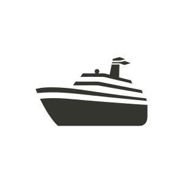

<p align="center">
  
</p>

<h1 align="center">Crewship</h1>

<p align="center">
  <strong>Run AI coding agents on your own hardware — each in a real, isolated container,<br/>
  with a company-grade control plane around the whole fleet.</strong>
</p>

<p align="center">
  <a href="https://github.com/crewship-ai/crewship/actions/workflows/ci.yml"></a>
  <a href="https://github.com/crewship-ai/crewship/actions/workflows/security.yml"></a>
  <a href="https://github.com/crewship-ai/crewship/blob/main/LICENSE"></a>
  <a href="https://golang.org/doc/devel/release.html"></a>
</p>

> **Status: open beta.** APIs and data models are still moving — pin a tag
> or commit SHA if you ship to production. [What's ready vs. WIP](#whats-ready-vs-wip)
> spells out the exact state of every piece.

<!-- DEMO: replace with an animated GIF (VHS) or a YouTube thumbnail once recorded, e.g.
<p align="center"><a href="https://youtube.com/@crewshipai"></a></p>
-->

---

## What is Crewship?

Crewship gives every crew of agents its own **real Linux container** — a fully
sandboxed machine where the agent runs and can install *literally anything*:
system packages, databases, build tools, whole workspaces. You choose what
drives it — **Claude Code**, **OpenCode**, or OpenCode running a **local model
via Ollama** — so you are never locked to one vendor or forced to push your
code into someone else's cloud.

Around that runtime, Crewship is the control plane a team actually needs to run
agents for real: **missions** where a lead plans a task breakdown and agents
work it, scheduled **routines**, human-filed **issues**, **role-based access
control** for a whole company, complete **audit logs** of every action, and a
governance layer (**Keeper**) that watches what agents do. Everything — code,
data, conversations, memory, the audit trail — stays on your hardware and packs
into **encrypted backups** that capture not just memory but the agents' whole
working state, so nothing an agent builds is ever lost.

Crewship models a crew like a small company, so the structure is obvious to
anyone: a **Lead** agent directs the work and can **hire** specialists on demand,
while member **Agents** do the tasks. Every participant — human and agent — has
their own **chat**, their own **inbox**, and a place in the org.

You bring the keys — or run fully local. Crewship keeps them encrypted at
rest and, for API-key auth on Claude Code, Codex, and Gemini, out of the
agent process too; other auth modes and adapters put the real key in the
container's environment (see [what's ready vs. WIP](#whats-ready-vs-wip)).

---

## The idea behind it

This is how I think AI should plug into a company or a project: **the tools are
rented, the work is owned.**

**Everything it produces is yours.** Memory, files, conversations, the audit
trail — on your disk, in your backups. Not with a model vendor, not in a cloud.

**Memory outlives the model.** An agent learns your codebase and your decisions.
Normally that dies the day you switch assistants. Here it does not — move the
agent to another provider and it keeps what it knew. The model is compute you
rent. The memory is the asset.

**A real machine, not a chat box.** Each crew gets its own Linux container and
installs what the work needs, then reaches the systems work lives in: internal
servers, documentation, a remote host, a file share.

**Built like a company.** Roles from OWNER to VIEWER enforced on every route, a
Lead who delegates, approvals on risky actions, budgets, and an append-only
record of every call — so a fleet of agents can be run the way a team is run.

**Agents report where people look.** [Pages](docs/guides/pages.mdx) are dashboards
an agent or routine pushes data into. The page holds no query and no credentials;
the producer already runs next to the data.

**Not just for engineers.** A company should not have to build its own chatbot.
Anyone in the org can have an agent of their own — with their skills, doing their
routine work — and reach it in the same chat and inbox everyone else uses. That
part is early, and it is the direction the rest is built toward.

**The bet:** local models get good enough that routine work stops needing the
strongest one. Most of what an agent does in a day is not hard — it is repetitive,
and a model running on your own hardware will handle it. Then the frontier model
becomes something you reach for deliberately rather than a dependency you route
everything through, and the part that matters is what surrounds it: the memory,
the environment, the permissions, the record. That is what this is built for, and
built so the model underneath can change without any of it moving.

A real container per crew is demanding, so today that means one host; Kubernetes
and multi-host scheduling are where it goes next.

**Status:** big concept, one person, **pre-1.0**.
[What's ready vs. WIP](#whats-ready-vs-wip) says which pieces are finished
instead of leaving you to find out.

---

## Quickstart

```bash
brew install crewship-ai/tap/crewship   # macOS / Linux (other installs below)
crewship doctor                         # checks container runtime, ports, deps
crewship start                          # boots the daemon on :8080
open http://localhost:8080              # 3-step wizard: workspace → crew → key → launch
```

You need a container runtime (Docker, Podman, Colima, OrbStack, or Apple
Containers). `crewship doctor` autodetects one, tells you exactly what's
missing, and names the **known gaps** of the runtime it found — some daemons
silently decline part of the sandbox Crewship asks for, and the symptom lands
nowhere near the cause. Want demo data to poke at? `crewship seed`.

> Prefer to wire everything from the terminal instead of the wizard? Jump to
> [First crew — CLI walkthrough](#first-crew--cli-walkthrough). Full install
> options (signed installer, Docker Compose, air-gapped) are under
> [Install](#install).

### Install a crew in one click

A **recipe** is a curated crew bundled with the credentials and MCP servers it
needs — installed **atomically** in a single transaction, so a half-installed
crew never exists.

```bash
crewship recipe list                    # browse the bundled crews
crewship recipe install <name>          # crew + credentials + MCP servers, one shot
```

---

## What's in the box

Labels: ✅ **stable** · 🟡 **early** (works, contract may still shift) ·
🚧 **WIP** (scaffolded, not yet end-to-end). Each item links to its guide.

**1 · The runtime**

- ✅ **Real Linux containers** — one per crew: non-root UID, read-only root,
  cap-drop ALL. Network is not isolated per crew — every crew's container
  joins one shared Docker bridge network on the host. Install, build, and run
  anything Linux supports. [→ devcontainers](docs/guides/devcontainers.mdx)
- ✅ **Pick your engine** — drive a crew with **Claude Code**, **OpenCode**, or
  OpenCode running a **local model via Ollama** (no API key required). Ollama
  is a model provider you pair with the OpenCode adapter, not a standalone
  engine — Claude Code itself always calls the Anthropic API.
  [→ CLI adapters](docs/guides/cli-adapters.mdx)
- 🟡 **Bring your own provider** — an embedded catalogue of models and their
  prices, two configurable wire codecs, and `crewship model price` to see what a
  call will cost before you make it. A provider is a **credential**, not a
  compiled-in arm of a switch: point a crew at OpenRouter or any
  OpenAI-compatible endpoint and the key stays in the crew's sidecar — each
  agent presents a derived route token, so the key never enters the agent
  container and cost still lands on the agent that spent it.
  [→ multi-provider](docs/guides/multi-provider-llm.mdx) · [model discovery](docs/guides/model-discovery.mdx)
  · [`crewship provider`](docs/cli/provider.mdx)
- ✅ **Skills** — author or import a `SKILL.md` playbook and attach it to one
  agent or a whole crew; an agent can also turn a workflow it just performed
  into one. [→ skills](docs/guides/skills.mdx)
  · [agent-authored](docs/guides/skills-agent-authored.mdx)
- 🟡 **Hooks** — shell, HTTP or subagent callbacks on lifecycle events. 4 of
  the 15 declared events are ever dispatched — agent start, agent stop, an
  approval request, and a guardrail trip — and only the agent-start hook can
  block the action that fired it; the other three fire but their result is
  discarded or only logged. [→ hooks](docs/guides/hooks.mdx)
- ✅ **Manifests** — declare your whole org as files and `crewship apply` it:
  21 kinds, from workspace, crews, agents, skills, integrations, issues, and
  projects down to labels, milestones, workflow templates, triage rules,
  routines, feature flags, connectors, and hooks. GitOps for your agent
  fleet — or read a crew manifest straight into the New-crew form in the
  browser, which tells you up front what it will fill in and what the file
  declares that the form cannot create. [→ manifests](docs/guides/manifests.mdx)

**2 · Working with agents (the "company")**

- ✅ **Crews with Lead/Agent roles + hiring** — a lead plans and delegates; hire
  ephemeral specialists on demand. [→ orchestration](docs/guides/orchestration.mdx)
  · [ephemeral agents](docs/guides/ephemeral-agents.mdx)
- ✅ **Missions** — a lead plans a task breakdown, agents work the tasks, and the
  mission moves through a tracked lifecycle you can start, resume, restart, or
  clone. [→ API: missions](docs/api-reference/missions.mdx)
- ✅ **Per-agent chat** — every agent has its own conversation, resumable across
  sessions. [→ chat sessions](docs/guides/chat-sessions.mdx)
- ✅ **Inbound webhooks** — `POST /api/v1/webhooks/{crewId}/{agentId}/trigger`
  wakes a specific agent from outside Crewship: HMAC-SHA256 over the body,
  keyed by the agent's webhook secret. Sending `X-Timestamp` upgrades the
  signature to `timestamp.body` with a 5-minute replay window; a sender that
  omits it gets accepted on body-only HMAC, which has no replay protection.
  An agent can be set to require the timestamped scheme, closing that gap for
  its callers. It starts the crew container if needed and opens or continues
  a chat turn. [→ API: webhooks](docs/api-reference/webhooks.mdx)
- 🟡 **Ask forms** — when an agent needs answers before it can start, it offers a
  short questionnaire instead of a paragraph of questions; what you fill in is
  sent as an ordinary message. [→ ask forms](docs/guides/ask-forms.mdx)
- ✅ **Issue tracker + triage** — humans file issues; **triage rules** auto-route
  each one to the right crew, agent, and project. Full backlog with **projects,
  milestones, recurring issues, and saved views**. **@mention an agent** in a
  comment to wake it onto the issue, attach files it can read, and link the
  GitHub PR or GitLab MR that closes it. [→ API: issues](docs/api-reference/issues.mdx)
  · [triage](docs/api-reference/triage.mdx) · [mentions](docs/guides/issue-mentions.mdx)
  · [git links](docs/guides/git-links.mdx)
- ✅ **Routines** — scheduled, AI-authored workflows: step DAGs, cron +
  HMAC-signed webhooks, human-in-the-loop waitpoints, immutable version history.
  Run one from a **slash command** in chat or `crewship shell`, and give it its
  inputs through a **form built from what it declares** rather than a wall of
  flags. [→ routines](docs/guides/routines.mdx)
  · [cookbook](docs/guides/routines-cookbook.mdx)
- 🟡 **Automations** — run a routine whenever a journal event happens, with no
  glue code in between. [→ automations](docs/guides/automations.mdx)
- ✅ **Inbox + notifications** — messages, mentions, and events land in a
  per-user inbox with configurable notification channels. [→ inbox](docs/guides/inbox.mdx)
  · [notifications](docs/guides/notifications.mdx)
- 🟡 **Watch a run from a shell** — newline-delimited JSON over plain HTTP,
  resumable, no SDK. [→ watching runs](docs/guides/watching-agent-runs.mdx)
- ✅ **Files in and out** — upload to an agent, download what it produced, and a
  shared crew space both sides can write.
  [→ files and output](docs/guides/files-and-output.mdx)
- 🟡 **Autonomy dial** — how much a crew may decide on its own, and whether an
  agent learns from what it did. [→ autonomy](docs/guides/autonomy-and-self-learning.mdx)

**3 · Control plane & governance**

- ✅ **Role-based access control** — OWNER › ADMIN › MANAGER › MEMBER › VIEWER,
  enforced on every route. [→ auth](docs/guides/auth.mdx)
- 🟡 **Approvals** — a human sign-off gate on starting an agent run, and on
  marking a finished mission task complete. Starting a run blocks
  synchronously — the caller polls until someone decides or it times out.
  Finishing a task does not block a call; it marks the task
  `AWAITING_APPROVAL` and the mission holds by never advancing that task's
  dependents until someone decides. A risky tool call mid-run is not paused
  before it executes — it runs, then gets logged and journaled.
  *(Harbormaster)* [→ harbormaster](docs/guides/harbormaster.mdx)
- ✅ **Keeper** — optional rule-based gate + watchdog on what agents pull and do:
  it sits between an agent and the vault and can refuse a secret the job does not
  justify asking for, with snitch-to-admin alerts. How often the watchdog reviews
  a tool call is a workspace setting (`crewship keeper sampling`), not a constant
  compiled into the build. Off by default. [→ keeper](docs/guides/keeper.mdx)
- 🟡 **Cost ledger** — every LLM call priced with token counts and written to
  an auditable ledger. Hierarchical workspace → crew → mission → agent budget
  enforcement is implemented in the pricing middleware and runs ahead of every
  call, but no API, CLI, or UI surface yet lets you create a budget — so there
  is no way to configure one, and the enforcement code never fires today.
  *(Paymaster)* [→ paymaster](docs/guides/paymaster.mdx)
- 🟡 **Input guard** — prompt-injection scanning (regex + zero-width/RTL
  heuristics, English-language patterns) runs on every user message and
  tool-result fed back to the model. An argument-schema validator exists in
  the same package but is not wired into any live request path yet.
  *(Lookout)* [→ lookout](docs/guides/lookout.mdx)
- ✅ **Audit journal** — append-only, searchable (FTS5), exportable stream of
  every LLM call, tool use, and decision, chained with a keyed HMAC-SHA256
  signature per entry so tampering is detectable end to end; `crewship journal
  verify` walks the chain and exits non-zero on a break. *(Crew Journal)*
  [→ crew journal](docs/guides/crew-journal.mdx)
- 🟡 **Replay & regression** — observational replay rehydrates a mission's
  trajectory from the journal and recomputes its metrics; it does not
  re-execute the agents. Regression diff compares tool success rate and cost
  between two runs. *(Quartermaster)* [→ API: eval](docs/api-reference/eval.mdx)
- ✅ **Checkpoints & fork** — snapshot a mission's state, advisory-restore it, or
  fork a fresh mission from any point. *(Cartographer)* [→ API: checkpoints](docs/api-reference/checkpoints.mdx)
- ✅ **Admin console** — instance security posture, plus rate limits and memory
  configuration tunable at runtime.
  [→ API: admin](docs/api-reference/admin.mdx) · [admin CLI](docs/guides/admin-cli.mdx)
- 🟡 **OpenTelemetry** — GenAI spans with W3C trace context propagated into the
  journal, so a run is one trace end to end. [→ tracing](docs/guides/tracing.mdx)

**4 · Your data, your keys**

- 🟡 **Encrypted credential vault** — AES-256-GCM at rest. Bare API keys for
  Claude Code, Codex, and Gemini are proxied per-request over a loopback TCP
  sidecar (`127.0.0.1:9119`) and never reach the agent process; OAuth tokens
  (any adapter, including Claude Code), Cursor CLI, Factory Droid, and
  non-proxied OpenCode providers land in the container's environment instead
  — and so does any `SECRET`-type credential, since Keeper, which gates
  `SECRET` behind a request/execute flow, is off by default.
  [→ credentials](docs/guides/credentials.mdx) · [encryption at rest](docs/guides/encryption-at-rest.mdx)
- 🟡 **Outbound scrubber** — the assistant's chat-facing response stream is
  redacted for credential patterns before it's journaled or shown. Raw
  container exec stdout/stderr is journaled unscrubbed first (up to 16 KB per
  chunk), for the internal replay snapshot.
- ✅ **Agent memory** — file-first memory that recalls across sessions, plus
  crew-shared facts with cross-crew isolation. Vector recall over the journal and
  keyword search across past chats sit on top of it.
  [→ agent memory](docs/guides/agent-memory.mdx) · [episodic](docs/guides/episodic-memory.mdx)
  · [conversation search](docs/guides/conversation-search.mdx)
- 🟡 **Memory portability** — memory is plain markdown, so it can leave: export a
  readable bundle you can diff and keep in git, or import memory produced by
  another harness. The point of the whole design — nothing here is a format only
  Crewship can read. [→ memory portability](docs/guides/memory-portability.mdx)
- ✅ **Encrypted backups** — Age-encrypted bundles capture a whole workspace or
  crew: the container is paused for a consistent snapshot, then its real
  filesystem is tarred out — code, data, conversations, journal, memory — so
  nothing agents create disappears. A bundle from a newer build restores on an
  older one, and the restore **reports the values it had to drop** instead of
  counting them as success. [→ backup](docs/guides/backup.mdx)
- 🟡 **Integrations** — connect agents to external tools via MCP and Composio.
  [→ integrations](docs/guides/integrations.mdx)

**5 · Interfaces**

- ✅ **Web UI** — activity feed, per-crew dashboards, approvals queue,
  integrations page, and a bottom command dock. Every create surface runs on one
  shell: ⌘/Ctrl+↵ to submit, a discard guard on Esc, a rejected form's field
  errors listed as a worklist, and a bottom sheet rather than a squeezed card on
  a phone. [→ activity](docs/guides/activity.mdx)
- 🟡 **Pages** — dashboards an agent or routine pushes data into, permissioned
  per panel and honest about when a number goes stale. The page holds no query
  and no credentials. [→ pages](docs/guides/pages.mdx)
- ✅ **Full CLI** — every workflow, scriptable and headless. [→ CLI overview](docs/cli/overview.mdx)
- ✅ **Browsable API docs** — the running instance serves its own OpenAPI spec at
  `/openapi.json`, browsable without a third-party renderer.
  [→ API overview](docs/api-reference/overview.mdx) · [`crewship system openapi`](docs/cli/system.mdx)
- ✅ **Single binary** — the Next.js UI is embedded in the Go server. No Node.js
  at runtime, no separate services to deploy.

---

## Everything, from your terminal

Crewship exposes one versioned REST surface under `/api/v1/` (five auth methods,
RFC 7807 errors, WebSocket + webhooks for real-time and inbound triggers) — and
**every API resource has a matching `crewship` command.** API↔CLI parity is a
project rule, not an afterthought: anything the platform can do, you can do from
a shell script *or* hand to an agent to drive safely.

```bash
crewship crew list --format json | jq '.[].slug'
crewship ask --agent viktor "scaffold a Go HTTP service with a /health endpoint"
crewship mission create --crew eng --title "ship the auth refactor"
crewship mission start <mission-id>     # the id `mission create` printed
crewship approvals list                 # what's waiting on a human
crewship cost --workspace demo          # token + dollar ledger
```

Full reference: [docs/cli/overview.mdx](docs/cli/overview.mdx) and
[docs/api-reference/overview.mdx](docs/api-reference/overview.mdx). The docs are
large — **85+ guides and 55+ API pages** under [`docs/`](docs/), rendered at
[docs.crewship.ai](https://docs.crewship.ai) (coming soon).

---

## What's ready vs. WIP

This is an **open beta**. The pieces marked ✅ above have been used by the
maintainer in production-shaped workloads; 🟡 and 🚧 are still being shaped.

- **Claude Code is the production-tested adapter.** Ollama and OpenCode run
  today; Codex / Gemini / Cursor / Factory Droid are wired end to end — command
  line, prompt handling, output parsing — but do not yet have the integration
  tests and tuning to call production-ready. Built-in tool curation is per
  adapter and not every CLI exposes the lever.
  [→ CLI adapters](docs/guides/cli-adapters.mdx)
- **SQLite for now.** Runs on `modernc.org/sqlite` (single binary, WAL, no extra
  services). PostgreSQL is on the roadmap.
- **Single host.** One instance manages many crews on its own host. A full
  container per crew is heavy, so scheduling across machines — Kubernetes and
  friends — is future work rather than a flag you can flip.
- **APIs may break across minor bumps.** Patch bumps inside a minor are
  backwards-compatible. Pin a tag for production.
- **Telemetry is opt-in on stable builds.** Prerelease/dev builds send anonymous
  crash reports to help a small team fix bugs; the onboarding wizard asks
  explicitly and your answer sticks (`crewship telemetry on|off`).
  [→ telemetry](docs/guides/telemetry.mdx)

Found a beta-blocker? [Open an issue][issues] — the `beta-blocker` label gets
priority triage.

[issues]: https://github.com/crewship-ai/crewship/issues/new/choose

---

## Install

Three supported paths — full details in [docs/guides/install](docs/guides/install.mdx).

```bash
# macOS / Linux — Homebrew
brew install crewship-ai/tap/crewship

# Any Unix — signed installer (fetch the script direct from the repo)
curl -fsSL https://raw.githubusercontent.com/crewship-ai/crewship/main/scripts/install.sh | bash

# Self-hosted — Docker Compose (builds from source; brokers all Docker API
# access through a docker-socket-proxy sidecar)
git clone https://github.com/crewship-ai/crewship.git
cd crewship
cp .env.example .env   # then set NEXTAUTH_SECRET + ENCRYPTION_KEY (both required)
docker compose -f docker/docker-compose.prod.yml up -d
```

Homebrew / curl installs then start with `crewship start` (the Compose stack
already boots the server). Defaults: HTTP on `:8080`, SQLite at
`~/.crewship/crewship.db`; override with `CREWSHIP_PORT` / `--db file:/path`.
Platform gotchas (macOS Gatekeeper, Linux linger, Windows SmartScreen) are in
[troubleshooting](docs/guides/troubleshooting.mdx).

## First crew — CLI walkthrough

The web wizard is the easy path. To wire the same setup from your terminal — to
script it, dotfile it, or run headless — every step has a subcommand:

```bash
crewship init --email you@example.com --name "You"   # first admin on an empty DB; returns a CLI token
crewship login --token <token-from-init>             # persists to ~/.crewship/cli-config.yaml
crewship crew create --name "Engineering" --slug eng --icon code --color blue
read -rs -p "Anthropic API key: " KEY && \
  printf '%s' "$KEY" | crewship credential create \
    --name anthropic-key --type API_KEY --provider ANTHROPIC --value-stdin && \
  unset KEY
crewship agent create --name "Viktor" --slug viktor --crew eng --role LEAD \
  --cli-adapter CLAUDE_CODE --tool-profile CODING --system-prompt @prompts/lead.md
crewship credential assign anthropic-key viktor --env-var-name ANTHROPIC_API_KEY
crewship ask --agent viktor "scaffold a Go HTTP service with a /health endpoint"
```

Full CLI reference: [docs/cli/overview.mdx](docs/cli/overview.mdx). Pair an
already-running server with a fresh CLI install via
[cli-pairing](docs/guides/cli-pairing.mdx) — the same device-code flow Claude
Code itself uses.

## Build from source

```bash
git clone https://github.com/crewship-ai/crewship.git
cd crewship
pnpm install          # frontend deps (pnpm required)
./dev.sh start        # SQLite, hot-reload, Go :8080 + Next.js :3001
```

`./dev.sh start` auto-generates `NEXTAUTH_SECRET` and `ENCRYPTION_KEY` into
`~/.crewship/secrets.env` on first boot — no `.env.local` editing for the happy
path. Other subcommands: `stop`, `restart`, `status`, `seed`, `nuke`, `logs`.

Single-binary production build:

```bash
make build            # pnpm build → scripts/embed-web-out.sh sync → go build
./crewship start
```

`make build` is end-to-end. **Don't** run `pnpm build` then `go build` directly
— the `scripts/embed-web-out.sh sync` step in between stages the export into
`web/out/`, which is what `//go:embed all:out` bakes into the binary.

A plain `go build ./...` always works, including in a fresh clone or
`git worktree add`, because `web/out/.placeholder.html` is tracked. The
resulting binary has **no UI**: every UI route answers `503` with a page
saying the web UI was not built. That is deliberate — see
[CONTRIBUTING.md](CONTRIBUTING.md#the-webout-embed).

## Stack

| Layer | Technology |
|---|---|
| UI | Next.js 16 (static export), React 19, Tailwind 4, shadcn/ui |
| Auth | NextAuth.js v5 (Auth.js), JWT + refresh tokens |
| Database | SQLite via `modernc.org/sqlite`, Go-side migrations (no Prisma at runtime) |
| Backend | Go 1.26 (`crewship`) — REST + WebSocket, Docker orchestration |
| Agent runtime | Docker containers; Claude Code / OpenCode adapters, Ollama as a local-model provider under OpenCode (plus scaffolds) |
| IPC | HTTP-over-Unix-socket, `<data dir>/crewship.sock` — `/tmp/crewship.sock` only for the packaged `/var/lib/crewship` install (X-Internal-Token auth) |

> **Prisma is TypeScript-types only.** All schema changes go through
> `internal/database/migrate.go`. Never run `prisma migrate`.

## Verify a change

```bash
go test ./... && go vet ./...        # backend
pnpm test && pnpm exec tsc --noEmit  # frontend
```

## Contributing

PRs welcome — see [CONTRIBUTING.md](CONTRIBUTING.md) for workflow and commit
conventions; open an issue first to discuss larger changes. Security: see
[SECURITY.md](SECURITY.md) — do not file public issues for vulnerabilities.
Community conduct: [CODE_OF_CONDUCT.md](CODE_OF_CONDUCT.md) (Contributor
Covenant 2.1).

## Community & links

- **Docs:** [docs/](docs/) in this repo; hosted [docs.crewship.ai](https://docs.crewship.ai) coming soon
- **Discord:** community help + showcase (invite on [crewship.ai](https://crewship.ai))
- **Reddit:** [r/Crewship](https://reddit.com/r/Crewship)
- **X / Twitter:** [@crewshipai](https://twitter.com/crewshipai) · **Bluesky:** [@crewship.ai](https://bsky.app/profile/crewship.ai)
- **YouTube:** [@crewshipai](https://youtube.com/@crewshipai)
- **GitHub Discussions:** [crewship-ai/crewship/discussions](https://github.com/crewship-ai/crewship/discussions)

## License

[Apache License 2.0](LICENSE) — free to use, modify, distribute.

Copyright 2025-2026 Unify Technology s.r.o.
