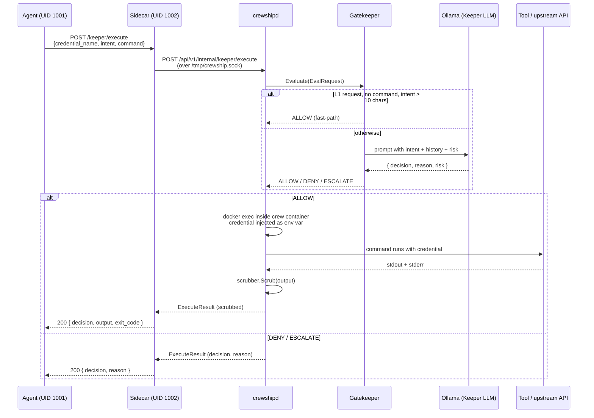

# Architecture

Crewship is a single-binary application that orchestrates AI coding agents in Docker containers. It combines a Go backend with an embedded Next.js frontend, SQLite database, and a sidecar proxy for secure credential injection.

## High-Level Architecture

```
                          +------------------+
                          |   User Browser   |
                          +--------+---------+
                                   |
                          HTTP / WebSocket
                                   |
                    +----------------------------------+
                    |         crewship binary           |
                    |  +----------------------------+   |
                    |  | Go HTTP Server (port 8080) |   |
                    |  +---+-----+-----+-----+-----+   |
                    |      |     |     |     |          |
                    |   REST  WS  SSE  IPC  Static     |
                    |   API  Hub       (Unix) Files     |
                    |      |     |     |     |          |
                    |  +---v-----v-----v-----v-----+   |
                    |  |       SQLite (embedded)    |   |
                    |  +----------------------------+   |
                    +--------+---------+----------------+
                             |         |
                    Docker API    Unix Socket IPC
                             |    (/tmp/crewship.sock)
                    +--------v---------v--------+
                    |    Crew Container          |
                    |  +---------+ +---------+   |
                    |  | Sidecar | | Agent   |   |
                    |  | (1002)  | | (1001)  |   |
                    |  +---------+ +---------+   |
                    +----------------------------+
```

## Single Binary Design

The `make build` process creates a single self-contained binary:

1. **Frontend:** `pnpm build` creates a Next.js static export
2. **Embedding:** The `out/` directory is copied to `web/out/` and embedded via `//go:embed`
3. **Compilation:** `go build` produces a statically linked binary with version metadata

```
crewship binary
├── Go HTTP server (Gorilla mux, chi router)
├── WebSocket hub (real-time updates)
├── SQLite database (modernc.org/sqlite, driver: "sqlite")
├── Container orchestrator (Docker/Apple provider)
├── Sidecar proxy binary (embedded)
├── Embedded static frontend (web/out/*)
└── Seed data (crew/agent templates)
```

<Warning>
  The SQLite driver registers as `"sqlite"` (not `"sqlite3"`). This is because Crewship uses `modernc.org/sqlite`, a pure-Go SQLite implementation.
</Warning>

## Container Model

Crewship uses **one container per crew** (not per agent). All agents in a crew share a container and filesystem.

```
Crew Container (crewship-team-{slug})
├── /crew/
│   ├── agents/{slug}/          # Per-agent home directory
│   │   ├── .memory/            # Persistent memory files
│   │   └── .mcp.json           # MCP server config
│   └── shared/                 # Cross-agent shared space
├── /output/{slug}/             # Agent output (visible in UI)
├── /secrets/{slug}/            # Read-only credentials
├── /workspace/                 # Temporary scratch
└── Processes:
    ├── Sidecar proxy (UID 1002, port 9119)
    └── Agent CLI exec (UID 1001, via docker exec)
```

### UID Security Boundary

| UID | Process | Purpose |
|-----|---------|---------|
| **1001** | Agent process | Runs coding CLI (Claude Code, OpenCode, etc.) |
| **1002** | Sidecar proxy | Handles credential injection, network policy |

The sidecar runs as UID 1002 so agents (UID 1001) cannot directly access the credential store or manipulate the proxy.

## IPC (Inter-Process Communication)

Communication between crewshipd and containers uses HTTP-over-Unix-socket at `/tmp/crewship.sock`. Authentication uses the `X-Internal-Token` header.

```
Sidecar (in container)
    |
    | HTTP POST to crewshipd base URL
    | Header: X-Internal-Token: {auto-generated-token}
    v
crewshipd (/api/v1/internal/*)
    |
    | Process request (assignment, keeper, query)
    v
Response back to sidecar
```

The internal token is auto-generated at startup if not configured:
```go
token, err := generateRandomToken(32) // 32 bytes -> 64 hex chars
```

## Orchestrator

The `Orchestrator` (`internal/orchestrator/orchestrator.go`) manages agent lifecycle:

1. **Container management:** Ensures crew containers exist via `GetOrCreateContainer`
2. **Agent execution:** Runs agents as `docker exec` commands inside crew containers
3. **System prompt assembly:** Builds the full prompt from preamble, persona, context, memory, and history
4. **Credential selection:** Picks the best credential via priority and round-robin
5. **Activity tracking:** Refreshes crew TTL on each agent run

### System Prompt Assembly Order

The system prompt is built in two stages:

**Stage 1** — Static prompt (`internal/api/agent_config_resolver.go`):
```
1. [CREWSHIP ETHOS] — role-specific adventure context
2. [LANGUAGE PREFERENCE] — workspace preferred language (optional)
3. [AGENT IDENTITY] — name, role, crew
4. [PERSONA] — user-defined system prompt
5. [SKILLS AVAILABLE] — injected skill playbooks
```

**Stage 2** — Runtime context (`internal/orchestrator/orchestrator.go`):
```
6. Conversation history (60% of remaining token budget)
7. [CREW CONTEXT] (Lead) OR [COORDINATOR CONTEXT] (deprecated 2026-04-16) OR [PEER CONTEXT]
8. [AGENT MEMORY] (40% of remaining token budget)
9. [MEMORY INSTRUCTIONS] — how to read/write memory files
```

## Sidecar Proxy

The sidecar (`internal/sidecar/`) is an HTTP proxy running inside each crew container. It provides:

### Core Functions

| Function | Description |
|----------|-------------|
| **Credential injection** | Intercepts HTTP requests and adds API keys |
| **Domain allowlist** | Blocks requests to non-allowed domains |
| **Reverse proxy** | Handles `ANTHROPIC_BASE_URL=http://127.0.0.1:9119` |
| **Memory API** | Search, status, reindex operations |
| **Assignment routing** | Forward `/assign`, `/results`, `/query` to crewshipd |
| **Keeper bridge** | Forward `/keeper/request`, `/keeper/execute` |
| **MCP gateway** | Connect to MCP servers, proxy tool calls |
| **Network policy** | Enforce free/restricted network modes |

### Network Modes

| Mode | Behavior |
|------|----------|
| **free** (default) | Allow all outbound connections |
| **restricted** | Only allow connections to allowlisted domains |

Default allowed domains:
- `api.anthropic.com`
- `api.openai.com`
- `generativelanguage.googleapis.com`
- `api.factory.ai`

Unknown network modes default to **restricted** (fail closed).

### Sidecar Endpoints (~36 handlers)

The sidecar exposes a comprehensive local API on port 9119:

| Category | Endpoints |
|----------|-----------|
| **Memory** | `/memory/search`, `/memory/status`, `/memory/reindex` |
| **Assignment** | `/assign`, `/results/{id}`, `/query`, `/standup`, `/escalate` |
| **Missions** | `/mission/create`, `/mission/{id}`, `/mission/{id}/start`, `/mission/templates`, `/missions/all`, `/missions/all/summary` |
| **Keeper** | `/keeper/request`, `/keeper/execute` |
| **MCP** | `/mcp/tools`, `/mcp/call`, `/mcp/status` |
| **Connections** | `/connections`, `/connections/{id}/message`, `/connections/{id}/messages`, `/connections/{id}/files` |
| **Management** | `/crews`, `/crew/create`, `/agent/create`, `/credentials`, `/agent-credentials` |
| **Other** | `/crew-connections`, `/proposal`, `/proposals`, `/manifest`, `/report-confidence` |
| **Health** | `/health`, `/healthz` |

## Keeper Request Lifecycle

The agent never holds a credential directly. Anything sensitive goes through one of two endpoints on the sidecar:

| Endpoint | What the agent gets back | When to use |
|----------|--------------------------|-------------|
| `POST /keeper/request` | The credential value, in cleartext | Tools that genuinely need the value (e.g. an SDK constructor that takes an API key) |
| `POST /keeper/execute` | Stdout / stderr from a command, scrubbed | Anything that can be expressed as a shell command — preferred, because the agent never sees the value |

### Decision flow

The sidecar forwards both endpoints over `/tmp/crewship.sock` to crewshipd, which calls into `internal/keeper/gatekeeper`:

1. **L1 fast-path** — for `request` only (never `execute`), an L1 credential plus an intent at least ten meaningful characters long is auto-allowed without an LLM round-trip. Single-character or whitespace-only intents are rejected.
2. **LLM evaluation** — every other request is scored by `Gatekeeper.Evaluate`, which prompts a local Ollama model with the request, the agent's recent conversation, and the credential's `SecurityLevel`. The model returns a structured `{ decision, reason, risk }` JSON object.
3. **Fail-closed default** — if no LLM provider is configured, the Gatekeeper returns `DENY`. The same applies if the LLM response cannot be parsed as JSON.
4. **Execute branch only** — on `ALLOW`, crewshipd runs the command via `docker exec` inside the crew container with the credential injected as an environment variable. Stdout and stderr pass through the [scrubber](#output-processing) before being returned. The credential value never crosses back into UID 1001.

### Sequence diagram



## Permission Scope

The trust boundary lives in the crew container, not in a per-call session token. Three components define what an agent can do, and all three are tied to the container's lifetime:

| Component | Lifetime | Mutable at runtime? |
|-----------|----------|---------------------|
| `DomainAllowlist` | Container | Yes — `s.Allowlist().Add(domain)` (used by the MCP gateway when it discovers a new server URL) |
| `CredStore` | Container | Loaded once at sidecar start; an agent can only read credentials its `agent_id` was granted |
| Keeper decision (per request) | Single request | Not memoized — a previous `ALLOW` does not count toward the next |

The crew journal is the audit trail and is persisted across container restarts: every keeper decision, allowlist change, and command execution emits a typed entry scoped to `(workspace_id, crew_id, agent_id, mission_id)`. Tearing down the container resets the in-memory components above; the journal record survives.

## Threat Model

### What Crewship protects against

- **Agent leaking a credential into chat or logs.** `/keeper/execute` runs the command in crewshipd, scrubs stdout/stderr, and only the redacted result reaches UID 1001.
- **Unauthorised egress in restricted network mode.** The proxy refuses non-allowlisted hosts. Unknown network modes default to `restricted` (fail-closed) rather than `free`, so a misconfigured workspace cannot accidentally open up egress.
- **Credential dump from the agent process.** Credentials are held in crewshipd's process memory; UID 1001 can talk to UID 1002 over loopback but cannot read the sidecar's process memory or files. Filesystem credentials at `/secrets/{slug}/` are mounted read-only.
- **Prompt injection in tool output.** `internal/lookout` scans inputs and outputs; on a finding it either sanitises (default for secret-shaped output) or blocks (default for input). Every action is logged to the journal.
- **Trivial fast-path bypasses.** L1 auto-allow is gated to `request` only — an attacker cannot smuggle a command through the L1 path because `execute` always pays the LLM round-trip. Empty or whitespace-only intents are rejected before they reach the LLM.

### What Crewship does NOT protect against

- **A compromised host.** Docker is the bottom of the trust stack. If the host kernel, Docker daemon, or root account is compromised, every credential and every journal entry is exposed. Run crewshipd on a hardened host; do not expose port 8080 publicly without an authenticating reverse proxy.
- **A malicious or misconfigured Keeper LLM.** If the Ollama model used by the Gatekeeper has been swapped for an adversarial one, `ALLOW` decisions cannot be trusted. Pin model digests, audit the model out-of-band, and treat the Keeper as a defense-in-depth layer rather than a primary control.
- **Side channels in scrubbed output.** The scrubber redacts known credential shapes. A sufficiently creative agent can still leak partial information through timing, exit codes, or format-string tricks. Treat `/keeper/request` as a weaker contract than `/keeper/execute` for genuinely sensitive secrets.
- **Cross-tenant isolation on shared infrastructure.** A single crewshipd process serves a single workspace database at a time. Hosting multiple tenants requires separate crewshipd instances with separate `ENCRYPTION_KEY`s and separate Docker daemons (or namespaces).
- **Supply-chain compromise of the agent CLIs.** Crewship invokes `claude`, `opencode`, `codex`, and similar binaries as-is. Pin their versions in any Dockerfile you control, and review their changelogs before bumping.

## CLI Adapters

Crewship supports multiple AI coding CLIs, configured per agent:

| Adapter | CLI Command | System Prompt | Notes |
|---------|------------|---------------|-------|
| `CLAUDE_CODE` | `claude --print --output-format stream-json` | Via `--system-prompt` flag | Supports `--model`, `--tools`, `--mcp-config` |
| `CODEX_CLI` | `codex --quiet` | N/A | Supports `--sandbox` for CODING profile |
| `GEMINI_CLI` | `gemini` | Via `--system-instruction` | Uses `-p` for prompt |
| `OPENCODE` | `opencode run` | Via `AGENTS.md` file in CWD | Reads system prompt from file |

## WebSocket Hub

Real-time updates (agent status, mission progress, chat messages) are delivered via WebSocket connections managed by the `ws.Hub`. The hub broadcasts events to connected clients based on workspace and crew subscriptions.

## Database

Crewship uses SQLite in single-binary mode. Key design decisions:

- **Driver:** `modernc.org/sqlite` (pure Go, no CGo)
- **Migrations:** Go-only in `internal/database/migrate.go` (never Prisma migrate)
- **Prisma:** Used only for TypeScript type generation (`pnpm db:generate`)
- **State:** Agent run states stored in BoltDB (`bbolt`) or PostgreSQL for high-throughput deployments

## Manifest System

Each crew container maintains a manifest file at `/crew/manifest.json` that tracks installed packages, credentials used, and setup commands. The manifest enables container reproducibility -- when a container is recreated, the manifest records what was installed.

| Endpoint | Method | Description |
|----------|--------|-------------|
| `/manifest` | `GET` | Retrieve the current manifest |
| `/manifest` | `PATCH` | Update the manifest (merge fields) |

The manifest tracks:
- **Installed packages:** apt, npm, and pip packages installed during agent sessions
- **Credentials used:** Which credentials were active during setup
- **Setup commands:** Commands run to configure the container environment

## Output Processing

Agent CLI output uses the **stream-JSON format** (Claude Code `--output-format stream-json`). Each line is a JSON object with a `type` field indicating the content block type:

| Block Type | Description |
|------------|-------------|
| `text` | Text content from the agent |
| `tool_use` | Agent invoking a tool (with name and input) |
| `tool_result` | Result returned from a tool invocation |
| `thinking` | Internal reasoning (when extended thinking is enabled) |

The final result message includes metadata:
- `duration_ms` -- total execution time in milliseconds
- `total_cost_usd` -- API cost for the run
- `num_turns` -- number of conversation turns

**Credential scrubbing:** All agent output passes through a `Scrubber` that detects and redacts credential values (API keys, tokens) before they reach WebSocket clients or logs.

## Execution Wrapping

Agent CLI commands are wrapped for reliable streaming and process management:

1. **Line-buffered stdout:** `stdbuf -oL` forces line-buffered output so JSON lines are flushed immediately for real-time streaming in the UI.

2. **tmux session wrapping:** When tmux is available, agent commands run inside a named tmux session (`agent-{slug}`). This provides:
   - Resilience against SSH disconnects
   - Named sessions for debugging (`tmux attach -t agent-{slug}`)
   - FIFO-based output streaming to the orchestrator

3. **FIFO for output streaming:** A named pipe is created for stdout, allowing the orchestrator to read output asynchronously while the agent runs in a tmux session.

4. **Exit code tracking:** The exit code is written to a file so the orchestrator can determine success/failure even when the process runs inside tmux.

If tmux setup fails, the orchestrator falls back to direct `sh -c` execution with `stdbuf`.

## Background Services

Three background services run alongside the main HTTP server:

| Service | Interval | Purpose |
|---------|----------|---------|
| **StatsCollector** | 5 seconds | Polls container metrics (CPU, memory, network, PIDs) via the container provider and broadcasts `container.stats` events over WebSocket |
| **TokenSyncer** | Configurable | Periodically fetches OAuth tokens from the token pool and syncs them to the credential store |
| **CredentialMonitor** | Configurable | Validates provider credentials (e.g., Anthropic API key status) and detects status changes (active, expired, rate-limited) |

The StatsCollector uses up to 10 concurrent workers with a 3-second timeout per container to avoid blocking the polling loop on unresponsive containers.

## Crew Journal Platform

PR #204 introduced the Crew Journal platform -- a set of packages built around a single append-only event stream that is the canonical source of truth for every observable action.

### Single-event-stream design

The `journal_entries` table (migration 52) is the one write target. Every platform surface is either a read-model over that stream or a middleware that emits into it:

```
                  +-------------------+
                  |  journal_entries  |
                  |   (append-only)   |
                  +---------+---------+
                            |
        +-------------------+---------+------------------+----------------+
        |                   |         |                  |                |
  Paymaster            Watch        Episodic        Cartographer     Quartermaster
  (cost_ledger +       Roster       Memory          (checkpoints)    (eval_runs +
   budget_limits       (agent_      (journal_                         regression
   are the write       status row   embeddings                        report)
   side; reads         is the       BLOB index)
   come from the       live
   journal +           projection)
   rollups)
```

- [Paymaster](/guides/paymaster) writes `cost_ledger` rows and emits `llm.call` / `cost.incurred` / `budget.*` entries.
- [Watch Roster](/guides/watch-roster) upserts `agent_status` and emits `agent.status_change`.
- [Episodic memory](/guides/episodic-memory) selectively embeds a subset of journal entries into `journal_embeddings`.
- [Cartographer](/guides/cartographer) anchors named checkpoints at journal cursors.
- [Harbor Master](/guides/harbormaster) queues approvals; transitions emit `approval.*`.
- [Hooks](/guides/hooks) fire on lifecycle events and emit `hook.fired` / `hook.blocked`.
- [Quartermaster](/guides/quartermaster) derives typed trajectories and metrics from the journal.

### Write-path order (LLM call stack)

The full [LLM middleware](/guides/llm-middleware) stack composes as:

```
telemetry  ->  paymaster  ->  lookout  ->  raw provider
```

The order is load-bearing:

- **Telemetry** outermost so the span covers budget enforcement + guardrails + the network hop.
- **Paymaster** outside lookout so a blocked call still records a partial ledger row when appropriate (attempted-but-blocked audit) and a cache-eligible call doesn't waste time on guardrails before being short-circuited.
- **Lookout** outside the raw provider so bad inputs never reach the LLM.

See `internal/llm/middleware.go` for the composition function and the rationale comment block.

### Adapter pattern: orchestrator decoupling

The `orchestrator` package stays decoupled from `internal/api` to avoid an import cycle. It depends only on narrow interfaces (`HookDispatcher`, `ApprovalGate`, `EpisodicRecaller`, `PresenceTracker`) defined next to it. The concrete adapters live in `internal/server/orchestrator_adapters.go`:

| Adapter | Interface | Wraps |
|---|---|---|
| `hooksAdapter` | `orchestrator.HookDispatcher` | `hooks.Dispatch` |
| `approvalGateAdapter` | `orchestrator.ApprovalGate` | `harbormaster.Gate` (with `NewEvaluatorWithDefaults`) |
| `episodicRecallAdapter` | `orchestrator.EpisodicRecaller` | `episodic.Recall` + `RenderInjection` |
| `presenceAdapter` | `orchestrator.PresenceTracker` | `presence.Upsert` |

The `server` package is the one place that imports all of them -- exactly because it owns top-level wiring. Any new feature that needs to be invoked from the orchestrator should follow the same pattern: define a narrow interface next to the orchestrator, write the adapter in `server/`, keep `internal/api` and `internal/<feature>` mutually unaware.

### Schema footprint

- **Migration 52** added 8 tables: `journal_entries`, `journal_embeddings`, `agent_status`, `approvals_queue`, `checkpoints`, `hooks_config`, `cost_ledger`, `budget_limits`.
- **Migration 53** added `eval_runs` (Quartermaster's durable replay/regression index with status + metrics columns).
- **Migration 55** added `journal_entries_fts` (FTS5 mirror of `summary` + `payload`), `journal_entries_archived` (compaction sink with truncated payloads), `memory_relations` (A-Mem-style edge graph), and `memory_health_snapshots` (daily 5-metric scoring) — see [Episodic memory](/guides/episodic-memory).
- **Migration 60** added a partial index on `journal_entries (workspace_id, trace_id) WHERE trace_id IS NOT NULL` to make run aggregation `GROUP BY trace_id` cheap.
- **Migration 61** backfilled the legacy `agent_runs` table into journal entries, snapshotted the original rows to `agent_runs_archive`, and dropped `agent_runs` — `journal_entries` is now the **single source of truth** for runs.
- **Migration 62** added 9 columns to `cost_ledger` for billing-mode-aware accounting (`billing_mode`, `quota_remaining_pct`, `quota_window`, `subscription_plan`, four `rate_*_per_m` snapshot columns, `cost_confidence`) plus a partial index on `(workspace_id, billing_mode)` — see [Paymaster](/guides/paymaster).

A consolidated catalog of recent migrations lives in [Migrations](/guides/migrations).

### Runs as journal projections

Since migration 61, the legacy `agent_runs` row no longer exists; a "run" is a logical aggregate over journal entries that share a `trace_id` (which equals the run id). The lifecycle emits five typed entries — `run.started`, `run.completed`, `run.failed`, `run.cancelled`, `run.timeout` — at every transition; `journal.ListRuns` reconstructs the row shape via `GROUP BY trace_id`, and `journal.RunStats` rolls up KPIs the same way. Trace-id propagation through goroutines is explicit: handlers attach the id to context with `journal.WithRunID(ctx, runID)` and emitters extract it via `RunIDFromContext(ctx)`. The `noop` emitter loudly errors on `run.*` types, so a misconfigured wiring fails immediately rather than silently dropping observability.

The `/journal` UI exposes this via a tab strip — `Timeline | Runs | Stats` — backed by the same SSE stream and the same FTS5 index (`?q=` does a server-side `MATCH` against `summary` + `payload`). Card enrichment (palette colours and lucide icons for crew/agent/mission chips) comes from a workspace-scoped lookup map at `GET /api/v1/journal/lookup`, fetched once and invalidated by realtime events. See [Crew Journal](/guides/crew-journal).

### Container snapshots — declared intent vs actual state

`devcontainer.json` is what the operator *declares* the container should look like. `container.snapshot` journal entries record what the container *actually* looks like after agents have finished a session running `apt-get install`, `pip install`, or `npm install`. The `internal/containerstate` package probes `dpkg-query -W`, `pip freeze`, `npm ls -g --json`, and `/etc/os-release` after every successful exec; the snapshot is hashed, and the orchestrator emits an entry **only** when the hash changes — so a quiet session is free. Missing probes (e.g. no `pip` in a Node-only image) are soft-fail and produce empty package lists rather than errors. See [Devcontainers](/guides/devcontainers#container-actuals).

### Reflection

The `internal/reflection` package implements role-based critique (Logician / Skeptic / Domain Expert) over a draft answer, then synthesises the critiques via the [Quartermaster](/guides/quartermaster) judge and feeds the result back into an Evaluator–Optimizer loop. It is provider-neutral and shares the [LLM middleware](/guides/llm-middleware) stack so its calls show up in the journal alongside everything else. See [Reflection](/guides/reflection).

### Journal emitter wiring

The production `*journal.Writer` is built once at server boot and exposed via `Router.Journal()`. Handlers take it through a `SetJournal` setter (collapses nil to `noopEmitter{}`) so they never nil-panic on audit emits. Call sites emit without checking:

```go
_, _ = h.journal.Emit(ctx, journal.Entry{...})
```

The telemetry package's `RegisterJournalResolver()` ties OTel span context into the emit path so every entry carries `trace_id` / `span_id` when telemetry is configured.
