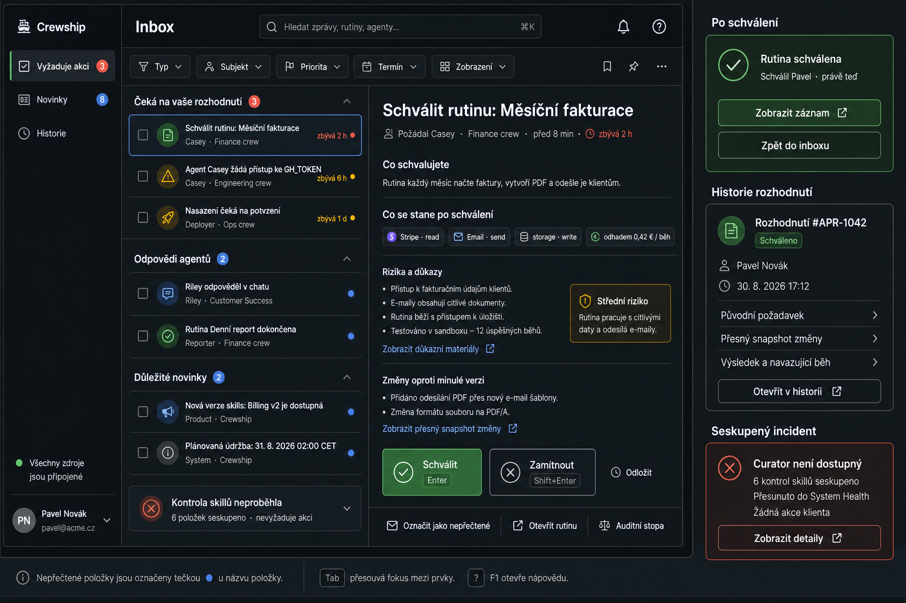

# Unified Inbox — maximum wireframe and no-loss contract

**Status:** `/inbox-v2` production implementation + follow-on server contract  
**Date:** 2026-08-30  
**Goal:** one client-facing inbox for every item that needs attention, without
turning infrastructure noise into client work and without losing a decision
after it has been made.



## Product promise

> If Crewship needs a person to know or decide something, it is visible in one
> Inbox. If a person decides it, the exact request and outcome remain
> searchable forever.

The inbox is not a fourth source of truth. It is the single attention
projection over the existing source rows and journal. Source mutation, the
attention projection and the immutable decision receipt must agree.

## Implemented in `/inbox-v2`

The production route aggregates all pages from `inbox_items`,
`approvals_queue` and mission task signals. Inbox and approvals APIs expose
stable `offset` pagination plus `has_more`; the UI walks those pages instead of
silently stopping at the old 100/50-row windows. Navigation, the command
palette, inbox bell and internal deep links now enter `/inbox-v2`; `/inbox`
remains available as a rollback surface.

The shipped UI provides Needs action, Updates and History; full-text filtering,
type/subject/priority filters, deadline ordering, grouped system advisories,
source-specific decision actions, post-decision confirmation and a permanent
history row. Opening an inbox row upgrades the list record with the detail API,
including decision evidence. A source health block turns visibly degraded when
any of the three reads fails or the approval subsystem is unavailable.

The remainder of this document is the stronger long-term server contract. In
particular, server-emitted `attention_class`/`action_contract`, journal-backed
receipt search and producer checkpoint freshness are follow-on work; the
current implementation classifies the existing typed payload contracts and
checks source-read health.

## Information architecture

The primary navigation has three destinations only:

| View | Contains | Does not contain |
|---|---|---|
| **Vyžaduje akci** | Items with a valid action contract the current user can perform or delegate | Pure FYI, infrastructure noise, already completed decisions |
| **Novinky** | Agent replies, completed work, important product/system news and non-blocking warnings | Items that block an agent or routine |
| **Historie** | Immutable decisions and archived news, with server-side search and pagination | Mutable live representations of the source |

`Unread` is a dot and a filter, not a primary destination. Reading is not
resolving. Archiving is not approving. A decision is never represented as a
generic archive action.

### Default order

1. Expiring destructive decisions.
2. Other expiring decisions.
3. Blocking decisions without a deadline.
4. Agent replies.
5. Important news.
6. Grouped advisories.

The server returns `attention_class`, `action_contract` and `deadline_at`.
Clients do not infer importance from `kind`, title text or payload keys.

## Main screen

### Global header

- Search across title, human-readable body, subject, crew, routine and decision
  receipts.
- Filters: type, subject, priority, deadline, outcome, decided by and period.
- A source-health indicator: **Všechny zdroje jsou připojené**. It is derived
  from producer checkpoints, not hard-coded UI copy.
- If any producer is behind, show **Inbox může být neúplný** with the affected
  source and last successful checkpoint. Never silently claim completeness.

### List row

Every row answers, without opening it:

1. What happened or what is being requested?
2. Who or what is it about?
3. Is a decision required?
4. When does it expire?
5. Is it unread?

One title line and one metadata line are the default. Priority is expressed by
order, deadline and a restrained marker; avoid a band of decorative pills.

Repeated events with the same `thread_key` collapse into one row with an
occurrence count. An unavailable curator evaluating six skills is one system
incident, not six client decisions.

### Decision detail

The reading order is fixed:

1. **Decision requested** — plain-language title, requester, subject, crew and
   deadline.
2. **What you are approving** — an immutable request snapshot.
3. **What happens after approval** — integrations, credentials, egress,
   writes, estimated cost and resumed work.
4. **Risks and evidence** — facts, not a model recommendation.
5. **Change from the previous version** — exact diff for routines, skills,
   memory and persona proposals.
6. **Actions** — one primary positive action, one negative action and defer
   where the source supports it.
7. **Audit trail** — origin event, source row, related run and prior decisions.

Raw JSON is never the default client experience. Operator-only diagnostics are
behind a disclosure and permission check.

### After a decision

The selected card must not disappear on click.

1. Disable actions while the request is in flight.
2. On success, transform the detail into **Schváleno / Zamítnuto**.
3. Name the human, timestamp and actual effect (for example, “run resumed”).
4. Offer **Zobrazit záznam** and **Zpět do inboxu**.
5. Keep a `Recently completed` confirmation for the current visit; the
   permanent copy lives in History.
6. On an unknown outcome, keep the card open and reconcile with the source.
   Never optimistically hide it.

## Permanent decision receipt

History reads append-only receipts, not the current mutable inbox row. A
receipt contains:

```text
decision_id
workspace_id
attention_event_id
source_type + source_id
subject_type + subject_id + display snapshot
request_snapshot_json
action_contract_snapshot_json
outcome                 approved | rejected | cancelled | expired | ...
source_outcome           source-native value
decided_by_user_id + display-name snapshot
decided_at
decision_comment
effect_snapshot_json     resumed run, enabled schedule, activated credential…
related_journal_entry_id
```

Restoring an archived news item restores its inbox visibility. It never erases
a decision receipt or reopens a source decision. A final decision can only be
superseded by a new explicit source event, linked to the previous receipt.

## Complete source coverage

All current producers must feed the same attention-event contract. Existing
surfaces can deep-link into Inbox, but may not maintain independent queues.

| Source family | Current examples | Target class |
|---|---|---|
| Pipeline waitpoints | approval step, deploy confirmation | action required |
| Pipeline governance | proposed routine, destructive change | action required |
| Pipeline execution | failed run, completed run, notify step | action or news according to declared contract |
| Pipeline schedules | missed occurrence, circuit breaker | action required when recovery is possible; otherwise news |
| Harbor Master | gated tool call, ephemeral hire, autonomy hold | action required |
| Agent escalations | credential, choice, missing input, risk | action required |
| Keeper access | credential access / four-eyes request | action required |
| Keeper findings | behavior, skill review, memory health | action only with a real client decision; otherwise grouped news or System Health |
| Agent authoring | skill, persona, memory proposal | action required |
| Chat | agent reply, mention, direct message | news; action only when the message declares one |
| Issues and missions | mention, review request, blocked/failed task, completion | action or news |
| Pages | ownership transfer, panel alert, webhook alert, proposed page write | action or news |
| Product/system | release note, planned maintenance, account/security notice | news |
| Future producers | any new module | registration is mandatory before the event can ship |

The existing `/approvals` queue and the mission-local `UnifiedInbox` become
source adapters. Their independent navigation and independent badge counts are
removed after parity is proven.

## No-loss technical contract

### Canonical envelope

Every producer emits an `AttentionEvent` through one package:

```text
event_id
workspace_id
event_type
attention_class          action_required | news | info
source_type + source_id
subject_type + subject_id
thread_key               grouping/deduplication
title + body_md
priority + deadline_at
target_user_id | target_role
action_contract          actions, permissions, endpoint/command, reversibility
request_snapshot
related_refs             crew, agent, routine, run, issue, chat, page
occurred_at
```

Direct `INSERT INTO inbox_items` is forbidden. Existing source-specific helper
functions become adapters over the canonical emitter.

### Durable delivery

1. Source mutation and an outbox event commit in one database transaction.
2. A dispatcher projects the event into the active inbox and broadcasts one
   realtime invalidation.
3. Projection is idempotent by `event_id`; grouping uses `thread_key` without
   overwriting historical events.
4. A reconciler compares pending source rows with active inbox rows and repairs
   missing or stale projections.
5. Producer checkpoints drive the UI source-health indicator.
6. A failed projection is observable in health metrics and logs; it is never
   swallowed as a harmless notification failure for an action-required event.

### Registry and enforcement

- A central registry defines every `event_type`, allowed attention class,
  action contract, resolving source and client renderer.
- Adding an event type without registry, database admission and renderer tests
  fails CI.
- Repository invariant rejects direct inbox SQL outside migrations and the
  inbox package.
- Contract tests enumerate every registered type and assert list, detail,
  action, resolution, history and permissions.
- An end-to-end coverage test seeds one event from every source adapter and
  proves it appears exactly once in the correct view.

## Noise rules

- `action_required` must have at least one valid source action and a target who
  can perform it. Otherwise emission fails closed and alerts the producer.
- Infrastructure failure with no client remedy goes to System Health. Inbox may
  receive one grouped news item, never N action cards.
- Repeated replies update one conversation thread while preserving individual
  message events behind it.
- Product news is rate-limited and dismissible.
- Completion updates can be digested by routine/crew according to user
  preference, but their underlying events remain searchable.
- Urgent security/account notices cannot be muted; the reason is explicit.

## Functional checklist

- Inline approve, reject, deny, retry, cancel, re-enable, run now, accept,
  dismiss, archive, defer and open-source actions where supported.
- Four-eyes and role-aware decisions.
- Deadlines, expiry and already-decided reconciliation.
- Search, grouping, bulk read/archive for non-decisions, filters and sorting.
- User-specific and role-specific audience enforcement.
- Secret redaction before API delivery; reveal only from the protected source.
- Realtime updates plus polling/reconciliation fallback.
- Server-side counts and cursor pagination for every view.
- Desktop, tablet and keyboard operation; visible focus, icon plus text, no
  meaning expressed by color alone.
- CLI parity over the same event and decision APIs.
- Notification-channel routing references the event, never creates a parallel
  lifecycle.

## Acceptance scenarios

1. Approve a routine: the card becomes a success confirmation, the routine is
   active, a linked run can resume, and the exact proposal remains in History
   after reload.
2. Approve from CLI or another tab: the open card reconciles to the same receipt
   and names the actual decider.
3. Curator fails for six skills: zero decision cards; at most one grouped news
   item and one System Health incident.
4. Harbor Master gates a tool call: it appears in the same **Vyžaduje akci**
   list and bell as a pipeline waitpoint.
5. A source write commits while projection delivery is interrupted: the outbox
   retries, source health becomes degraded, and the reconciler restores the
   missing item without duplication.
6. More than 500 historical decisions exist: all remain reachable through
   cursor pagination and server-side search.
7. A producer adds a new notification without registering it: CI fails.
8. No authorised user can see a target-user item addressed to somebody else;
   higher roles see role-targeted items only according to the hierarchy.

## Wireframe generation provenance

The PNG was generated with the built-in image generation tool using the
`ui-mockup` use case. The prompt requested a Czech, high-fidelity dark B2B SaaS
wireframe with a single Inbox, the three-view hierarchy, an actionable routine
detail, explicit post-approval confirmation, an immutable history receipt and
a grouped curator incident. It explicitly excluded separate approval queues,
raw JSON, decorative cards and instant disappearance after a decision.
