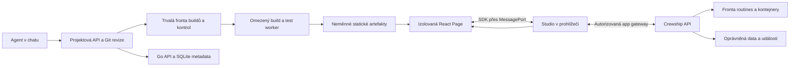

# Pages Apps: implementační architektura

> **Implementační PRD první dodávky:** [Pages Apps v1](pages-apps-v1.md), včetně jednoho YAML exportu a přesného stavu implementace. Tento dokument zachovává širší architektonický kontext.

Stav: návrh k implementaci, 2026-09-08. Vychází ze zadání plně vlastních Pages tvořených agenty v chatu. Tento dokument sjednocuje cílovou architekturu; [průzkum a předchozí experiment](pages-apps.md) zůstává dokladem pouze tam uvedených ověření. Žádné níže navržené API, tabulky ani balíčky SDK tímto dokumentem nevznikají.

## Aktuálně potvrzený produktový rozsah

**Pokročilé dashboardy a jednoduché aplikace nad daty dodanými z kontejnerů.** Příklady: stav Ansible běhu, zdraví MySQL, výsledky routines a provozní přehledy. Toto upřesnění má přednost před širšími ambicemi níže. Kapitoly o plném SDK, jemné delegaci a aplikační platformě jsou budoucí návrhový kontext; nejsou rozsahem první dodávky.

- Podporovaný frontend: React + TypeScript + Vite. Tailwind/shadcn jako nepovinný starter; grafové a tabulkové komponenty přidávat podle pilotu. Refine, Puck ani JSON renderer nejsou potřeba v základním stacku.
- Primární datová cesta: producent v kontejneru → existující sidecar push → validovaný uložený snapshot v Crewshipu → autorizovaná Page. Vlastní React zobrazení se oddělí od formátu a oprávnění dat. Současné uzavřené payload schemas nelze prostě prohlásit za libovolný JSON: pokud nestačí, přidat explicitní verzovaný a omezený datový kontrakt, nikoli obejít validaci.
- Agent vytvoří stránku i sběrný skript. Pravidelný sběr pak vykonává deterministická routine/script bez povinného LLM volání. Počet otevřených prohlížečů nezvyšuje počet dotazů na MySQL ani počet Ansible jobů.
- Minimální SDK: číst povolený snapshot a omezenou historii, dostávat aktualizace, vyvolat deklarovanou akci, sledovat její vlastní pending/run a získat stav oprávnění. Konkrétní existující read API lze přidat podle pilotu; všeobecná API proxy není podmínkou.
- Akční cesta: tlačítko → serverová validace a RBAC → existující routine fronta → běh v kontejneru → nový snapshot. První verze nerozšiřuje oprávnění operátora nad práva existujícího backendu. Browser nemá přímé připojení k MySQL, Ansible ani shellu.
- Oddělit revizi kódu od aktualizace dat. Nový údaj nemění Git commit a nevyvolává build. Statický artefakt se sestavuje pouze při změně projektu.
- Data nesou stáří, původ a stav. Nedostupný producent nezmění poslední úspěšný údaj na aktuální zelený stav. Neznámá hodnota není nula. Opožděné/duplicitní push zprávy potřebují definovanou politiku pořadí; její přesnou semantiku ověřit v pilotu.
- Výchozí sběr pro běžný health dashboard navrhujeme po 30–60 s, průběh jobu podle událostí s omezením frekvence. Jde o výchozí návrh, interval se řídí SLA a náklady zdroje. Reconnect načte poslední stav. Detailní logy zůstávají u běhu, neposílají se celé v každém snapshotu; retence a agregace grafů jsou omezené.
- Zachovat izolaci custom JavaScriptu, build sandbox, Git, preview/publish/rollback a serverové oddělení práv producenta, čtenáře, editora a operátora. Příjemce Page nikdy nedostane data cizí crew pouze kvůli sdílení stránky.
- První pilot: vlastní MySQL health dashboard a Ansible job přehled s jednou povolenou akcí. Ověřit souběh dvou uživatelů, výpadek producenta, push bez oprávnění, zastaralá data, změnu kódu a návrat publikace. Žádný nový aplikační databázový produkt, trvalý frontendový Node server ani obecná CI platforma.

Zdroje existujícího základu: [sidecar producer](../../internal/sidecar/pages.go), [snapshot/realtime klient](../../hooks/use-pages.ts), [serverová autorizace](../../internal/api/pages_authz.go), [akce](../../internal/api/pages_actions.go). Integrace custom runtime s tímto základem je k 2026-09-09 implementovaná v rozsahu [v1](pages-apps-v1.md); širší návrhy níže tím nejsou prohlášeny za dokončené. Stav nasazení a testů určuje [handoff](pages-apps-handoff.md).

**Druhá architektonická revize:** §14–18 zpřesňují závazné podmínky RBAC, izolace backendových operací, údržby a licencování. Zejména možnost spustit existující routine sama neprokazuje omezení oprávnění jejího procesu. Produkční gate z §13 vyžaduje i tyto podmínky.

**Revize rozsahu:** §19 určuje minimální první dodávku a hranice růstu. Bezpečnostní invarianty výše platí pro všechny dodané funkce; širší SDK, delegovaný executor a více prostředí jsou cílové rozšíření, nikoli povinnost vše implementovat před prvním vydáním. Funkce bez hotového vynucování se nenabídne.

## 1. Rozhodnutí a hranice produktu

**Page je verzovaná interní webová aplikace.** Podporovaný základ je React + TypeScript + Vite. Agent tvoří běžný zdrojový projekt, nikoli povinný strom bloků. Může navrhnout libovolný layout, vlastní komponenty, tabulky, grafy, formuláře, navigaci a interakce. Zákazník zadává úkol v chatu a dostane náhled; nemusí vybírat framework ani spravovat Git.

Použít podporovanou, otestovanou a připnutou kombinaci verzí. Aktualizace závislostí je nový ověřený build, nikoli automatické přebírání `latest`. „Moderní“ nesmí znamenat proměnlivou produkci.

| Oblast | Rozhodnutí |
|---|---|
| Frontend | React, TypeScript strict, Vite, ESM, standardní CSS; Tailwind/shadcn jako starter |
| Datové aplikace | Volitelný Refine adapter nad SDK; základ jej nevyžaduje |
| Vizuální editor | Puck až jako rozšíření pro explicitně editovatelné komponenty |
| JSON renderer / amis | Nejsou součástí základního runtime |
| Integrace | Verzovaný, frameworkově nezávislý protokol a typované Crewship SDK |
| Zdrojový kód | Spravovaný Git projekt pro každou novou custom Page |
| Produkce | Neměnný statický artefakt; žádný Node/Vite server na každou Page |
| Backend práce | Existující API, fronta a routines; samostatné limity pro buildy a testy |
| Úložiště | SQLite pro řídicí metadata, Git pro zdroje, soubory/objektové úložiště pro artefakty |
| Bezpečnost | Izolace vlastní aplikace od Studio session a serverové ověřování každé operace |

V první podporované verzi je aplikace statický frontend. Python či shell skript patří do řízené backendové operace; Node server, SSR, libovolné SQL proti interní databázi nebo trvale běžící proces nejsou vlastností frontendového balíčku. Pozdější Vue/Svelte klient může používat stejný protokol, ale komponenty ani editory se tím nestávají vzájemně zaměnitelnými.

## 2. Co již existuje a co musíme doplnit

Základ ověřen v checkoutu `005470ed7157ea2504c77484617ace97b1daeb4c`; přihlášené Pages na dev2 nebyly prohlédnuty. Toto není audit jejich konkrétního obsahu ani důkaz shody nasazeného buildu.

| Existující část | Využití / mezera |
|---|---|
| [Pages spec a panely](../../internal/pages/spec.go) | Zachovat současné Pages a producenty; uzavřený panelový spec nenahrazuje zdrojový projekt |
| [Panelové akce](../../internal/api/pages_actions.go) | Znovu použít zařazování routine, validaci a audit; vlastní aplikace potřebuje explicitní autorizaci operací |
| [Akční UI](../../components/features/pages/panels/panel-actions.tsx) | Korelace podle routine slugu nestačí: sledovat vlastní `pending_id → run_id` |
| [Script runner](../../internal/pipeline/runner_script.go) | Timeout čtení attach nepotvrzuje zabití procesu; nutná pravdivá semantika cancel |
| [Agent save](../../internal/api/pages_internal_save.go) | Zachovat svázání identity přes sidecar; současné vytvoření nemá draft/publish lifecycle |
| [Realtime](../../hooks/use-pages.ts) | Navázat na existující WebSocket; nezavádět polling každého widgetu |
| [OpenAPI generátor](../../cmd/gen-openapi/main.go) | Základ generovaných typů; doplnit klasifikaci operací, transportů a aplikačních oprávnění |
| [StorageProvider](../../internal/provider/storage.go) | Workspace soubory; negarantuje atomické dokončení artefaktu ani správu jeho životnosti |
| [Container config](../../internal/provider/container.go) | Nepřebírat privilegia, mounty, init skripty ani prostředí crew do build sandboxu |
| [Backup](../../internal/backup/) | Rozšířit existující obnovu o repozitáře, artefakty a konzistentní reference |

## 3. Rozdělení práce a provozní topologie



Go server spravuje identity, metadata, oprávnění, fronty a publikaci. Build worker obstará Git checkout, pnpm, TypeScript, Vite a browser testy mimo HTTP handlery. Náročná analýza, exporty a skripty patří do úloh. Zobrazení hotové Page nevyžaduje build, LLM ani start kontejneru. Úmyslně spuštěná akce kontejner potřebovat může; UI musí ukázat čekání či probouzení.

Statické soubory běží na vyhrazeném originu bez Studio cookies. První instalace může používat lokální artefaktové úložiště a samostatný virtual host stejné distribuované služby. Později lze připojit objektové úložiště, cache a vzdálené workery bez změny projektů. Host pro aplikace nesmí obsluhovat Studio API ani přesměrovávat neznámé cesty do Studio shellu. Ověřit konfiguraci Host headeru a trusted proxy.

Worker může zpočátku sdílet fyzický server, ale musí mít vynucené limity CPU, RAM, procesů, disku, síťové propustnosti a souběhu. To omezuje dopad; neodstraní sdílené I/O a paměťový tlak. Pro tvrdou izolaci výkonu nasadit worker na jiný stroj. Samotné oddělení Go procesu od Node procesu není důkaz výkonové izolace.

## 4. Agent tvoří projekt, zákazník používá aplikaci

1. Agent načte aktuální Page, očekávanou revizi, dostupné SDK operace a jejich schémata. U nové Page dostane funkční starter, pravidla prostředí a realistická testovací data.
2. Vytvoří pracovní kopii projektu ve svém workspace. Produkční repozitář ani publikované artefakty nemá připojené k zápisu.
3. Mění soubory proti konkrétní revizi. Při checkpointu server ověří scope, kvóty, cesty a manifest a uloží Git commit. Souběžnou změnu vrátí jako konflikt s diffem, nikoli přepsáním cizí práce.
4. Zařadí build. Čte strukturované diagnostiky a opravuje chyby v omezeném počtu pokusů podle časového a tokenového rozpočtu.
5. Uživatel vidí náhled stejného artefaktu, který lze publikovat. Náhled má vlastní oprávnění a výchozí testovací/read-only prostředí.
6. Kontrola aplikace ověří konkrétní revizi a zaznamená důkazy. Nová změna relevantní výsledky zneplatní.
7. Publikace atomicky přepne aktivní revizi podle existující politiky. Zobrazení aplikace, změna jejích pravomocí a schválení nebezpečné akce zůstávají samostatnými rozhodnutími.

Navrhované nástroje agentů: `page_project_create`, `page_project_read`, `page_project_checkpoint`, `page_build`, `page_preview`, `page_check`, `page_publish`, `page_diagnostics`. Názvy jsou návrh, nikoli současné příkazy. Každá mutace podporuje očekávanou revizi, stabilní identitu volajícího a dohledatelný receipt. Povolení publikovat není automatickým následkem práva editovat.

Starter obsahuje `package.json`, `pnpm-lock.yaml`, `tsconfig.json`, `vite.config.ts`, `src/`, `crewship.page.json` a minimální testy kritických uživatelských cest. Manifest popisuje kompatibilitu runtime, požadované operace, vazby na zdroje, typy nastavení a limity. Neobsahuje přístupové tokeny. Oprávnění v manifestu jsou žádost; grant vzniká na serveru.

Agent standardně používá přístupné komponenty, loading/empty/error stavy, zobrazení stáří dat, responzivní layout, ochranu rozepsaných formulářů a srozumitelné potvrzení dokončení. Knihovna doporučených komponent je zkratka ke kvalitě, nikoli povinný jazyk. Automaticky opravit neznamená automaticky publikovat.

## 5. Git, data a publikace mají odlišné odpovědnosti

Repozitář obsahuje kód, lockfile, manifest, testy a deklarace operací. Neobsahuje provozní data, přílohy klientů, faktury, tajné hodnoty, `node_modules` ani build logy. Každý checkpoint zaznamená autora, jednajícího agenta a původní chat/run. Zákazník může exportovat standardní Git projekt; externí Git hosting je volitelné zrcadlo, nikoli nutná závislost instalace.

Git CLI doporučujeme do spravovaného prostředí projektové služby/workeru. Dnešní finální serverový image jej automaticky neobsahuje. SQLite již funguje jako embedded knihovna. Zavedení Git neznamená požadovat GitLab, GitHub nebo samostatný databázový server.

**Konzistence bez předstírané společné transakce Git a SQLite:** projektová služba nejprve bezpečně vytvoří neměnný commit. Následně v krátké SQLite transakci přepne draft pointer pouze při shodě očekávané revize. Při konfliktu zůstane neodkazovaný objekt, který později uklidí GC. Git refy jsou opravitelným indexem; autoritativní draft a publikace jsou v DB. Reconciler opravuje přerušené operace. Žádná DB transakce nečeká na Git, build či síť.

Git operace běží s řízeným configem a vypnutými hooks/filters. Import cizího projektu neprovádí jeho hooky, submoduly, LFS pomocníky ani vlastní credential helpers. Podpora těchto rozšíření vyžaduje samostatný ověřený importní proces.

Navrhované logické tabulky — přesné SQL vznikne při implementaci a respektuje existující vlastnictví Pages:

| Entita | Obsah a hlavní invariant |
|---|---|
| `page_projects` | Jedna vazba na `pages.id`, draft commit, generation, runtime major; zachovat workspace/owner pravidla |
| `page_builds` | Commit, lock/toolchain/config digest, stav, lease, worker generation, výsledek; index fronty |
| `page_artifacts` | SHA-256 manifest, velikosti, ověřená úplnost, umístění; žádné blob soubory v DB |
| `page_publications` | Neměnný artefakt + commit + SDK/protokol + grant revize + vazby operací + kontrolní report |
| `page_app_grants` | Schválené schopnosti a resource constraints, revize a revokace |
| `page_app_sessions` | Uživatel, Page, publikace, scope, expirace/revokace; nezaměňovat se Studio loginem |
| `page_checks` | Artefakt, prostředí, sada kontrol, pass/fail/skipped, timestamp a odkazy na důkazy |

Použít krátké transakce, indexy cizích klíčů/front, CAS a outbox pro audit/události navázané na změnu. Publikační pointer smí odkazovat jen na kompletní ověřený artefakt. Dva publish požadavky proti stejné generation: jeden vyhraje, druhý obdrží konflikt. Opakování stejného požadavku je idempotentní.

Rollback přepne UI artefakt, ale znovu ověří aktuální oprávnění a dostupnost backendových kontraktů. Nevrací platby, migrace dat ani účinky skriptu. Publikace musí pinovat revizi routine, pokud runner takové spuštění podporuje; jinak tuto vazbu nesmí označit za reprodukovatelnou. Nepodporované pinování je implementační mezera, nikoli důvod tvrdit, že Git verzoval i backend.

## 6. Build a distribuce

Stavy build úlohy: `queued → leased → running → succeeded | failed | cancelled | timed_out`. Lease má heartbeat a generation token; výsledek starého workeru po převzetí úlohy nelze publikovat. Pád workeru vede k omezenému retry bezpečné build úlohy, nikoli k opakování obchodních akcí.

Každý build běží v jednorázovém sandboxu z připnutého image. Bez Docker socketu, host credentials, produkčních secretů, privilegovaného režimu, crew init hooků a libovolných host mountů. Zachovat UID konvence repozitáře. Síť vynucuje runtime/proxy, nestačí pole `AllowedDomains` v konfiguraci. Node/Vite plugin je spustitelný cizí kód i při vypnutých instalačních skriptech.

Instalace používá pnpm a frozen lockfile. Lifecycle skripty jsou výchozí deny; potřebné výjimky se vážou na ověřený balíček/verzi a build policy. Soukromé registry řeší krátkodobý scope a credential proxy, ne tajné proměnné dostupné projektovému JavaScriptu. Cache nesmí zpřístupnit privátní balíčky cizím workspace; zápis probíhá do oddělené staging vrstvy a ověřený obsah je neměnný.

Build cache key zahrnuje commit, lockfile, toolchain image, architekturu, SDK, build config a policy revizi. Cache hit není nové bezpečnostní schválení. Typecheck a build jsou oddělené kontroly; úspěch transpileru není důkaz typové správnosti.

Artefakt nahrávat streamem do staging prostoru. Kontrolovat počet/velikost souborů, MIME, normalizované relativní cesty, symlinky, traversal a decompression bombs. Platforma vypočítá digest z manifestu a obsahu. Source mapy držet soukromě pro diagnostiku. Scanner tajných hodnot pomáhá, ale nenahrazuje zákaz poskytovat secrets buildu.

Doplnit specializované rozhraní pro `stage`, `verify`, `finalize`, `open` a referenční pinování artefaktů. Lokálně použít dokončení atomickým rename na stejném filesystemu; objektové úložiště potřebuje ověřený completion manifest a teprve potom DB referenci. Stávající obecné `Write` samo tuto záruku neposkytuje.

Vite vytváří statický bundle a podporuje relativní `base`; pro Pages zvolit `base: './'` a ověřit i lazy importy a CSS/font assety. Publikace uchovává staré chunky pro otevřené revize. Přechod na novou revizi nabídne host; nesmí zahodit rozepsaný formulář automatickým reloadem. [Vite build](https://vite.dev/guide/build).

## 7. Runtime v prohlížeči a privátní artefakty

Výchozí bezpečnostní profil: důvěryhodný malý bootstrap na odděleném originu, iframe `sandbox="allow-scripts"`, aplikace v opaque originu. Nedostane Studio cookies, JWT ani DOM rodiče. Vlastní styling tento profil neomezuje na katalog komponent. Sandbox má ovšem dopad na browser API; jde o explicitní platformní kontrakt. [MDN iframe](https://developer.mozilla.org/en-US/docs/Web/HTML/Reference/Elements/iframe).

Bootstrap vyjedná verzovaný MessageChannel. Host ověří konkrétní `iframe.contentWindow`, jednorázovou challenge a očekávanou relaci. `origin: null` není identita aplikace. Kvůli opaque originu může první předání portu vyžadovat `targetOrigin: '*'`; předává se pouze do předem ověřeného window a další komunikace běží přes svázaný port. Zprávy mají schema, request ID, limity velikosti/frekvence a timeout. Navigace iframe či jeho zánik port i relaci zneplatní. [Channel Messaging](https://developer.mozilla.org/en-US/docs/Web/API/Channel_Messaging_API).

**Konkrétní návrh doručování soukromého kódu, povinný browser pilot:** po autorizaci host přidělí neprůhledný náhodný asset lease omezený na jediný artefakt. Cesta `/assets/<lease>/<digest>/...` umožní relativním importům zachovat scope. Lease je bearer přístup pouze ke kódu dané revize, nikdy k API; přenášet jej až po handshake, redigovat v logách a použít `Referrer-Policy: no-referrer`. Žádné tajné hodnoty v artefaktu.

Aktivní autorizovaný host prodlužuje tentýž lease, takže URL lazy chunků zůstávají stabilní. Návrh: obnova po 60 s, platnost 5 minut od poslední obnovy, absolutní maximum relace 8 hodin; návrat ze spánku nejprve reautorizuje relaci. Po absolutní expiraci nabídnout bezpečné znovuotevření s uloženým draftem. Selhání již odmítnutého ESM importu nepovažovat za automaticky opravitelné prostým retry.

Asset endpoint poskytuje credentialless CORS pro sandboxové moduly. CORS není autorizace: tu dává úzce omezený lease. Pro privátní artefakty výchozí `Cache-Control: no-store` vůči prohlížeči/sdílené HTTP cache; interní cache obsahu podle digestu lze použít až za kontrolou lease. Tím vědomě obětujeme část opakovaného cache hitu za jednodušší první bezpečný kontrakt. Veřejné artefakty mohou později používat dlouhou immutable cache jako samostatný režim. Již stažený kód nelze revokací vymazat z paměti uživatele.

CSP dodává hostovaná runtime služba, ne projekt: skripty pouze z artefaktového hostu, bez `unsafe-eval`, výchozí zákaz přímých API síťových spojení, řízené zdroje obrázků/fontů/stylů, zakázané formulářové odesílání a nested frames. Obvyklé inline styly jsou možné; inline JavaScript není podporovaný výstup starteru. Případná síťová rozšíření vyžadují explicitní kontrakt, ne odstranění CSP.

SDK zprostředkuje navigaci, soubory, download, clipboard, theme/locale, předvolby a uložení draftu. Některé browser operace potřebují gesto uživatele přímo v hostu; řešit je hostovaným ovládáním a ověřit v prohlížečích. LocalStorage, service workers, iframe cookies, libovolné externí embedy a každá npm knihovna nejsou garantované vlastnosti tohoto profilu.

Browser sandbox není tvrdý limit CPU/RAM a CSP není absolutní ochrana před únikem dat, která jsme aplikaci již zpřístupnili. Nedůvěryhodný kód může zneužít i navigaci či uživatelské chování. Minimalizovat poskytovaná data, řídit publikaci a mít kill switch. Ověřit chování nekonečné smyčky a možnost hosta aplikaci zavřít v podporovaných prohlížečích; samotný heartbeat neprokazuje izolaci hlavního vlákna.

## 8. Úplné SDK s přesnými pravomocemi

Navrhované balíčky: `@crewship/sdk` (typy a headless klient), `@crewship/react` (hooky/cache), volitelně `@crewship/ui` a `@crewship/refine`. Názvy jsou návrh. Typy a klienty generovat z existujícího veřejného OpenAPI; streaming, soubory a dlouhé úlohy potřebují explicitní adaptéry. Interní sidecar API se nestane veřejným jen proto, že existuje SDK.

Každá veřejná operace má položku serverového katalogu: stabilní SDK ID, schéma vstupu/výstupu, transport, druh účinku, resource scope, požadované oprávnění, idempotenci a limit. Současné generované `operationId` závisí na HTTP cestě; pro veřejný SDK kontrakt zavést stabilní mapování a test změn. CI odmítne novou neklasifikovanou operaci. Report pokrytí rozlišuje přímé volání, hostem zprostředkovanou funkci a nepodporovanou operaci; nevydávat částečný pilot za 100% pokrytí.

Citlivé obrazovky pro secrets, přihlášení nebo správu bezpečnosti se otevírají v důvěryhodném hostu. Aplikace může vyvolat povolený workflow, ale nemá dostat heslo či trvalý token jako návratovou hodnotu. „Plné SDK“ znamená pokrytí produktových funkcí, nikoli anonymní univerzální proxy.

Efektivní právo běžného volání je průnik aktuálních práv uživatele, schválených schopností aplikace a scope konkrétních dat. Identita autora se nepoužívá jako identita každého návštěvníka. Delegovaná operace pro méně privilegovaného uživatele potřebuje explicitní serverový grant na konkrétní routine/revizi, cíle a vstupy; nelze ji implementovat prostým obejitím dnešního manager checku.

Host používá svou autentizovanou cestu do nové app gateway. Ta přijímá session ID, operation ID a typované argumenty, nikoli libovolnou URL či hlavičky. Na serveru se znovu ověří uživatel, workspace, Page, publikace, grant i konkrétní záznamy. Adaptéry musí projít stávající autorizací a policy; přímé zavolání handleru bez jeho middleware není bezpečná zkratka. Rezervované identity se nikdy nepřebírají z argumentů iframe.

Odvolání členství/grantu zneplatní další požadavky i události; nespoléhat jen na expiraci session. UI může skrýt nepovolené tlačítko, ale nedostane nepovolená data, aby je následně skrylo. Scope platí stejně pro batch, download, export a subscription. Upload má samostatnou omezenou cestu a stream, ne velké base64 zprávy přes port.

SDK sjednotí chyby do typovaného výsledku s `code`, `status`, `requestId`, případně `retryAfter`, aniž by měnilo oba existující backendové error envelopes. Zrušení čekajícího requestu je jiné než zrušení úlohy. Automatické opakování mutace je dovoleno pouze s podporovanou idempotencí. Klíč se váže na aktéra, aplikaci, operaci a logický požadavek, fingerprint na vstup; po nejasné síťové chybě nejprve dohledat receipt.

## 9. Data, realtime a tlačítko Start

Read operace musí mít stránkování, filtry a omezenou velikost odpovědi. Výchozí starter nevytáhne všechny issues a nepřefiltruje je až v prohlížeči. Náročné agregace se připravují jako řízená projekce s časem poslední aktualizace. Payload panelu je snapshot/projekce, nikoli univerzální transakční databáze účetnictví.

Data s vlastní doménou mají explicitního backendového vlastníka: existující Crewship entity nebo připojený systém. Pokud později nabídneme vlastní aplikační kolekce, potřebují schémata, oprávnění, migrace, souběh a zálohy jako samostatnou backendovou funkci. Zatím neslibovat `sdk.sql()` nad interní SQLite. Editace záznamů používá revision/ETag a konflikt; nikdy tiché last-write-wins u kritických dat.

React adapter spravuje jednu cache pro danou aplikaci. Klíče zahrnují workspace, aktéra/scope a resource parametry; při změně identity cache zanikne. Refine adapter se připojí na stejnou datovou vrstvu, ne na druhý nezávislý polling systém. Citlivé odpovědi se výchozně nepersistují v browser storage.

Jeden sdílený realtime transport Studio tabu, multiplexované subscriptions podle potřeb. Události nesou minimum dat a serverově filtrované identifikátory; klient invaliduje jen dotčené queries. Slučovat rychlé změny, pozastavit nadbytečnou práci skrytých aplikací, při reconnectu ověřit cursor a při mezeře načíst snapshot. Přeplněná bounded fronta vyžádá resync, nehromadí neomezenou RAM. Cursor/replay je požadavek na rozšíření, nikoli doložená vlastnost současných událostí.

Start vytvoří receipt s `pending_id`. UI sleduje právě tuto úlohu a později její `run_id`. Stavy pro uživatele: čeká na schválení / ve frontě / startuje prostředí / běží / dokončeno / selhalo / žádá se zrušení / zrušení potvrzeno / stav neznámý. Dva uživatelé spouštějící stejnou routine musí vidět vlastní běhy.

Server znovu ověří policy v okamžiku provedení citlivé operace, ne pouze při zařazení. Idempotence fronty není záruka právě jedné platby v externím systému; obchodní operace potřebuje vlastní idempotenci nebo kompenzaci. Stop potvrdit až po ověření ukončení procesu a relevantních potomků. Dokud to provider nedokáže, zobrazit omezení pravdivě a nepublikovat tuto akci jako bezpečně zrušitelnou.

## 10. Měřitelné výkonové a provozní rozpočty

Následující hodnoty jsou **navržené výchozí rozpočty a akceptační cíle, nikoli naměřená kapacita Crewshipu**. Pilot je musí potvrdit nebo zdůvodněně změnit. Limity platí také souhrnně za workspace a instanci, aby je neobešlo vytvoření více Pages.

| Oblast | Výchozí návrh |
|---|---|
| Build souběh na malé instalaci | 1; samostatná fronta od routines, admission podle skutečně volných zdrojů |
| Build sandbox | Nejvýše 2 CPU, 2 GiB RAM, 10 minut; PID a disk quota v runtime profilu |
| Browser check | Odděleně, nejvýše 2 CPU, 2 GiB RAM, 5 minut; výchozně nesouběží s buildem |
| Artefakt / log | Hard cap 100 MiB rozbaleného artefaktu, 2 000 souborů, 20 MiB logu na job |
| Počáteční JS | Cíl do 300 KiB gzip včetně Reactu; editor, velké grafy a nepoužité SDK moduly lazy |
| Read requesty | Nejvýše 6 současných na aplikaci; stránka standardně 100 záznamů, max. 500 podle endpointu |
| Odpověď / batch | Výchozí strop 1 MiB pro JSON, max. 20 operací v batch; export oddělenou úlohou |
| Realtime | Max. 50 subscriptions/app a 200/tab; slučování do 250 ms, fronta max. 256 událostí před resync |
| Read timeout | Výchozí 10 s; dlouhá práce vrací receipt, nedrží dlouhý HTTP request |
| UI | Cíl LCP ≤ 2,5 s, INP ≤ 200 ms, CLS ≤ 0,1 na deklarovaném testovacím profilu |
| API | Pilotní cíl p95 běžných read/receipt ≤ 250 ms, bez času samotné routine |
| Vliv workeru | Při definované zátěži nárůst p95 běžných API nejvýše 20 % proti stejnému testu bez buildu |

Přesný profil referenčního testu: 4 vCPU / 8 GiB RAM, lokální SSD, zahřátá instance se seed daty; jeden omezený worker, 100 přihlášených sessions, každá jedna aplikace, pět stránkovaných dotazů při otevření, potom jedna relevantní změna za 10 s a jedna akce za minutu. Doplňkově studený start, desetnásobná špička otevření, pomalá síť a background/resume. Před měřením zaznamenat velikost DB, CPU model, OS, browser a dataset; samotný počet uživatelů bez workloadu není kapacitní údaj.

Frontend měřit samostatně na pevném mobilním emulačním profilu s omezenou sítí/CPU; výsledky browser automatu nejsou totéž jako skutečný mobil. Zátěžový test musí zahrnout Go RSS, CPU, disk latence, DB lock wait, WAL růst, frontu, síťový objem a chyby. 100 sessions × 5 úvodních dotazů = 500 dotazů při otevření; bez jejich časového rozložení nelze tvrdit konkrétní RPS.

Velikost bundle je výchozně diagnostika s publikační politikou, nikoli zákaz složitějšího designu. Hard resource limity zůstávají vynucené. Při překročení kvóty přijde 429 a retry informace; bez kapacity úloha čeká nebo je srozumitelně odmítnuta. Přetížení nesmí spustit nekonečné retries ani odsunout kritické běžící routines neomezeným proudem buildů. Scheduler potřebuje férovost mezi workspace.

## 11. Kontrola aplikace, diagnostika a obnova

„Zkontrolovat aplikaci“ spouští skutečné nástroje nad konkrétním artefaktem: manifest/typy/build, runtime handshake, browser smoke, načtení deklarovaných dat, autorizaci, kritické interakce, základní přístupnost a rozpočty. Úspěšný build samotný neznamená funkční aplikaci.

Výsledky mají `pass`, `fail`, `skipped`, `unknown`, prostředí, aktéra, revizi a čas. Chybějící credentials nejsou zelený test. Read-only integrační kontroly mohou používat omezenou testovací identitu; zápisové testy patří do sandbox datasetu/dry-run implementace, nikoli k náhodnému spuštění skutečné platby či deploye. Automat musí bránit tomu, aby škodlivý test v preview získal větší práva než aplikace.

Agent shrne důkazy a navrhne opravu. Výsledek vlastního tvrzení agenta není kontrolní důkaz. Kontrola nevyžaduje LLM, pokud má jen vykonat deterministické testy. Periodický monitoring má rozpočet a plán; žádný nekonečný agent opravující aplikaci po každé události.

Provoz sleduje build queue/čas, cache hit, publikace, SDK chybovost/latenci, odmítnutá oprávnění, ztracené subscriptions, script stavy a revokace. Trace ID propojí UI požadavek, gateway, pending a run. Logy scrubovat, objem omezit a těla citlivých dat standardně nelogovat. Page/user IDs patří do řízených logů a tras, ne do neomezených metrických labelů. Uživatel dostane srozumitelnou chybu a možnost přiložit diagnostiku agentovi bez secretů.

SQLite WAL dovoluje souběh čtenářů a zápisu, ale zůstává jeden zapisovatel a WAL vyžaduje sdílenou paměť na témže hostu. Metadata držet malá, logy a artefakty mimo DB. Tato verze nepodporuje aktivní víceuzlový Go server sdílející SQLite přes síťový disk. [SQLite WAL](https://www.sqlite.org/wal.html).

Záloha používá konzistentní SQLite snapshot existujícím podporovaným postupem, ne prostou kopii živého DB souboru. Během zálohy pinovat odkazované commity a artefakty proti GC; backup manifest propojí DB snapshot, Git a digesty. Obnova musí ověřit úplnost a skutečně otevřít publikovanou Page. Chybějící artefakt nesmí potichu přesměrovat na jiný build. [SQLite backup](https://www.sqlite.org/backup.html).

GC maže pouze obsah bez publikace, draftu, aktivního jobu, session či backup pinu a po ochranné lhůtě; návrh 7 dní pro osiřelé staging objekty. Uložené publikace mají explicitní retenční politiku. Nedostatek disku zastaví nové buildy před poškozením SQLite. Kill switch zablokuje aplikaci nebo workspace a odvolá SDK sessions; nezaměňovat jej s automatickým ukončením již běžících backend úloh.

## 12. Kompatibilita a zavádění

Stávající panelové Pages zůstanou funkční. Přidat explicitní režim projektu a nové endpointy, nikoli přetížit payload `save_page` nekompatibilním významem. Stávající `spec_json NOT NULL`, vlastnictví a granty musí mít při aditivní migraci validní reprezentaci i pro app režim; implementační migrace musí otestovat obě větve. Jejich staré editory nesmějí uložením odstranit app metadata.

Nové projektové endpointy doporučujeme pod `/api/v1/pages/{slug}/project/...`, s vyhodnocením existujícího workspace a stabilního `page_id` na serveru. Slug je adresa, ne autorizační scope. Přesné route kontrakty schválit typy a OpenAPI testem před implementací SDK.

Pro staré panelové Pages případný Git import řešit jako oddělenou idempotentní migraci. Nekopírovat do Git každý datový push. Pokud se začne verzovat i panelový spec, jeho všechny zápisové cesty musí používat jednu autoritativní revizní službu; dvojí nezávislé zapisování do DB a Git není přechodový plán.

SDK/protokol podporuje explicitní major a feature negotiation. Při upgradu Crewshipu proběhne kontrola kompatibility všech aktivních publikací; nekompatibilní upgrade nesmí tiše rozbít aplikace. Výchozí závazek: podpora aktuálního a předchozího major protokolu, odstranění až po inventuře a migraci dotčených publikací. Kritická revokace má přednost před zpětnou kompatibilitou. Zdrojový export není záruka funkčnosti bez Crewship API.

## 13. Implementační balíky a důkaz připravenosti

| Pořadí | Dodávka | Podmínka dokončení |
|---|---|---|
| 1 | Runtime, oddělený origin, minimální SDK read/action, asset lease | Chromium/Firefox/WebKit: modul/CSS/font/lazy import, expiry/resume, spoofed messages, cizí workspace, logout/revokace, formulář a download; žádný Studio token ve frame |
| 2 | Projektová služba, Git, job fronta, artefakty, publikace | Konflikt dvou autorů, pád v každé fázi uložení/publikace, starý worker, disk full, rollback a backup/restore s otevřením Page |
| 3 | Katalog SDK, práva, routine receipts | Každá veřejná operace klasifikovaná, kritické scopes negativně testované; dva uživatelé stejné routine vidí správné běhy; cancel je pravdivý |
| 4 | Agent starter, preview, check/repair v existujícím chatu | Agent od zadání vytvoří a upraví reálnou aplikaci; změna oprávnění projde policy; testy neprovedou produkční obchodní účinek |
| 5 | Výkon, limity, provozní UX | Zátěžové cíle změřené, runaway build/test/app scénáře, queue fairness, reconnect, cold start a souhrnné kvóty |
| 6 | Volitelné Refine/Puck a širší katalog starterů | Nemění bezpečnostní kontrakt; čtecí bundle nenačítá editor; žádný příslib univerzálního převodu vlastního React kódu |

První čtyři balíky tvoří úzký integrační průřez, pátý je produkční gate, nikoli volitelná optimalizace po vydání. Začít jednou skutečnou SRE aplikací: přehled ze skutečného read API, tlačítko řízené routine, vlastní průběh, změna agentem, kontrola, publikace a rollback. Následně datová aplikace s formulářem, konfliktem změn a odlišnými právy druhého uživatele.

**Otevřené technické důkazy:** chování opaque-origin runtime se soukromými lazy chunky, browser CPU izolace, skutečné procesové cancel, pinování backend revizí a výkon při souběhu s hlavním serverem. Návrh pro ně určuje kontrakt a test; dosavadní kompatibilitní experiment je neověřil. Pokud pilot selže, upravit příslušnou vrstvu před rozšířením funkcí. Výsledkem má být široká svoboda tvorby aplikací a předvídatelný provoz, nikoli příslib, že libovolný generovaný kód bude automaticky rychlý a bezchybný.

## 14. RBAC: jeden serverový autorizační kontrakt

RBAC je povinný základ, doplněný o vazbu na konkrétní workspace, crew, Page, prostředí a záznam. Role „editor“ sama neodpoví, které aplikace a data smí člověk měnit. Role seskupuje oprávnění, resource binding určuje jejich rozsah. Deny-by-default, kontrola každého requestu a objektových vztahů odpovídají doporučením [OWASP Authorization](https://cheatsheetseries.owasp.org/cheatsheets/Authorization_Cheat_Sheet.html).

**Nález v repozitáři:** [tiers.ts](../../lib/permissions/tiers.ts) výslovně dokumentuje rozdíly CASL a serverových mutation gates. [Pages autorizace](../../internal/api/pages_authz.go) již odděluje čtení, produkci dat a změnu specu; grant na Page nedává právo k datům cizí crew. [Capabilities](../../internal/api/capabilities_check.go) mají cache a invalidaci, [RBAC](../../internal/api/rbac.go) efektivní role a token scopes. Navázat na ně; nevytvářet nový nezávislý systém rolí uvnitř SDK.

Navrhovaný interní kontrakt autorizace:

```text
Authorize(subject, action, resource, context) ->
  allow | deny | approval_required
  + reason_code + authorization_revision + constraints

subject: skutečný uživatel / omezená identita služby; agent a původní
         delegující osoba jsou zachované v auditním řetězci
resource: workspace_id, page_id, environment_id, případně cílový objekt
context: publikace, operation revision, vstupy, aktuální granty a policy
```

Autorizace vychází z existujících pravidel a explicitních nových akcí. Výsledek `approval_required` patří policy nad úspěšnou kontrolou práv; schválení nesmí změnit `deny` na `allow`. Chyba resolveru znamená zamítnutí, nikoli pokračování. Nezavádět samostatný OPA/OpenFGA server jen pro Pages: nejprve společné Go rozhraní a regresní testy nad současnou autoritou. Případný budoucí engine se připojí za tento kontrakt.

Následující Page role jsou navržené resource-scoped presety, nikoli náhrada existujících workspace rolí:

| Preset | Oprávnění | Co z něj neplyne |
|---|---|---|
| Viewer | Otevřít publikovanou aplikaci a její povolené čtecí operace | Přístup ke všem datům aplikace ani ke zdrojovému projektu |
| Operator | Viewer + explicitně přiřazené backendové operace | Libovolný shell, libovolná routine, změna kódu |
| Editor | Zdrojový projekt, checkpoint, build a omezený preview | Publikace do produkce nebo změna grantů |
| Publisher | Vybrat ověřenou revizi pro konkrétní prostředí | Schválit si nové oprávnění či měnit kód bez Editor role |
| App administrator | Správa přístupu, nastavení a grantů v mezích vlastní delegační pravomoci | Automatické získání práv cizí crew nebo platformní administrace |

Presety jsou kombinovatelné; skutečné permission názvy například `pages.view`, `pages.source.read`, `pages.edit`, `pages.build`, `pages.preview`, `pages.publish`, `pages.grants.manage`, `pages.archive`. Spuštění je navíc vázané na operation ID a schválený resource scope. Pouhé sdílení odkazu nedává právo spouštět akce. Rozšíření datového přístupu vyžaduje autoritu vlastníka těchto dat, ne pouze vlastníka Page.

SDK poskytne serverem vypočítané dostupné akce pro UI. Jde o pomůcku pro zobrazení, nikoli náhradu kontroly při provedení. Query, detail, agregace, count, export, přílohy a realtime musí uplatnit stejné scope před serializací. Počet nepovolených záznamů nebo jména souborů mohou také prozrazovat data. Odpovědi respektují existující pravidla 404/403 a nesmějí zavést existence oracle.

**Zásadní hranice:** všechna vlastní JavaScriptová logika v jedné aplikaci sdílí její efektivní SDK přístup. Nelze slibovat tajná data „jen uvnitř jedné důvěryhodné komponenty“, pokud je stejný runtime dostupný libovolnému vlastnímu kódu. Takovou komponentu musí obsloužit samostatná důvěryhodná plocha hosta.

Práva editora jsou citlivá: změněný kód mohou později otevřít privilegovaní lidé. Privilegovaný preview proto nedostává automaticky produkční mutace; publikační politika může vyžadovat jinou osobu pro editaci a schválení. Schválení se váže na přesný commit/artefakt/grant digest. Následná editace je nový kandidát. Autor ani agent si nesmí sám rozšířit identitu změnou manifestu.

## 15. Autorizace musí pokračovat až do backendového procesu

Běžné volání: práva aktuálního uživatele ∩ schválený app scope ∩ práva cílového objektu. Delegovaná akce: právo uživatele vyvolat přesnou schválenou operaci ∩ omezení delegace ∩ oprávnění její vykonávací identity. Toto není spuštění libovolného skriptu s plnými právy autora.

Každá publikovaná operace má neměnný kontrakt: ID a revizi, digest kódu/image, vstupní a výstupní schéma, povolené cíle, secret references, egress pravidla, timeout, souběh, idempotenci a cancel semantics. Vstupy nikdy neobsahují libovolný shell command, credential ID nebo cílovou URL tam, kde grant dovoluje jen konkrétní akci. Typová validace sama nestačí: povolený string může být nepovolený produkční cluster.

**Dva výslovné provozní profily:**

- Existující crew routine: zachovává dnešní provozní pravomoci. Je dostupná jen tam, kde tyto pravomoci a způsob spuštění skutečně schválila odpovídající autorita. Nesmí být označena za izolovanou delegovanou operaci pouze proto, že ji spustilo SDK.
- Izolovaná app operation: pro jemnou delegaci vlastní řízený executor se scope pro daný job, omezenými credentials, egress a filesystemem. Nesdílí zapisovatelný workspace ani široké prostředí jiné úlohy. Znovu používá frontu, audit a provider rozhraní Crewshipu; jeho omezení musí runtime vynutit.

Sidecar/proxy dostane krátkodobou identitu konkrétního jobu a povolené credential reference. Nestačí skrýt secret v browseru, pokud si skript může přes širší crew proxy vyžádat cokoli. Pokud požadovaný provider neumí scope či zrušení vynutit, tuto třídu delegovaných operací odmítne jako nepodporovanou. Neprovádí tichý fallback na privilegovaný kontejner.

Container izolace závisí na namespacech, capabilities, konfiguraci daemonu a dalších omezeních. Docker socket ani privilegovaný režim nejsou součást app jobu. Pro nedůvěryhodné vícezákaznické hostování stanovit zvláštní profil s odděleným worker hostem a silnější runtime izolací; neprohlašovat běžný sdílený kontejner za ekvivalent VM. [Docker security](https://docs.docker.com/engine/security/).

Při zařazení i těsně před spuštěním ověřit aktuální oprávnění. [Současná autonomy policy](../../internal/policy/types.go) pracuje se snapshotem na začátku operace; neslibovat tedy automatické přehodnocení každého již běžícího kroku. Návrh přidává revokační signál pro job a credentials. Po revokaci nesmí začít nová autorizovaná operace; běžící externí účinky mohou být nevratné a stav ukáže žádost o zastavení, dokud ji executor nepotvrdí.

Autorizační cache musí být svázaná s revizí členství/grantů. Změna práv se potvrdí až s lokální invalidací a revokací sessions/subscriptions; samotná TTL není okamžitá revokace. Před vydáním otestovat všechny změnové cesty včetně odebrání crew členství a delegující osoby. První topologie zůstává single-control-plane; distribuovaná invalidace je podmínka budoucího multi-node provozu.

## 16. Údržba a aktualizace jsou řízený produktový proces

Každá aplikace má vlastníka údržby, podporovanou verzi runtime/SDK, inventář závislostí, poslední kontrolu a stav podpory. Tyto informace vidí správce v přehledu celé instalace. Agent může navrhovat údržbu mnoha aplikací, ale nemění tiše produkční zdroje ani nepřebírá automaticky nová oprávnění.

| Co se mění | Jak se dodává |
|---|---|
| UI kód a npm závislosti | Nový Git commit, lockfile, izolovaný build, kontrola a nový neměnný artefakt |
| React v aplikaci | Součást konkrétního bundle; žádná neřízená výměna globálního Reactu pod běžícími Pages |
| SDK/protokol | Kontraktové testy aktivních podporovaných verzí a explicitní migrace |
| Host bootstrap | Verzovaný runtime; bezpečnostní minimum a kompatibilitní matice proti publikacím |
| Backend operace | Nová neměnná operation revize, rozdíl grantů a kontraktové testy |
| Data/schema | Backendová migrace s expand/contract postupem a oknem kompatibility starých UI |
| Licence / limity | Serverové rozhodnutí bez rebuildu projektu; nemění bezpečnostní scope |

Z buildu zaznamenat původ zdrojů, toolchain digest, lock digest a inventář závislostí. Potvrzení o původu artefaktu vytváří důvěryhodný supervisor po ověření obsahu; podpisový klíč není dostupný projektovému buildu. Výsledek zrušeného či zastaralého workeru není platný kandidát. Stejné vstupy mají řízené prostředí, ale bitovou reprodukovatelnost neslibovat bez opakovaného porovnání digestů.

Upgrade: inventura dotčených aplikací → návrh změny → build/test → preview → publikace do vybraného prostředí → sledování regresí → rozšíření. Oprava s chybou zachová předchozí publikaci. Automatický rollback může vracet pouze UI tam, kde starší kontrakt stále funguje; po nekompatibilní datové migraci musí být odmítnut. Kriticky zranitelnou revizi může správce zablokovat a host zobrazí vysvětlení, nikoli tichou náhradu neověřeným kódem.

Prostředí `preview`, `staging`, `production` mají od začátku vlastní identitu a resource bindings, i když první edice nabídne jen preview a produkci. Tentýž artefakt se může propagovat mezi prostředími bez buildu: veřejné runtime nastavení předá host, secrets zůstanou na backendu. Produkční data se do preview nekopírují implicitně. Environment ID patří do cache klíčů, jobů, grantů a auditu.

Pro dlouhodobou stabilitu preferovat ESM balíčky s tree shaking, on-demand importy a malý vlastní SDK runtime. Refine, editor, grafy a jednotlivé API domény nesmějí vytvořit povinný monolit každé Page. Konkrétní bundler optimalizace ověřovat produkčním reportem a browserem; použití Vite samo velikost ani odezvu negarantuje. [Vite build](https://vite.dev/guide/build).

## 17. Licence a kapacita bez prolínání s RBAC

Zavést oddělené kontrakty: `Authorization` rozhoduje kdo/co/s čím; `Entitlements` dostupnost funkce v edici; `Admission` zda je kapacita pro práci. Každý má jiný reason code a audit. Placené „unlimited Pages“ odstraní produktový početní limit, nikdy workspace izolaci, rate limiting či CPU/RAM limit jobu.

Početní limit rezervovat atomicky při vytvoření projektu, aby jej neobešel souběh požadavků. Nákladové rezervace a uvolnění po pádu navázat na job lease; bez neomezeného přeplňování fronty. Výchozí algoritmus férovosti omezuje aktivní joby workspace a střídá workspace s čekající prací. Vyšší plán může přidělit vyšší kapacitu, ale zachová rezervu pro řídicí server a dokončení již přijaté práce.

Licenční rozhodnutí nevolá externí billing při každém SDK dotazu. Self-hosted instalace potřebuje lokálně ověřitelný stav a explicitní chování při nedostupnosti licenční služby. Grace period a reakce na konec předplatného jsou produktová nastavení; výchozí návrh zachovává čtení existujících aplikací a export a omezuje nové placené operace. Bezpečnostní revokace se řídí samostatně a platí i během grace period.

## 18. Doplněná akceptační matice

Vedle testů v §13 jsou povinné následující scénáře. Jde o požadavky na implementační testy, ne o testy provedené při této revizi dokumentace.

| Scénář | Požadovaný výsledek |
|---|---|
| Viewer volá mutation přímo, obejde UI | Backend odmítne bez účinku |
| Editor si do manifestu přidá grant / podstrčí preview adminovi | Žádná eskalace ani automatický produkční zápis |
| Publisher publikuje jiné bytes než schválené | Digest/revize nesouhlasí, publikace odmítnuta |
| Operator vymění ID cílové crew/clusteru, parametry nebo operation revizi | Server odmítne i při syntakticky validním vstupu |
| Uživatel ztratí členství po enqueue nebo při otevřeném streamu | Nové spuštění odmítnuto; stream odpojen/odfiltrován; další request zamítnut |
| Schvalující či původní delegující osoba ztratí právo | Grant se znovu vyhodnotí; nezůstane trvalá skrytá pravomoc |
| App akce zkouší číst credentials jiné úlohy | Executor/proxy odmítne; žádné sdílené tajné prostředí |
| Události, agregace a export obsahují cizí záznam | Server data před odesláním vyloučí; UI filtr není důkaz |
| Stará publikace po upgradu SDK nebo schématu | Projde podporovaným kontraktem, nebo upgrade/publikace obdrží explicitní blokaci |
| Více workspace zahltí build frontu | Férový postup, omezená fronta, měřitelná ochrana API a již přijatých úloh |
| Neomezená licence, překročená RAM/CPU | Provozní limit stále vynucen |
| Změna authz v jedné zápisové cestě | Stejný výsledek v API, SDK, UI affordance i subscriptions |

**Rozhodnutí po druhém průchodu:** zachovat zvolený frontend a modularitu Go platformy. Nezvyšovat počet infrastrukturních služeb bez měření. Nejdříve dokončit jednotný autorizační kontrakt a izolovaný vertikální průřez, až potom tvrdit plnou delegaci SDK a spravovaný provoz vlastního kódu. Tyto vlastnosti jsou součást první produkční verze, nikoli pozdější enterprise hardening.

## 19. Kritický přezkum rozsahu: zabránit vzniku druhé platformy

Předchozí kapitoly popisují cílový systém, ale jako jediný implementační balík by byly příliš široké. Náklady nerostou pouze s velikostí Go binárky: přibývají nástroje v distribučních imagech, provozní stavy, počet podporovaných kombinací a odpovědnost za aplikace zákazníků. „Navrhnout správně“ znamená určit hranice a invarianty, ne implementovat každou hypotetickou budoucí vrstvu.

**První dodávka:** jeden React/TS/Vite starter, jeden sandbox profil a ověřený build profil, lokální Git/artefakty, draft a produkce, publish/rollback, základní diagnostika, existující serverová oprávnění a malá explicitní sada SDK operací pro pilot. Default deny pro všechny ostatní operace. Klasifikační kontrakt SDK je povinný; úplné pokrytí veřejného API je postupný cíl. První verze nedeleguje uživateli akce přesahující jeho současná práva. Taková delegace se zapne až s vynuceným executor scope z §15.

Doporučené rozdělení distribuce:

| Součást | Umístění a závazek |
|---|---|
| Evidence Page, oprávnění, odkazy na publikace a SDK gateway | Go moduly v Crewshipu; využívají existující auth, queue a audit |
| Node/pnpm/Vite/Git/browser nástroje | Volitelně instalovaný, verzovaný Pages tools image; žádný browser v základním Go server image |
| Artefaktové soubory | Lokální volume v první dodávce; adaptér pro další storage až s konkrétní potřebou |
| React hooky a starter komponenty | Oddělený SDK balíček, editor a těžké knihovny nejsou součást základního Studio bundle |
| Licencování | Rozšířit existující `internal/license`; nevytvářet paralelní licenční službu |

V repozitáři již existuje [ověřování podepsané licence](../../internal/license/license.go). [Limit enforcement](../../internal/license/enforce.go) nyní vrací úspěch bez vynucování. Jde o existující základ, nikoli doklad hotových placených limitů. Před zapnutím vyžaduje oddělený produktový kontrakt a test souběhu.

Vypnuté Pages Apps nesmějí spouštět worker, instalovat tools image, registrovat subscriptions ani periodicky procházet projekty. Trvalý nárůst řídicího kódu a DB schématu je skutečný a musí být změřen; označení „modul“ samo nulový dopad negarantuje. Nainstalovaný worker bez práce nezakládá kontejner pro každou Page. Smazání jedné aplikace uklidí jen její neodkazované prostředky a nesmí zasáhnout jiné aplikace.

**Vědomě odložit:** vlastní aplikační SQL databáze, SSR a trvalé backendové servery, Puck, Refine jako povinnou vrstvu, další frameworky, marketplace, multi-region/HA, externí Git synchronizaci, automatické změny produkce, vlastní obecný CI jazyk a vlastní distribuovaný policy engine. Rozhraní navrhovat podle skutečné první implementace; nepsat nevyužité univerzální providery.

### Otázky, které mohou změnit návrh

| Kritická otázka | Skrytý následek | Jak získat odpověď / výchozí hranice |
|---|---|---|
| Bude zákazník potřebovat nové obchodní entity, nebo hlavně ovládat Crewship? | Požadavek na účetnictví může znamenat vlastní databázi, integritu dat a migrace | Dva piloty s konkrétními záznamy; data zůstávají v explicitním existujícím systému |
| Co přesně znamená naše „údržba kódu“? | Funkční platforma není záruka správné účetní či provozní logiky každé aplikace | Oddělit podporu platformy, podporovaného starteru a zákaznického kódu; testovat obchodní scénáře s vlastníkem |
| Fungují potřebné knihovny v sandboxu bez rozsáhlých výjimek? | SSO popup, storage, importy, clipboard nebo embedy mohou narazit na hranice | Pilot s formulářem, soubory, grafem a navigací před širokým SDK; neřešit každý problém odstraněním sandboxu |
| Je instalace se druhým originem přijatelná v reálné firemní síti? | DNS, TLS, proxy a offline provoz mohou stát víc než samotná Page | Čistá instalace a upgrade u skutečného self-hosted profilu, jasná diagnostika konfigurace |
| Bude SDK potřebovat tolik výjimek, že se stane kopií backendu? | Druhá implementace validace a RBAC se začne rozcházet | Přidávat operace přes existující doménové služby, smluvní testy a měřit ruční práci na každé nové doméně |
| Kolik starých aplikací budeme podporovat za dva roky? | Každý framework/SDK/toolchain násobí kompatibilitní matici | Jeden starter a release train; migrační pilot s více staršími publikacemi před slibem dlouhé podpory |
| Nejsou AI opravy dražší než vytvoření aplikace? | Opakované dependency upgrady, buildy a kontroly vytvářejí trvalé náklady | Změřit jednu změnu zadání a jeden upgrade napříč deseti pilotními projekty, včetně tokenů a zásahů člověka |
| Co udělá organizace se stovkami zapomenutých aplikací? | Storage, neaktuální přístupy, běžící routines a nepřehledné vlastnictví | Vlastník, archivace, přehled aktivity a vazeb; archivace UI nesmí bez explicitní vazby vypnout sdílenou routine |
| Lze obnovit aplikaci mimo původní server? | Git export bez secrets, dat a backendových vazeb nemusí stačit k provozu | Restore na čisté instalaci, report chybějících vazeb; přenositelnost kódu odlišit od přenositelnosti služby |
| Co se stane po odchodu autora či delegujícího správce? | Rozbitá aplikace nebo naopak zapomenuté silné granty | Převod vlastnictví a reautorizace delegací jako testovaný tok |
| Je jedna pomalá aplikace schopná zahltit audit, realtime nebo prohlížeč? | Statický hosting nepokrývá query storm, event amplification ani browser CPU | Zátěžový a škodlivý pilot s limity na port, API i souhrn workspace; sledovat hlavní Studio |
| Co znamená „neomezené“ při ceně za údržbu? | Neomezený počet Pages nemusí pokrýt neomezené buildy, storage a opravy agentem | Oddělit počet aplikací od spotřeby; produktové rozhodnutí opřít o naměřené náklady |

Otázky jsou pracovní hypotézy, ne tvrzení o chování dnešních zákazníků. Odpovědi se mají získat pilotem a uživatelským pozorováním; další seznam knihoven je nevyřeší.

### Stop pravidla pro rozsah

1. Pokud první Page vyžaduje nový obecný databázový produkt, zúžit pilot na existující data a operace.
2. Pokud pilot vyžaduje oslabit autorizaci nebo sandbox, nepublikovat takový profil jako podporovaný; změnit use case nebo runtime návrh.
3. Pokud běžná SDK operace vyžaduje vlastní kopii doménové logiky, nejprve vytáhnout společnou službu, teprve potom přidat adapter.
4. Pokud upgrade aplikací opakovaně potřebuje individuální ruční opravy, zúžit podporovanou kombinaci závislostí před rozšířením nabídky.
5. Pokud vypnutý modul měřitelně zvyšuje idle CPU/RAM nebo přináší povinné nástroje do základní instalace, opravit packaging a inicializaci před vydáním.

Měřit čistou instalaci se zapnutými/vypnutými Apps, prázdný idle stav, čtení publikace, souběh buildu s routines, upgrade a obnovu. Výstup zahrne velikost server image i tools image, startup, RSS, storage růst, p95 API a počet provozních kroků správce. Teprve tyto výsledky dovolí odpovědět, zda modul zůstal přiměřený.
