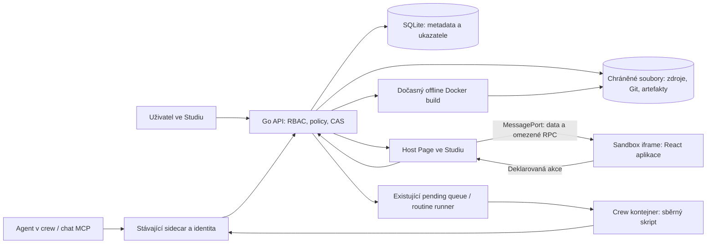

**Crewship Pages Apps — audit implementace a podklad pro nezávislou oponenturu**

Stav: 9. září 2026. Autor: implementující Codex. Určeno vlastníkovi produktu a druhému modelu/reviewerovi. Tento text je obhajoba rozhodnutí a kontrola zdrojů, nikoli nezávislý pentest. Nežádám reviewera, aby přijal mé závěry bez ověření.

**1. Rozhodnutí, které bych doporučil dnes**

Pokračovat s touto architekturou pro **interní dashboardy a jednoduché aplikace nad daty Crewshipu**. Nedeklarovat hotovou univerzální aplikační platformu ani bezpečné spouštění libovolného nedůvěryhodného webu.

Funkční průřez je implementovaný a na dev3 funguje: React stránka, data ze skutečného crew kontejneru, řízené spuštění routine, historie, Git revize, publikování, přenos zdrojů, zálohy a společný vzhled. Závěrečné Go i frontendové sady prošly. **Celá dodávka PRD ještě není uzavřená:** zbývá živé autorství z chatu s více rolemi, čistá produkční instalace runtime, politika podpory prohlížečů při vadném skriptu a review/merge zdrojů.

Nejsilnější stránka řešení je propojení vlastního UI s existujícími producenty dat a oprávněními. Nejslabší stránka je hranice mezi slibem „plně custom“ a skutečně podporovaným, úzkým build profilem. Druhá slabina je správa životního cyklu: přibyl vlastní malý systém pro zdroje, buildy, publikace a obnovu, který je potřeba dlouhodobě udržovat.

**2. Co je předmětem auditu a odkud jsou důkazy**

Autoritativní rozsah: `docs/prd/pages-apps-v1.md`, zvláště aktuální checklist. Starší `pages-apps-architecture.md` a `pages-apps.md` obsahují širší vizi a historické návrhy, nikoli automaticky závazek v1. `pages-apps-handoff.md` obsahuje chronologii i současný stav. Historické odstavce typu „Git zatím není“ nebo „zálohy zbývají“ jsou překonané pozdější implementací. Jejich ponechání je dokumentační dluh; nový reviewer má začít aktuálním checklistem a tímto auditem.

Implementace je ve worktree `/srv/crewship/crewship_3/.claude/worktrees/pages-apps-project`, větev `feat/pages-apps-project`, základ `676e16e45897bf6767f47156a894fb01bfb56162`. **Změny nejsou commitnuté ani mergnuté.** Root checkout je jiná pracovní větev. Nasazená binárka proto není důkaz, že funkce existuje v hlavní větvi nebo běžné distribuci.

Před touto prací již existovaly panelové Pages, producentní API, schémata payloadů, granty, workspace RBAC, sidecar, routine fronta/runner, SQLite a základní backup systém. Nepřisuzuji si jejich vytvoření. Nový rozsah tvoří především source/build/publication vrstva, React runtime a SDK propojení, integrace do existujících záloh/autorů/CLI, demo seed, paleta a UX načítání.

Důkazy rozlišuji takto:

| Označení | Co znamená |
|---|---|
| Kód | Rozhodnutí je přímo dohledatelné v implementaci. Není samo o sobě důkazem všech provozních vlastností. |
| Test | Existuje konkrétní úspěšná automatická kontrola. Rozsah testu je omezený jeho scénářem. |
| Živě | Scénář proběhl proti dev3 a skutečnému runtime/kontejneru. |
| Historicky | Výsledek předchozí etapy, nyní znovu zkontrolovaný v logu nebo handoffu; nebyl v tomto auditu znovu spuštěn. |
| Návrh / riziko | Úsudek autora nebo požadavek na další ověření, nikoli prokázaná chyba. |

Tento audit nepouští další plnou testovací sadu a nemění produktový kód. Kontroluje dokončené výsledky, zdroje a aktuální provozní údaje. Soubor `reports/pages-apps-review-evidence-2026-09-09.json` obsahuje identifikátory a SHA256 vybraných zdrojů a dostupných důkazů; hash prokazuje identitu souboru, nikoli jeho správnost.

**3. Původní vize versus skutečně dodaná v1**

| Přání / očekávání | Skutečný stav | Hodnocení |
|---|---|---|
| Vlastní webová stránka, nikoli jen předem dané bloky | Vlastní React komponenty, CSS, rozložení, grafika, formulářové prvky a lokální stav | Splněno v rámci podporovaného profilu. |
| Vite + React + TypeScript | Jeden verzovaný profil a offline compiler | Splněno; konkrétní verze nejsou argumentem, že jde o „nejlepší stack navždy“. |
| Libovolné knihovny / frameworky | Jen přesně připnuté dependency mapy a lockfile profilu | Nesplněno jako obecný slib; vědomě mimo v1. |
| Odemknout celé Crewship API | Úzké SDK pro data, historii, deklarované akce a vlastní běhy | Vědomé zúžení rozsahu. Plné API SDK není dodané. |
| Stránka navázaná na agenta/kontejner | Agent může být autor, crew je trvalý vlastník/producent; kontejner lze nahradit | Úmyslně stabilnější životní cyklus než vazba na jedno container ID. |
| Tlačítko pustí skript | Tlačítko vyvolá deklarovanou routine; ta spustí skript v crew | Splněno přes existující oprávnění a frontu, nikoli libovolným shellem z browseru. |
| Agent vytvoří Page v chatu | MCP autorství implementované a integračně testované | Ještě chybí živá akceptace celého scénáře s reálným chat agentem. |
| Jeden YAML soubor | Definice Page + projektové soubory/assets | Splněno pro Page. Nezahrnuje automaticky celý backend, secrets, DB ani producenta. |
| Git verzování | Lokální bare Git archiv pro Page + SQL revize a publikace | Splněno. Není to GitHub synchronizace, vzdálený Git hosting ani GitOps deployment. |
| „Kouzelné tlačítko“ zkontroluje všechno | Check kontroluje integritu, build a vazby | Částečně. Není to agentní diagnostika, test správnosti business logiky ani bezpečnostní audit. |
| Firemní vzhled pro nové Pages | Paleta workspace v SDK, starteru a demo aplikaci | Splněno. Vlastní CSS ji může ignorovat; nejde o vynucení design systému. |
| Plynulé otevření / mobil | Řízené načtení a fade, mobilní úpravy shellu, otestované demo | Splněno pro shell a ukázku. Libovolný autor může stále napsat neresponzivní aplikaci. |
| Placená distribuce a „neomezené“ features | Nové entitlementy, účtování a placené balíky zde nejsou | Mimo implementaci. Technické bezpečnostní limity nejsou obchodní limity tarifu. |

**4. Katalog funkcí: proč jsou navržené právě takto**

Každá položka níže je produktová/architektonická funkce, nikoli komentář ke každé jednotlivé Go/TS funkci. Pro kontrolu jednotlivých metod slouží uvedené zdrojové soubory a testy.

| Funkce | Proč toto řešení | Cena, omezení a hlavní důkaz |
|---|---|---|
| Zachování původních panelových Pages | Existující schémata, SLA, producenti a ACL už řeší datovou vrstvu. Vlastní UI je další způsob zobrazení. | Dvě podoby jedné Page zvyšují složitost UI. `components/features/pages/page-application.tsx`, existující `pages_*` API. |
| Jeden React profil | Agent má předvídatelný vstup a compiler má omezenou plochu podpory. | Není možné bez další práce přinést Vue, Svelte, SSR či libovolný React projekt. `tools/pages-build/package.json`, `build.mjs`. |
| Standardní TSX/CSS místo vlastního jazyka | Nevytváříme proprietární jazyk pro rozložení, události a stav. | Agent může vytvářet nekvalitní nebo nebezpečný JS. Framework neřeší jeho důvěryhodnost. |
| Omezené dependency mapy a lockfile | Nedůvěryhodný build nestahuje balíčky a nespouští jejich install scripts. | Aktuální profil obsahuje React/ReactDOM a build nástroje, nikoli katalog chart/grid knihoven. Demo graf je SVG. |
| Vlastní HTML shell runtime | Crewship kontroluje bootstrap, nonce, CSP a kořen aplikace. | `index.html` je v projektu povinný, ale Vite library entry je `src/main.tsx`; volné úpravy HTML shellu nejsou plně podporované. To musí být jasné autorovi. |
| Crew jako stabilní vlastník | Restart kontejneru ani výměna agenta nesmí zrušit Page nebo její historii. | Je nutné rozlišit autora, producenta, vlastníka a čtenáře. Staré Pages mohou mít i jiné podporované typy vlastníka. `pages_project_internal.go`, `pages_project.go`. |
| Autorství z agenta přes MCP | Recykluje existující sidecar identitu a `page_create` policy; agent nepotřebuje uživatelský admin token. | MCP → API → Git → Docker byl testován, živé chat autorství ještě ne. Identita nese crew/agent, ne prokazatelnou identitu konkrétního chat runu. |
| File-patch save a očekávaná revize | Agent nemusí přepisovat celou aplikaci; současná editace se neztratí tichým přepsáním. | Konflikt 409 musí autor vyřešit načtením nové revize; není automatický merge. `pages_project_internal.go`, `pages_project_history_test.go`. |
| Oddělený draft a publikace | Rozpracovaná změna nesmí poškodit dashboard kolegům. | Uživatel musí rozumět „uložené“ versus „publikované“. `pages_project.go`, `pages_project_publish.go`. |
| Lokální Git checkpointy | Přesné zdroje a definice lze přiřadit k revizi a obnovit. | Přibývá Git jako binární závislost a další reprezentace zdrojů. Bez remote, hooks, checkoutů, submodulů či credential helpers. `internal/pages/project_git.go`, `project_archive.go`. |
| SQLite jako autorita ukazatelů | CAS a publikaci lze provést transakčně; Git ref sám nemění živou aplikaci. | SQLite + filesystem nejsou jedna distribuovaná transakce. Neodkazované soubory se musí uklidit. |
| Build oddělený od Go procesu | Compiler a nedůvěryhodný vstup dostanou OS limity, timeout a omezené prostředí. | Crewship potřebuje přístup k Docker daemonu. To je významná operátorská hranice důvěry, ne bezplatná izolace. `internal/pagebuild/docker.go`. |
| Jeden build slot | Zabraňuje tomu, aby několik agentů najednou vytlačilo hlavní server z RAM/CPU. | Chybí fronta a spravedlivé pořadí; další požadavek dostane 429. Při růstu bude potřeba řízený build scheduler. `internal/api/pages_build.go`. |
| Immutable artefakt + digest | Zobrazení a rollback používají již sestavené bytes, bez opakování buildu. | Digest potvrzuje integritu, ne bezpečnost kódu. Artefakt je čtenářům dostupný a není tajný. `internal/pagebuild/build.go`, `store.go`. |
| Preview v sandbox iframe | Kód aplikace nedostane přímo DOM, relaci a oprávnění Studia. | Izolace originu není univerzální izolace CPU ani úplná prevence úniku dat. `runtime.go`, `bootstrap.js`, `page-preview.tsx`. |
| Oddělený runtime site | Omezit dopad vadného JS na Studio; původní srcdoc test se zacyklením hosta nevyhověl. | DNS/TLS/routing jednou pro instalaci; chování závisí na prohlížeči. Dev3 má explicitní slabší vývojovou výjimku. |
| Úzký SDK bridge | Host autentizuje volání a server znovu ověřuje oprávnění; do dítěte nejde token ani libovolná API proxy. | Rozšíření SDK vyžaduje promyšlené endpointy. Přímý `fetch` na vlastní backend není součástí profilu. `sdk.ts`, `preview-runtime.ts`, `use-application-actions.tsx`. |
| Snapshoty z producentů | Otevření dashboardu samo nespouští MySQL/Ansible kontrolu. | Server stále zajišťuje zápisy, čtení a fan-out; nejde o nulovou serverovou zátěž. Kolektor musí mít vlastní provozní plán. |
| Backpressure pro iframe | Jedna nepotvrzená zpráva a poslední čekající snapshot nezaplní frontu při pomalém rendereru. | Slučování záměrně zahazuje mezilehlé stavy; kanál není auditní log ani timeseries. `PreviewSnapshotChannel`. |
| SDK historie | Užitečné porovnání posledních stavů přes stejnou autorizaci jako panel. | Stránkování nejvýše 20 položek a omezené bytes; nejde o analytický sklad. `pages_application_history.go`. |
| Deklarovaná akce | Browser posílá ID existující akce a vstupy; cílová routine zůstává ve schválené definici. | Jen podporovaný druh `call`; libovolný shell/routine/URL z browseru se nepřijímá. `pages_application_actions.go`. |
| Potvrzení ve Studiu | Aplikace si nemůže sama nakreslit autoritativní schválení operace. | Klik navíc; nenahrazuje business pravidla uvnitř routine. `use-application-actions.tsx`. |
| Publication fence + idempotence | Zabrání spuštění podle zastaralé deklarace a omezí duplicitní enqueue. Kontrola verze a vložení do fronty jsou ve stejné SQL transakci. | Nejde o exactly-once provedení všech externích side effectů. Samotná routine musí řešit bezpečné opakování. |
| Stav vlastního runu | Uživatel uvidí svůj pending/run výsledek, nikoli cizí běhy celé firmy. | Potvrzení přijetí neznamená dokončení. Timeout není důkaz zastavení. `ApplicationActionStatus`. |
| Check / publish / rollback / withdraw | Kontrolovat konkrétní zdroje a vazby, přepnout publikaci a mít cestu zpět. | Check výslovně ponechává browser/security review na člověku. Rollback UI nevrací účinky již spuštěných skriptů ani nepřipíná historickou verzi backendové routine. |
| Nová verze bez automatického přepnutí čtenáře | Uživateli se během práce nevymění aplikace a neztratí lokální stav. | Starý otevřený klient musí načíst novou verzi před akcí, pokud se publikace změnila. Bezpečnostní odebrání oprávnění má přednost před zachováním UI. |
| YAML bundle v2 | Jedna přenositelná Page se zdroji, nikoli ruční skládání ZIPů. V1 dál funguje. | Bez Git historie, credentials, živých dat, buildů a automatické instalace producentů. `internal/pages/transfer*.go`, `pages_transfer.go`, CLI. |
| Strict parser a bezpečné cesty | Import nesmí expandovat aliasy, přepsat cizí soubor nebo obejít limity kódováním. | Přísnost přináší odmítnuté projekty; konkrétní rozdíl mezi parserem a compilerem viz rizika. `project.go`. |
| Inertní import a opětovná autorizace vazeb | Přenos souboru není důvěra, grant ani schválení spuštění. | Po importu mohou chybět crew/routines; uživatel je musí dodat. Není to jedno kliknutí na kompletní cizí infrastrukturu. |
| Záloha zdrojů, Git objektů a artefaktů | Samotná SQLite by obnovila ukazatele na chybějící soubory. | Rozšiřuje restore, ID remapping a práci pod lockem. Není tím dokázaná bezchybná obnova při libovolném výpadku disku. `internal/backup/pageprojects.go`. |
| Leases a retence | Mazání nesmí zničit soubor mezi jeho ověřením a použitím. SQL kořeny zůstanou před fyzickým úklidem konzistentní. | Maintenance může zdržet požadavky; Git předkové nadále rostou. Více aktivních writer serverů není podporovaná HA architektura. |
| Společná firemní paleta | Agent i aplikace dostanou stejné sémantické barvy bez omezení layoutu. | Jen šest hex barev, žádná kompletní správa typografie/loga/témat. Staré CSS se nepřebarví magicky. `workspace_pages_theme.go`, `lib/pages/theme.ts`. |
| Animace a řízené načtení | Skrýt prázdný dokument a panelový fallback; odkrýt po prvních datech a render cyklech. | Není to health check ani čekání na všechna asynchronní data libovolného webu. Reduced motion vypíná přechod. |
| Operations Lab demo + seed | Zákazník i agent mají skutečný fungující vzor, ne prázdnou platformu. | Demo není důkaz produkčního nasazení libovolného MySQL/Ansible provozu. Re-seed chrání custom Page/projekt a withdrawals; běžné skripty/routines mají vlastní seed konvenci. |

Hlavní důvod, proč jsem nepřidal Puck, Refine nebo JSON renderer: konečný zúžený v1 scope potřebuje vlastní React UI nad malým SDK. Další autorský/CRUD/blokový systém by přidal další produktový model a podporovaný kontrakt. Není to tvrzení, že tyto frameworky jsou obecně horší. Pokud se později objeví prokázaná potřeba vizuálního editoru nebo rozsáhlého CRUD, má jejich posouzení znovu smysl.

**5. Architektura a hranice infrastruktury**



Go server zároveň obsluhuje konstantní runtime bootstrap. V produkčním návrhu přichází přes odlišný browser site, ve vývojové ukázce přes stejný origin pod explicitním operátorským přepínačem. Diagram proto neznamená samostatný Node server pro iframe.

**Cesta vytvoření:** agent/CLI uloží projekt a draft definici → validace a CAS → immutable snapshot + Git checkpoint → build konkrétní revize → artefakt → preview/check → samostatná oprávněná publikace. Základní Page vzniká existujícím `save_page`; teprve potom následuje `page_project init/read/save/build/status/check`. Agent nemá v `page_project` operaci publish.

**Cesta dat:** naplánovaná routine spustí skript v crew → `page.write` přes existující systém oprávnění → validovaný snapshot → invalidace/čtení ve Studiu → filtrovaná data do iframe. Sealed panely se do SDK snapshotu nezahrnou. Zastarání se neřeší vymýšlením zeleného údaje.

**Cesta akce:** aplikace požádá o action ID → host zobrazí potvrzení → server ověří uživatele, panel, publikaci, deklaraci a vstupy → standardní policy/fronta → pending ID → run ID → výsledek. Změna publikace nebo deklarace mezi kontrolou a enqueue je ošetřená SQL fence.

**Úložiště:** SQLite drží šest Pages Apps tabulek: `page_project_drafts`, `page_project_revisions`, `page_project_builds`, `page_project_publications`, `page_project_live`, `page_project_withdrawals`. Historie zdrojů má Git checkpoint; immutable projektový YAML je praktický obsahově adresovaný snapshot. Artefakt má vlastní hash. Je to úmyslná redundance, ale vyžaduje konzistenční testy a úklid.

```text
/srv/crewship/dev3-pages-data/                 # operátorské soukromé úložiště
  <sha256 workspace ID>/
    <source digest>.yaml
    .maintenance.lock
    git/<sha256 Page ID>/                     # bare Git repozitář
      objects/  refs/checkpoints/  HEAD  config
  artifacts/<sha256 workspace ID>/
    <artifact digest>.json

examples/pages-apps/                          # canonical demo ve zdrojovém repu
  custom-operations.page.yaml                 # definice + celý React projekt
  custom-operations.routine.yaml
  scripts/collect_container.mjs
  embed.go                                   # embed stejných souborů pro seed

tools/pages-build/
  Dockerfile  build.mjs  sdk.ts  package.json  pnpm-lock.yaml
  starter/index.html  starter/src/main.tsx.tmpl  starter/src/style.css
```

Hash adresáře není šifrování ani anonymizace. Přístup chrání filesystem a API. Toto živé úložiště není automaticky šifrované; šifrovaná záloha je samostatná schopnost backup systému. Sources adresář nesmí být připojen do agentových crew kontejnerů.

Dev3: veřejná adresa `https://crewship-dev3.unifylab.cz/pages/custom-operations`, Go listener 8083, embedded Next static export, instance-specific systemd override, binárka `/srv/crewship/dev3-pages-release/crewship`. Dřívější Next dev server není potřebný pro tuto nasazenou ukázku. Novou doménu pro každou Page nepotřebujeme. Produkční runtime adresa a její DNS/TLS jsou však stále nedokončenou instalační povinností.

Git je lokální CLI závislost, nikoli Git server. SQLite už v Crewshipu existuje; nepřidáváme další DB službu. Docker pro agenty už existuje, Pages přidávají jiný, omezený typ dočasného buildu. Není přidaný Kubernetes, Redis, PostgreSQL, samostatná realtime služba ani trvalý app server na každou Page.

**6. Oprávnění a bezpečnost: co lze a nelze obhájit**

| Operace | Serverová hranice |
|---|---|
| Číst publikovanou aplikaci/data | Oprávnění k Page a jednotlivým panelům v autentizovaném workspace. |
| Číst/exportovat původní projekt, editovat a buildit | Page edit právo; běžné právo vidět dashboard nestačí. |
| Publikovat / spravovat publikaci | Page ownership nebo administrace workspace; nestačí samotný write grant. |
| Agentní init/save/build | Interní token + crew/workspace vazba + skutečný acting agent + owner crew/delegace + `page_create` policy. |
| Spustit akci | Práva uživatele, čitelnost panelu, aktuální publikace a uložená call deklarace, běžné action gates. |
| Číst stav akce | Vlastní invoking user, stejná Page/workspace a stále čitelný panel. |
| Upravit firemní paletu | OWNER/ADMIN workspace; přes šest validovaných barev nelze dodat CSS/URL. |

Rozhodující je server, nikoli viditelnost tlačítka ani TypeScript typ. Publication fence, RBAC a sandbox jsou různé vrstvy; žádná nenahrazuje ostatní.

Iframe má `sandbox="allow-scripts"` bez `allow-same-origin`, vlastní CSP a dedikovaný MessagePort. Bootstrap ověřuje přesný parent a přijme jednu inicializaci. Kód se nepouští přímo v React stromu Studia. Přenos neobsahuje uživatelský token. Zákaz síťového fetch v CSP ale **není kompletní důkaz prevence exfiltrace**: navigace vlastního iframe a další browser chování vyžadují oddělené posouzení. Odpojení portu po navigaci nevrátí již předaná data.

Toto omezení není specifické pro náš jazyk komponent. Iframe je samostatný dokument s vlastní navigací a náklady; vlastnosti sandboxu popisuje [MDN iframe](https://developer.mozilla.org/en-US/docs/Web/HTML/Reference/Elements/iframe). Procesové oddělení různých sites v Chromiu je jiná vrstva než omezení DOM; viz [Chromium Site Isolation](https://www.chromium.org/Home/chromium-security/site-isolation/). Tyto reference nejsou důkazem, že naše aplikace prošla pentestem.

Z toho plyne podporovaný model důvěry: **reviewovaný interní kód**, omezené datové oprávnění a kontrolované akce. Netvrdím, že admin může bezpečně publikovat libovolný škodlivý JS z internetu nad citlivými daty. `reviewed_code=true` je prohlášení oprávněného uživatele, nikoli automatická kontrola obsahu nebo dvoučlenné schválení.

Čtenář musí získat spustitelný JS/CSS, a může si jej prohlédnout. Právo edit chrání původní projektový export, nikoli tajemství natvrdo zapsané do klientského JS. Zákaz `.env` souborů není secret scanner. Podobně odvolání oprávnění zamezuje dalším autorizovaným operacím; nemůže vymazat dříve stažená data z uživatelova počítače.

Běžné zobrazení v Safari potvrdil uživatel a automatické WebKit testy nyní ověřily načtení, animaci a mobilní obsah. Historické Firefox/WebKit testy **zastavení nekonečné smyčky** neprošly. Nejde o rozpor. Čtyři rozdílné výroky jsou: „vykreslí se“, „nečte parent DOM“, „vadný skript nezablokuje Studio“ a „má hard CPU/RAM limit“. Splnění prvních dvou neprokazuje další dva. Dev3 používá slabší same-origin development mode a procesovou ochranu negarantuje ani z principu návrhu této výjimky.

**7. Provozní náročnost a skutečná měření**

Čísla níže nejsou doporučené minimální HW požadavky. Jsou to buď limity implementace, nebo jednorázová měření této instance. Nemáme kontrolní měření stejného Crewshipu bez Pages, takže z nich neodvozuji přesnou režii funkce.

| Oblast | Konkrétní údaj | Co z něj lze vyvodit |
|---|---|---|
| Build | 1 aktivní slot na instanci; 1 CPU, 1 GiB RAM/swap limit, 128 PID; Node heap 384 MiB | V době kompilace musí host mít rezervu. Je to limit, nikoli obvyklá naměřená spotřeba. |
| Build izolace | Read-only rootfs; `/work` tmpfs 512 MiB, `/tmp` 32 MiB; bez sítě a crew mountů; UID 1001, cap-drop ALL, no-new-privileges | Omezený blast radius; stále důvěřujeme Docker daemonu, kernelu a připnutému image. |
| Deadline | Kontejner 120 s, Go wrapper 130 s, cleanup do 10 s; TypeScript fáze 45 s | Build se nemá změnit na neomezený proces ani po pádu klienta. |
| Build image | Docker inspection: 123 250 463 B, přibližně 117,5 MiB | Jeden tools image, nikoli jeden image na Page. Není to komprimovaná download size ani veškerá Docker disk režie. |
| Živý artefakt | 207 467 B JS+CSS; JSON soubor 223 147 B | Operations Lab je relativně malý bundle. Nelze to přenést na každou budoucí aplikaci. |
| Pages úložiště dev3 | `du`: 1 096 KiB | Současné malé demo, ne kapacitní test stovek Pages. |
| Crewship binárka | `du`: 143 724 KiB, přibližně 140,4 MiB | Celá binárka s embedded webem; není to velikost samotné funkce Pages. |
| Systemd MemoryCurrent | 147 214 336 B, přibližně 140,4 MiB při auditu | Celá služba v daný okamžik; není izolované RSS Pages ani dlouhodobý peak. |
| Demo kolektor | 8 cgroup vzorků, zhruba 1,2 s sběru; konkrétní úspěšný run 1,388 s, další kolem 1,9 s | Bez LLM a bez síťových dotazů. MySQL/Ansible workload může být výrazně dražší. |
| Historické API ověření | 24 současných čtenářů, 480 conditional reads, 0 opakovaných body bytes artefaktu, p95 přibližně 25–45 ms | Omezený test čtení na sdíleném dev hostu. Nezahrnuje všechny payloady, stovky buildů ani dlouhodobý provoz. |

Zdrojový projekt: nejvýše 256 souborů, 512 KiB na soubor, 2 MiB decoded obsah, 4 MiB serializovaný dokument. Artefakt: 2 MiB JS+CSS, až 8 MiB JSON envelope. RPC vstup: 32 KiB. Snapshot do iframe: 1 MiB; maximálně 10 odeslání/s, jedna nepotvrzená a jedna poslední čekající zpráva. SDK drží nejvýše 32 čekajících RPC, timeout 90 s; host omezuje současné požadavky a jejich frekvenci. Historie vrací nejvýše 20 položek a omezený objem odpovědi.

Workspace má oddělené kvóty přibližně 128 MiB pro source snapshots, 128 MiB pro artefakty a 128 MiB pro Git, plus počtové limity. Nejde o přesný 384 MiB limit veškeré diskové spotřeby workspace: SQL, filesystem overhead, staging, zálohy a další Crewship data jsou zvlášť. Kvóty per workspace nejsou globální kapacitní politika serveru.

Retence drží posledních 64 revizí/buildů a 32 publikací plus chráněné kořeny živé verze, draftu a běžících buildů. Maintenance probíhá zhruba jednou za hodinu, s omezeným časem na workspace. Počty nejsou jednoduchá tvrdá horní mez, protože živé závislosti se nemažou.

**Jak roste zátěž:** počet klientů sám nezvyšuje počet sběrů z MySQL, ale zvyšuje počet autorizovaných čtení, websocket připojení a předání dat. Reader má navíc 60s conditional revalidation publikace: řádově N/60 požadavků za sekundu pro N aktivních otevřených aplikací, k tomu změnové invalidace a ostatní provoz. MessagePort backpressure omezuje frontu v browseru, nikoli celkový síťový fan-out Go serveru. Velké payloady krát velký počet čtenářů zůstávají drahé.

Můj úsudek: **lehký běžný provoz, středně náročné buildy, významná údržbová složitost**. Není důvod přidávat služby před měřením problému. Ale není poctivé tvrdit, že funkce „nenafukuje Crewship vůbec“.

Při auditu měl celý pracovní strom 198 dotčených/nových cest: 102 implementačních, 59 testových, 26 docs/examples a 11 generated/config/lock. Orientační filtr produkčních přípon ukázal 53 nových kódových souborů s 5 886 řádky plus 751 přidaných/198 odebraných řádků v existujících kódových souborech. Je to mechanický odhad rozsahu WIP, nikoli přesná metrika hodnoty nebo čistá statistika budoucího PR. Generované OpenAPI a celé již existující soubory nesmějí být vydávané za nové ručně napsané LOC.

**8. Testy a co opravdu prokazují**

| Důkaz | Výsledek a rozsah |
|---|---|
| `/tmp/pages-loading-all-go.log` | Celý repozitář: 139 testovaných balíčků + 11 bez testů, exit 0. API 984,276 s, database 951,467 s. |
| `/tmp/pages-loading-all-frontend.log` | 670 souborů / 8 192 testů, exit 0. Jde o celý frontend, nikoli 8 192 specifických Pages bezpečnostních testů. |
| `/tmp/pages-loading-responsive-tests.log` | 502 cílených frontendových testů pro Pages/layout a související transport. |
| `/tmp/pages-loading-vet.log` | `go vet ./...`, exit 0. |
| `/tmp/pages-loading-final-build.log` | Next static export a TypeScript sestavení prošly. |
| `/tmp/pages-loading-final-lint.log` | 0 chyb, 32 existujících warnings. Nelze říkat „bez warnings“. |
| `/tmp/pages-loading-final-browser.log` | Skutečný Chromium i WebKit: zpožděný bootstrap skrytý, render fade, desktop/900/390 px, nepřekrytá hlavička, služby, rozbalená historie, reduced motion, žádné Page runtime errors. |
| `/tmp/pages-loading-live-action.log` | Skutečné dev3: přihlášení, React, filter, SDK historie, stop/reopen, potvrzení, Ops container routine a dokončený vlastní run. |
| `/tmp/pages-theme-live-browser.log` | Uložení palety přes UI, doručení jiné otevřené záložce bez remountu, návrat původní palety, animace. |
| `/tmp/pages-theme-seed-docker.log` | Skutečný offline Docker build a seed lifecycle včetně ochrany upraveného projektu a stažené publikace. |
| P5 acceptance v handoffu | Historické skutečné MCP/API/Git/Docker testy, MySQL/Ansible pilot, encrypted backup/fork restore, restart, revokace a omezená zátěž. Přesné logy a test soubory jsou v handoffu. |

Konkrétní regresní brány: `pages_project_publish_test.go` pro CAS/rollback/reach, `pages_application_actions_test.go` pro oprávnění/akce, `pages_project_internal_test.go` pro agentní identitu/policy, `pages_project_retention_test.go` pro chráněné kořeny, `internal/backup/pageprojects_*test.go` pro přenos souborů, `project_git*_test.go` pro archiv, `page-loading.test.tsx` pro skrytí dokumentu a chybu načítání.

Docker/browser testy mají vlastní předpoklady a některé Go integrační testy se bez konfigurace přeskočí. Samotná zelená `go test ./...` tedy neprokazuje živý Docker/browser průchod. Proto jsou výše uvedené samostatné skutečné průchody důležité.

Neověřeno: kompletní živá tvorba z chatu s více rolemi, čistá zákaznická produkční instalace, dlouhodobý soak test, stovky souběžných dashboardů s velkými payloady, spravedlivé sdílení buildu mezi mnoha workspace, univerzální browser RAM/CPU izolace, úplný audit přístupnosti, nezávislý penetrační test, libovolná kombinace výpadku filesystemu/DB při obnově.

**9. Nálezy a slabiny, které má reviewer aktivně napadat**

| ID | Závažnost / typ | Nález a požadovaná reakce |
|---|---|---|
| A01 | Blokátor produkčního příslibu; ověřené omezení | Dev3 má same-origin development výjimku. Oddělený runtime a čistý instalační postup nejsou dokončené. Nedeklarovat produkční procesovou izolaci. |
| A02 | Blokátor široké browser podpory; historický test | Firefox/WebKit stop-loop selhal. Běžné Safari zobrazení a nové WebKit smoke testy to neuzavírají. Stanovit podporovanou politiku a ověřit její implementaci. |
| A03 | Bezpečnostní model; známá mez | CSP + iframe + review flag nejsou úplná ochrana před exfiltrací či škodlivým autorem. Výslovně omezit model důvěry a nepublikovat secrets v payloadu/kódu. |
| A04 | Akceptace produktu; dosud neověřeno | Funkci mají tvořit agenti v chatu, ale živá ukázka vznikla přes CLI. Dokončit celý agentní scénář, včetně čtenáře a revokace. |
| A05 | Release proces; ověřený stav | Zdrojové WIP není commitnuté/reviewované/mergnuté. Rozdělit review po vrstvách, zachovat testové důkazy a zabránit ztrátě worktree. |
| A06 | Kapacita a lifecycle; odvozeno z kódu | Git prune zachovává předky ponechaných commitů. Lineární historie může růst i po retenci SQL revizí a narazit na 128 MiB kvótu. Potřeba politika archivace/checkpointů nebo explicitní dlouhodobý limit. Netvrdit, že retence automaticky udrží Git navždy malý. |
| A07 | Kompatibilita; návrhová mez | Source runtime je `react-vite-typescript/v1`, ale SDK je vložené z aktuálního tools image. Stejný zdroj + lockfile s jiným SDK image nemusí dát stejný výsledek. Toolchain je evidovaný u artefaktu, portable source sám nezaručuje bitově reprodukovatelný rebuild. Definovat podporu starých profilů a upgrade/migrace. |
| A08 | Konkrétní nesoulad validátorů; statická kontrola | Go parser připouští některé přenositelné Unicode/mezery v cestách, worker má užší regex a odmítá skryté segmenty. Projekt může projít importem/save a selhat až v buildu. Příklad k reprodukci: `src/čísla.tsx`. Sjednotit kontrakt nebo dát včasnou profilovou chybu. V tomto auditu neopravováno. |
| A09 | Provozní model; výslovný limit kódu | Source quota admission má procesový mutex; maintenance lease není důkaz podpory více aktivních Go writerů nad stejným úložištěm. Neprezentovat jako HA/distribuovanou architekturu. |
| A10 | Výkon/fairness; návrhová mez | Jeden globální build slot chrání host, ale jeden aktivní autor může ostatní opakovaně blokovat. Potřeba měřit 429, dobu buildu a případně zavést spravedlivou frontu. |
| A11 | Backup/fault tolerance; mez důkazů | Restore validuje soubory předem a aplikuje je před SQL commit pod lease. To je rozumné pořadí, ale ne jedna atomická transakce filesystem + SQLite + Docker. Doplnit cílený fault injection podle konkrétních failure windows. |
| A12 | Produktová použitelnost; vědomé omezení | „Full custom“ neznamená vlastní npm dependencies, HTML shell, externí fetch, SSR, routovací server či vlastní SQL backend. UI/onboarding musí tento profil vysvětlit; jinak agent opakovaně generuje nepodporované projekty. |
| A13 | Dokumentační dluh; ověřeno | PRD/handoff mají dlouhou chronologii s překonanými tvrzeními. Aktuální checklist existuje, ale pro release je vhodné oddělit současnou specifikaci od archivu. Také některé inline komentáře záloh ještě odkazují na dobu před file-phase integrací. |
| A14 | Metriky a provozní přehled; neověřená úplnost | Existují job stavy, audit a logy. Není doložený ucelený Pages SLO dashboard, dlouhodobé latency/queue/quota/GC trendy ani alerty pro všechny selhané buildy a stale producenty. |
| A15 | Údržba klientských aplikací; otevřený produktový proces | Git historie umožňuje návrat, ale sama neudržuje staré klientské aplikace při změně SDK. Potřeba vlastník údržby, kompatibilitní testy a bezpečný upgrade workflow. |
| A17 | Konzistence schválení; známá mez | Publikace připíná Page definici a UI artefakt, nikoli verzi backendové routine a jejích skriptů. Runner vykonává aktuální routine. Změna jejího obsahu může změnit účinek stejného tlačítka. Zdokumentovat rozsah review; pro citlivé akce zvážit pin revize nebo opakované schválení. |
| A16 | UX/obchodní slib; dosud mimo v1 | „Neomezený“ placený tarif nesmí automaticky odstranit hard limity paměti, payloadů a execution. Oddělit obchodní entitlement od ochrany infrastruktury. |

A06–A17 nejsou všechny automaticky blokátory pilotu. Jejich priorita závisí na tom, zda produkt vydáváme pro pár reviewovaných interních Pages, nebo pro mnoho nedůvěryhodných autorů a zákaznických instalací. Druhou variantu současné důkazy nepodporují.

**10. Co bylo v průběhu práce chybně a jak se to opravilo**

Nechci prezentovat jen zelený konec. Testy a živé ověření odhalily mimo jiné:

- JSON objekt z `page.write` template se změnil na string a neprošel panelovým schématem. Opravený průchod zachovává objekt a odmítá nesprávný typ.
- Veřejná Studio adresa byla nesprávně používaná pro interní token sync/IPC; veřejný proxy správně vracel 404. Oddělena interní Go adresa od veřejného parent originu, proxy ochrana se nevypnula.
- Nové workspace `pages_theme` nešlo přímo scanovat ze SQLite TEXT do používaného RawMessage typu. Přidán string scan buffer a testy GET/list/update.
- Paleta dorazila druhé záložce, ale background refresh nastavil `loading=true` a remountoval aplikaci. Zachována načtená data během background refresh, doplněná regrese a živý test bez navigace iframe.
- OpenAPI obsahovalo `pages_theme`, ale chybělo v required response fields. Celá Go sada to odhalila; schéma opraveno a následný poslední celý Go běh už prošel.
- Bílé pozadí iframe a předčasný panelový fallback způsobovaly bliknutí. Zaveden host loading state a runtime render handshake. Mobilní hlavička se překrývala kvůli zmenšování identity; opraven flex shrink.
- WebKit testovací fixture při přechodu z dashboardu zachytávala rušené požadavky a příliš brzy vzorkovala animaci/resize. Opraveno čekání a oddělení autentizace v nové záložce; neumlčely se plošně chyby runtime.

To jsou důvody pro integrační a browser testy vedle unit testů. Není správné z testové chyby dělat vždy chybu produktu, ani produktovou chybu přejmenovat na „flaky test“ bez vysvětlení.

**11. Které funkce mají nejvyšší hodnotu**

Toto je produktový úsudek, nikoli validace trhu.

1. **Vlastní UI nad již existujícími crew daty a routines.** Uživatel může dostat stránku přesně pro svůj tým, aniž Crewship naprogramuje každou vertikálu.
2. **Řízený přechod od přehledu k akci.** Dashboard není mrtvý report: uživatel může spustit povolenou operaci a dohledat svůj výsledek.
3. **Agentní autorství se stejným SDK a profilem.** Potenciálně hlavní diferenciátor; právě proto je živá chat akceptace důležitější než další vizuální efekty.
4. **Draft/publish/rollback a vlastnictví.** Ochrana běžné práce ostatních před rozpracovanou změnou.
5. **Přenosný YAML a kvalitní seed.** Zkracují cestu od instalace k funkčnímu příkladu a snižují závislost na ruční konfiguraci autora.
6. **Firemní paleta a hladký shell.** Výrazný UX přínos za relativně malou provozní cenu; nemají nahrazovat funkční a bezpečnostní základy.

Zálohy, limity, revokace a retence jsou vysoká infrastrukturní hodnota, ale obtížně se prodávají jako „wow feature“. Jejich nepřítomnost by se ukázala až při incidentu.

Co bych teď nepřidával: marketplace, více frontend frameworků, trvalé servery na Page, univerzální SQL vrstvu, automatický neomezený npm install a široké API proxy. Nejdřív dokončit stávající release gates a nasbírat skutečné použití několika týmů.

**12. Doporučený pořadník dokončení**

1. Nezávisle prověřit bezpečnostní model a deployment výjimku; určit přesnou produkční deklaraci podpory browserů a důvěry v autory.
2. Provést živé vytvoření a změnu Page z chatu, publish oprávněným člověkem, akci a odebrání oprávnění. Zapsat reprodukovatelné kroky.
3. Čistá instalace a obnova včetně runtime DNS/TLS, připnutého tools image, Git CLI a filesystem oprávnění.
4. Sjednotit source/build validaci cest a dokumentovat skutečný build profil. Ujasnit pravidla jeho verzování před širší distribucí.
5. Uzavřít review/PR/merge. Rozdělení po vrstvách je vhodnější než požadovat povrchní schválení velkého monolitického diffu.
6. S pilotními zákazníky měřit tvorbu první užitečné Page, počet úspěšných akcí, potřebu custom dependencies, build odmítnutí, stale data a náklady údržby. Teprve podle výsledků rozšiřovat stack.

**13. Zpráva pro druhý model — lze předat beze změn společně s tímto souborem**

Jsi nezávislý reviewer implementace Crewship Pages Apps. Předložený dokument napsal autor řešení; ber jej jako soubor tvrzení k ověření, ne jako autoritu. Posuď, zda řešení odpovídá zúženému PRD pro pokročilé interní dashboardy a jednoduché aplikace, a zároveň výslovně označ rozdíly oproti původní širší vizi uživatele.

Nejdřív napiš vlastní verdict: přijmout pro pilot / přijmout podmíněně / odmítnout, a zvlášť verdict pro produkční distribuci. Potom ověř funkce a architekturu proti zdrojům a testům. U každého nálezu uveď závažnost, konkrétní soubor/metodu, scénář selhání nebo reprodukci, dopad na uživatele, nejmenší smysluplnou opravu a zda je to release blocker.

Zaměř se zejména na hranici iframe versus plná prevence exfiltrace a CPU izolace; serverové RBAC a revokaci; publication fence a idempotenci akcí; agentní identitu bez impersonace uživatele; source/Git/SQL/artifact konzistenci; restore failure windows; Git retenci; kompatibilitu build profilu a SDK; agregovanou zátěž mnoha uživatelů; a rozpor mezi „full custom“ a pevnými dependencies.

Neoznačuj za chybu to, že nebylo implementováno vše z původního brainstormingového návrhu, pokud to aktuální PRD vědomě vyřadilo. Současně nepřijímej tvrzení „hotové PRD“, pokud chybí výslovně otevřené release gates. Běžný úspěšný Safari render nepovažuj za důkaz stop-loop izolace. Počet testů nepovažuj za procento bezpečnostního pokrytí. Nezaměňuj celkovou paměť Crewshipu za režii Pages.

Navrhni i jednodušší alternativu, pokud zachová vlastní UI, agentní autorství, existující oprávnění, bezpečné akce, přenos a obnovu. U každé alternativy pojmenuj, který současný požadavek by oslabila. Uveď, co bys ponechal, co odstranil a co je potřeba ověřit před placenou distribucí. Pokud nemáš zdrojový repozitář nebo logy, explicitně omez verdict na návrh a nepředstírej jejich kontrolu.

**14. Mapa pro kontrolu zdrojů**

| Oblast | Primární soubory |
|---|---|
| Scope / historie | `docs/prd/pages-apps-v1.md`, `pages-apps-handoff.md` |
| Source codec / transfer | `internal/pages/project.go`, `transfer.go`, `transfer_parse.go`, `internal/api/pages_project.go`, `pages_transfer.go` |
| Git / files / lock | `internal/pages/project_store.go`, `project_git.go`, `project_archive.go`, `project_lease.go`, `project_retention.go` |
| Build | `internal/api/pages_build.go`, `internal/pagebuild/{docker,build,store}.go`, `tools/pages-build/build.mjs` |
| Runtime | `internal/pagebuild/runtime.go`, `bootstrap.js`, `components/features/pages/page-preview.tsx`, `lib/pages/preview-runtime.ts` |
| Agentní autorství | `internal/api/pages_project_internal.go`, `internal/sidecar/pages_project.go`, `tools/pages-build/profile.go` |
| Publish / lifecycle | `internal/api/pages_project_publish.go`, `pages_project_lifecycle.go`, `pages_project_history.go`, `pages_project_retention.go` |
| Akce / historie | `internal/api/pages_application_actions.go`, `pages_application_history.go`, `pages_actions.go`, `components/features/pages/use-application-actions.tsx`, `tools/pages-build/sdk.ts` |
| Backup | `internal/backup/pageprojects.go`, `runner_create.go`, `runner_restore.go`, příslušné `pageprojects_*test.go` |
| Paleta | `internal/api/workspace_pages_theme.go`, `workspaces*.go`, `hooks/use-workspace.ts`, `lib/pages/theme.ts`, `pages-appearance-card.tsx` |
| Navigace / loading | `components/features/pages/page-application.tsx`, `page-preview.tsx`, `pages-layout.tsx`, `components/layout/sub-bar.tsx` |
| Demo / seed | `examples/pages-apps/`, `cmd/crewship/seeddata/pages_app.go`, `cmd_seed_page_app.go`, `cmd_seed_data_pages.go`, `cmd_seed_data_packs.go` |
| Živé browser ověření | `e2e/pages-loading-smoke.mjs`, `e2e/pages-appearance-smoke.mjs`; patologický runtime test `e2e/pages-preview-smoke.mjs` |

Nasazená publikace Operations Lab: source revision/publication 3, source digest `4ad8095167662e7f55be7762114e9e2706949ce0360200d905bf6d928697ea16`, Git `c464ac447263853764fe20ad63a8c1f5aae92048`, artifact `c10d979889a7dbcd86caee7361124c0b4202aaa1d6abdfdf1da7d8668298c38e`. Aktuální dev3 binárka po loading úpravě: SHA256 `f82b350d6c229892e25b8df7e66c1c745abc4826b226ff2d0b0e1aa7db531fe7`. Tools image: `sha256:cca058230111eea5d07fa69c7537647ee46ea1b5b841233e3ff632e65b0dafb2`.

Review jiného commitu, worktree nebo binárky nemusí hodnotit tutéž implementaci. Samotný tento dokument nezpřístupňuje druhému modelu soukromý repozitář ani serverové logy.
