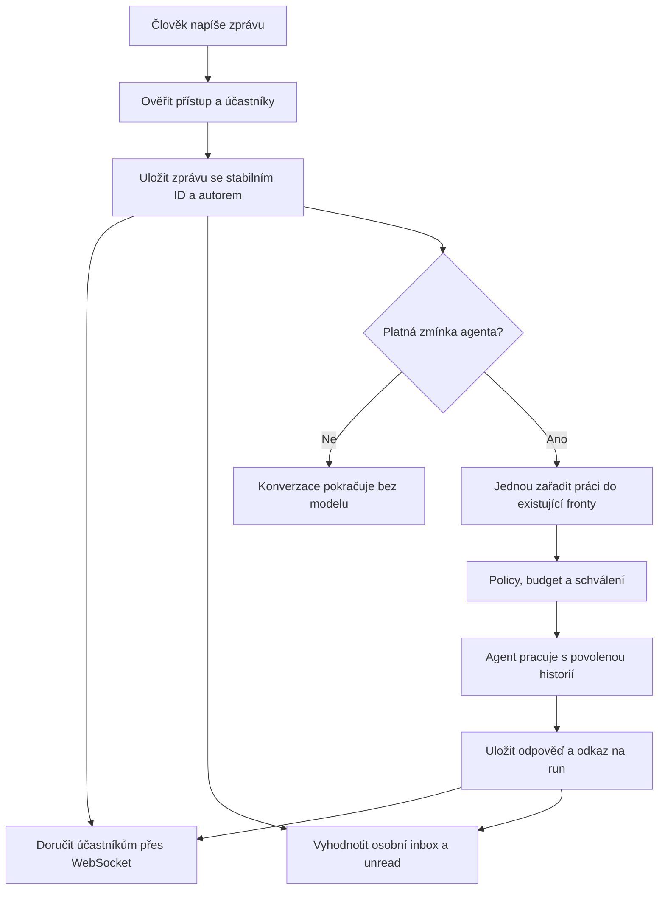

# Chat Dev2 — audit, opravy a příprava společných konverzací

Datum: 2026-09-06. Zadání: opravit základní práci s chatem a připravit lehký
společný prostor lidí a agentů, inspirovaný Buzz. Nejde o požadavek na přepis
Crewshipu ani na převzetí síťového protokolu jiné aplikace.

## Co bylo skutečně ověřeno

- Výchozí běžící Dev2: `2369cabc`, Go 8082 / Next 3012. Pracovní větev vychází
  z čerstvě staženého `origin/main e7eb4361`; chatové soubory se mezi těmito
  revizemi nelišily. Místní AGENTS.md/CODEX.md zachovány.
- Chromium přihlášený dokumentovaným demo účtem, veřejný Dev2, desktop
  1440 × 1000 a mobil 390 × 844. Žádný reset dat ani změna hesla.
- Existující `/chat/ma-ena` načetl skutečnou historii. Picker pod malým `+`
  obsahoval Mařenu i přes její existující konverzace. Absolutní zákaz druhé
  session se nepotvrdil; běžná cesta přes Commands byla vypnutá.
- Team skutečně zobrazil „No conversations yet / Agent-to-agent conversations
  will appear here.“ Mobilní More zobrazilo záložky bez obsahu. V této
  průchodové kontrole nebyly nezachycené JavaScriptové chyby.
- Dva uživatelovy screenshoty: první zachycuje otevřenou command palette a
  ztmavující backdrop. Nelze z něj odvozovat běžný kontrast celého chatu.
  Druhý zachycuje filtr Issues při zobrazení přímé konverzace.

Níže jsou oddělené reprodukované vady, nálezy z kódu a produktové návrhy.
Podrobnosti backendu: [architektura společného chatu](chat-workspace-architecture-2026-09-06.md).

## Zjištění podle priority

| Priorita | Zjištění | Důkaz / dopad |
|---|---|---|
| P1 | New session v Commands je zakázaná | `composer/slash-palette.tsx`, CLIENT_ACTION_CONTRACT; požadovaná operace dostává jen radu hledat jiný ovladač. |
| P1 | Obecný start je schovaný v tlačítku 20 × 20 px | `conversations-sidebar.tsx`; živý picker funguje, ale hlavní úkol není viditelná primární akce. |
| P1 | Nový chat zůstane pod Issues/Routines a bez vybraného řádku | `chat-client.tsx`, startConversation; UUID se změní, ale scope a lokální draft nejsou viditelně sladěné. |
| P1 | Mobilní More míří do vypnutých Triggers | `chat-panel.tsx`, `right-panel.tsx`, `lib/feature-gates.ts`; potvrzeno prohlížečem. |
| P1 | Mobilní Files nezapínají načítání souborů | `filesVisible` v chat-panel; záviselo pouze na desktop drawer store. |
| P1 | Souborová chyba se může vydávat za prázdný seznam | původní fetch mapuje non-OK na `[]` a polyká exception; uživatel nepozná selhání. |
| P1 | Preview u vytvořeného souboru volá prázdnou funkci | `noopFileClick` → `AssistantTurn`; tlačítko nesplní deklarovanou akci. |
| P1 | Rozepsaný text nepřežije návrat do konverzace | composer čistil draft store při send, ale při psaní do něj neukládal a neobnovoval jej. |
| P1 | Šipky a Escape v mention pickeru nefungují správně | každý keyup resetuje výběr; Escape ho znovu otevře. Nové regresní testy nejprve selhaly na obou případech. |
| P1 | Team znamená něco jiného, než uživatel čeká | je to read-only `peer_conversations`, bez lidí a bez členství v chatu. |
| P1 | Team filtruje až po limitu celé crew | relevantní zprávy se ztratí za aktivitou jiných agentů. Filtr musí být v SQL před LIMIT. |
| P1 | Neuložená editace souboru může zmizet | explicitní close/open jiné položky a remount panelu; musí být chráněná samostatně od draftu zprávy. |
| P2 | Sidebar nemá úplnou synchronizaci změn z jiného klienta | místní obnovy a agent.status nejsou kompletní conversation event contract. |
| P2 | Live je odhad podle nejnovějšího threadu běžícího agenta | může označit jinou session, než ve které agent pracuje. Potřebuje skutečné session/run ID. |
| P2 | Pravý drawer odsazen 48 px vedle 56px railu | nesoulad rozměrů v right-drawer a right-rail. |
| P2 | Historie komunikace agentů je oříznutá | line-clamp bez cesty k celé otázce/odpovědi. |
| P2 | Files jsou agent-scoped, copy tvrdí session | je třeba pojmenovat skutečný rozsah; budoucí přílohy místnosti jsou jiná datová vazba. |
| P1 | Upozornění na odpojení překrývá akce hlavičky | Zachyceno při browser ověření; banner má být v layoutu, ne přes klikatelné New chat/Commands. |
| P1 | Team → jiný agent změní URL, ale ponechá původní chat | Zachyceno s novým Team v sestaveném frontendu; dynamická exportovaná route se při klientské navigaci nemusí remountovat. Odkaz nyní načte cílovou route. |

P1 zde znamená zásadní funkční problém při běžném úkolu, nikoli automaticky
bezpečnostní klasifikaci. Nálezy nejsou tvrzení, že všechny nastaly v té jedné
uživatelově session.

## Vizuální a interakční návrh

Zachovat tmavý základ, rozdíl mezi rámem a čtecí plochou, omezenou šířku
textu a sbalitelné panely. Uživatel tento směr přijímá. Největší přínos mají
jasné akce a skutečně fungující vztahy mezi částmi aplikace.

1. **Nová konverzace musí být čitelná akce.** Viditelné tlačítko v levém
   sloupci, plus možnost založit další chat se stejným agentem z hlavičky
   a Commands. Po kliknutí vybraný draft, fokus composeru a Direct scope.
   Nevytvářet serverovou session pouhým navštívením stránky. Persistovat při
   první zprávě nebo uploadu přes existující ensureSession.
2. **Hlavička říká, kde jsem.** Název konverzace / místnosti, účastníci,
   stav odpovědi. Role, model, počty skills/credentials a runs patří do
   rozbalitelného detailu. U prázdné konverzace zbytečně neopakovat celou
   stejnou hlavičku v těle.
3. **Prázdný stav pomáhá začít.** Krátké „S čím chceš pomoci?“ + 2–3
   skutečně relevantní návrhy. „0 skills“ není hlavní sdělení agentovy
   použitelnosti; může fungovat přes svůj prompt. Nabídky nemají předstírat
   schopnosti, které agent nemá. Volný prostor v prázdném chatu sám o sobě
   není chyba; problém je obsah a vzdálenost od místa psaní.
4. **Pravý panel nese kontext otevřené konverzace.** Files jasně rozlišuje
   přílohy této konverzace, agentovy výstupy a crew files. Team nyní může
   poctivě ukázat roster crew a samostatnou spolupráci agentů. Až bude
   fungovat membership, přibude skutečné „Účastníci konverzace“.
5. **Commands nabízí proveditelné akce.** Primární chatové příkazy před
   administrací. U zakázaných akcí viditelný celý důvod, nikoli oříznutý
   text. „Create routine from conversation“ vyžaduje skutečný návrh
   workflow a review; pouhé otevření plánovače není ekvivalent.
6. **Mobil má stejnou funkci.** Stejné drafty, přílohy, mention picker a
   dostupné panely. Nepřebírat label More s neexistujícím cílem.
   V dodaném balíčku jsou přímo Chat / Files / Team, bez druhé řady
   konkurenčních tabů uvnitř panelu.

Budoucí levý sloupec: Konverzace, Skupiny/kanály a odděleně automatická
práce (Routines, Issues). Nepřidávat nefunkční položky s nulou jen kvůli
vizuálnímu dojmu úplnosti. Stávající backend rozlišování druhů konverzací
ponechat před stránkováním, jinak rutiny opět vytlačí lidské konverzace.

## Rešerše Buzz a co z ní přenést

Ověřený produkt je **Buzz od Block**, odkazovaný z buzz.xyz na
[block/buzz](https://github.com/block/buzz). Web byl načten skutečným
Chromium; dokumentace přes oficiální repozitář. Buzz nebyl instalován ani
otestován s účtem; schopnosti níže jsou tvrzení projektu, nikoli náš E2E
výsledek.

- [README](https://github.com/block/buzz/blob/main/README.md) popisuje společné
  místnosti lidí a agentů, kanály, vlákna, DM a propojení konverzací s prací.
  Smysluplná inspirace pro Crewship je společný kontext a dohledatelný
  výsledek práce.
- [VISION](https://github.com/block/buzz/blob/main/VISION.md) odděluje otevřené
  kanály, soukromé kanály a účastnické DM; přístup vynucuje server. Rozlišuje
  průběžnou komunikaci od osobního feedu a omezuje výchozí notifikační hluk.
  Pro Crewship navrhujeme osobní inbox pro zmínky, přímé zprávy, žádosti
  o rozhodnutí a výsledky sledované práce, nikoli kopii každé zprávy.
- [ARCHITECTURE](https://github.com/block/buzz/blob/main/ARCHITECTURE.md)
  popisuje události, subscriptions a most @mentions → agent. Crewship už má
  journal, WS, queue, policy a inbox; propojit existující části společnými
  identitami je vhodnější než zavádět nový paralelní relay.

Nostr, nové podpisové identity, vlastní git hosting, voice huddles, mobilní
nativní aplikace a síťová federace nejsou podmínkou požadovaného lehkého
chatu. Modernost zde znamená spolehlivé doručení, kontext, čitelnost a
ovládání, nikoli počet nových subsystémů.

## Cílová kompatibilita s Crewshipem

| Uživatelův úkol | Cílové chování | Stav po tomto auditu |
|---|---|---|
| Další chat s Mařenou | Viditelná akce → samostatný draft → první send vytvoří session | Opravovaný první balíček |
| Najít vzniklý soubor | Preview otevře konkrétní dostupný soubor; chyba má retry | Opravovaný první balíček |
| Zjistit, kdo je v týmu | Crew roster oddělený od agentí spolupráce | Opravovaný první balíček |
| Člověk napíše člověku | Uložená zpráva, doručení online, inbox offline | Chybí kompletní lidský transport/notifikace |
| Skupina diskutuje | Členství, historie, autoři, per-user unread | Část tabulek existuje, frontend a kontrakty chybí |
| Označit agenta | Jen označený agent dostane oprávněný kontext a jeden dispatch | Pro jednoho owner agenta existuje textová zmínka; multi-agent zbývá |
| Odebrat účastníka | Přestane číst HTTP/WS/search/files i dostávat inbox | Před soukromými skupinami vyžaduje společnou ACL |
| Výsledek konverzace → issue/routine | Vytvoření s odkazem na zdroj a zpětný odkaz v chatu | Existující workflow propojit po ověření schopností |

Zachovat staré `/chat/<slug>?session=<id>` odkazy z CLI, inboxu a notifikací.
Nový kanál má stabilní conversation ID, ke kterému lze mapovat existující
session; zobrazovaný název není identita ani autorizační hranice.

## Doporučené inkrementy

**A — Spolehlivý dnešní chat.** Session UX, drafty, soubory, Team, mobil,
zmínky. Ověřit desktop/mobile, explicitně rozlišit chybu a empty state.

**B — Jeden společný workspace/crew kanál.** Lidská zpráva se uloží a doručí
bez závislosti na běžícím agentovi. Autor je stabilní user ID. Membership
je skutečná data a má viditelné join/leave události. Žádná automatická
konverzace agentů mezi sebou bez explicitní politiky.

**C — Inbox a realtime.** Událost message.created s conversation ID,
stabilním message ID a autorem; per-user unread cursor a replay po reconnect.
Notifikace nemůže být odvozena jen z úspěšného dokončení agent runu.
Při aktivně čteném vlákně potlačit duplicitní upozornění, po odchodu uživatele
ho správně doručit. Zprávy, mentions, schválení a výsledky se propíší do
existujícího unified inboxu. Jeho UI má souběžnou práci #2435 v crewship_1;
neduplikovat ji.

**D — Více agentů.** Oddělit konverzaci od jednoho povinného agent_id.
Typed participant/mention identity, explicitní seznam agentů, dispatch
dedupe `(message_id, agent_id)`, audit a původ každé odpovědi. Použít
existující queue, budget a approval, ne druhý orchestrátor uvnitř chatu.

**E — Soukromé skupiny a lidské DM.** Teprve po jednotných oprávněních
pro seznam, detail, historii, send, WS subscribe/replay, search, export,
files a inbox. Dnešní `visibility=private` nelze vydávat za soukromí před
ostatními členy workspace. Migrace pouze nové, nikdy nepřepisovat v118.

## Akceptační scénáře pro skupinovou fázi

Navržený tok — zatím ne popis kompletně dodané funkcionality:

1. A napíše B ve skupině: jedna durable zpráva, B online ji vidí jednou,
   B offline má inbox; A nedostane vlastní notifikaci.
2. Bez zmínky neběží model; `@Mařena` vyvolá právě Mařenu. Zmínka mimo
   povolený roster je odmítnuta / explicitně vyžádá přidání agenta.
3. Reconnect či retry stejného message ID nevytvoří druhou zprávu ani run.
4. Vyřazený člen neobdrží další zprávy ani jejich metadata přes WS/search/
   files/inbox; cizí workspace nedostane ani existenci konverzace.
5. Dva lidé píší současně; jejich autorství a pořadí se zachová. Jeden
   busy agent neblokuje lidské zprávy.
6. Nový agent vstoupí viditelnou událostí a načte jen povolenou historii.
7. Inbox odkaz otevře správnou místnost a zprávu, read cursor neoznačí
   novější neviděné zprávy automaticky za přečtené.
8. Klávesnice, touch, paste/drop, upload failure, draft return, dlouhá
   historie a přístup po workspace switch mají konkrétní testy.

## Rozsah výstupu

Tento dokument je audit a implementovatelná posloupnost. Skupiny, soukromé
DM a kompletní lidský inbox nejsou označeny jako hotové funkcionality.
Přesný výsledek kontrol a seznam dodaných oprav doplňuje závěrečný handoff.

## Závěrečný handoff

Pracovní větev: `fix/chat-workspace-foundations`, založená na `e7eb4361`.
Změny jsou místní, bez commitu a bez restartu běžícího Dev2.

Dodáno: viditelný start konverzace, New chat v hlavičce, funkční New session
v Commands, správný Direct scope a vybraný draft; drafty zpráv oddělené
podle přihlášeného uživatele; opravy mention klávesnice a mobilní picker;
Preview/editor/download, Files loading/error/retry; zachování editoru při
zavření desktop draweru a přepínání panelů, potvrzení explicitního zahození;
Team roster/spolupráce/stránkování/realtime; mobilní Chat / Files / Team;
čitelnější a klikatelné pravé záložky, keyboard resize a reconnect banner
umístěný mimo ovládání.

Ověření:

- 730 frontend testů v 73 souborech chatu/hooks prošlo. Následné drobné
  opravy navigace, reconnect a mobilních tabů mají další cílené úspěšné běhy
  (11, 30 a 8 testů; čísla se překrývají, nesčítat).
- `go test ./... -count=1`: všechny balíčky kromě API a database prošly v
  prvním běhu. Tyto dvě sady dosáhly výchozího limitu 10 minut bez samostatné
  hlášky o selhané aserci. Opakování `go test ./internal/api ./internal/database
  -count=1 -timeout 30m` s TMPDIR v `/dev/shm` prošlo: API 100,460 s,
  database 323,044 s. Neoznačujeme původní timeout za zelený běh.
- `go vet ./...` prošlo. `pnpm lint` prošel bez chyb, s 32 warningy mimo
  měněnou implementaci; upravené soubory prošly také cíleným ESLintem.
- Finální `pnpm build` včetně TypeScriptu a static exportu prošel.
  `agents-invariants`, migration lint a `git diff --check` prošly.
- Chromium proti skutečnému Dev2 API se sestavenými frontendovými soubory
  obslouženými přes Playwright route interception: 12 úspěšných kontrol.
  Pokryto nové UUID, prázdný draft, žádný POST při pouhém startu, obnovení
  rozepsané zprávy, Commands, roster, přepínání railu přes backdrop,
  Team → jiný agent, mobilní Team, request Files a klikatelné New chat při
  odpojení. Bez nezachycené JS chyby. Frontendové testování tím nevyžadovalo
  nasazení do živého serveru. Nový SQL filtr má Go regresní test; při tomto
  browser běhu backend stále běžel v původní verzi.

Do živého chatu nebyla odeslána testovací zpráva a nebyl spuštěn model.
První persist/send je pokryt automatickými testy, nikoli novým živým runem.
Účastnické skupiny, lidské offline notifikace a soukromé DM zůstávají další
implementační fází. Neuložený souborový editor zatím nepřežije navigaci do
jiné session ani přepnutí celé mobilní obrazovky. Duplicita hlavičky prázdného
stavu a širší conversation realtime contract jsou zaznamenané další kroky.
