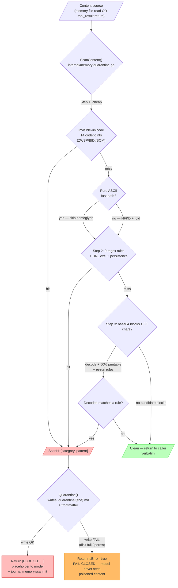

# Threat Model

Crewship's security posture rests on five layers that compose into a
defense-in-depth model. Each layer assumes the layer above it can
fail. This page is the 1-page summary; deep-dive links for each layer
are at the bottom.

## Adversary

The threat model we design against is an **agent that has been
prompt-injected, jailbroken, or is otherwise misaligned** — an
attacker has supplied input the agent treats as instructions, and we
have to assume the agent will execute that input verbatim against
whatever tools it has access to. The attacker is **not** assumed to
have compromised the host machine, the operator's terminal, or the
Crewship binary itself.

In practice this means we trust:

- The host kernel and container runtime.
- The Crewship binary and sidecar binary on disk. The `curl | sh`
  installer verifies the SHA-256 against a signed checksums file and
  — **when `cosign` is on PATH** — also verifies the Sigstore
  signature against the project's release workflow identity. Homebrew
  and Docker Compose installs rely on the upstream channel's own
  integrity; operators in regulated environments should run cosign
  verification manually. See [Install](/guides/install).
- The operator running `crewship`.

We **do not** trust:

- Anything the agent reads — system prompt, user prompt, tool output,
  fetched documents, MCP server responses.
- The agent's own output, until the scrubber has run over it.
- Network destinations the agent wants to reach.

## Layer 1 — Container isolation

Every agent runs in its own Linux container. The defaults applied in
`internal/provider/docker/docker_container.go`:

- **UID 1001** (`agent`) for the agent process; UID 1002 for the
  per-agent sidecar.
- **`CapDrop: ["ALL"]`** as the starting capability set.
- **`CapAdd: ["NET_RAW"]`** is added back so the agent can use `ping`
  and other ICMP-shaped probes inside its sandbox. This is the one
  capability that survives the drop.
- **`no-new-privileges`** security opt + **read-only root filesystem**
  + **PID limit** + **memory + CPU quotas** + tmpfs `/tmp` with a 500 MB
  cap.
- **No Docker socket bind-mounted** into the agent container. The
  agent cannot launch sibling containers, mount the host docker.sock,
  or enumerate peers.
- Mounts: the workspace directory read/write and `/output/<agent>/`
  for any persistent files; nothing else by default.
- `NetworkMode` is **instance-wide**, set from the server config
  (`p.cfg.Network`) — *not* per-agent. Operators who need per-agent
  network isolation must build it at the host network layer (e.g.
  per-crew Docker networks) rather than rely on the runtime default.

### Privileged-mode escape hatch

A crew can be flagged `Privileged: true` in its security profile —
needed for DinD or anything requiring `SYS_ADMIN`. When that flag is
set the runtime **disables** `no-new-privileges` and **drops**
`ReadonlyRootfs` because Docker rejects both under privileged mode.
`CapDrop: ALL` still applies on paper, but with `Privileged=true` the
container has full root-equivalent host access regardless. Treat a
privileged crew as **outside this threat model** — its isolation
guarantees are whatever the host runtime provides.

### Blast radius if the agent escapes

If a non-privileged agent breaks out of the container runtime it
gets the host process namespace as UID 1001, with `CapDrop: ALL +
NET_RAW` capabilities, no Docker socket, read-only root, and the
quotas above. This is the standard rootless-container failure mode;
operators are expected to layer host hardening (SELinux, AppArmor,
seccomp, kernel patching) on top.

Detail: [Container isolation](/security/container-isolation).

## Layer 2 — Sidecar credential broker

The agent never sees raw credentials. Instead:

1. **Credentials live in the host's encrypted store** (`internal/sidecar/credstore`)
   encrypted with `AES-256-GCM` using the operator's `ENCRYPTION_KEY`.
2. **A per-agent sidecar** runs alongside the agent container, also as
   a non-root user (UID 1002).
3. **The agent's outbound HTTP traffic is proxied through the sidecar.**
   When the agent calls `https://api.openai.com/...`, the sidecar:
   - Checks the destination against the per-agent **allowlist**.
   - Looks up the credential mapped to that destination.
   - Injects the `Authorization` header on the way out.
   - Forwards the response back.
4. **The sidecar's credentials are loaded once at startup over stdin**
   as a base64-encoded JSON payload. They are never written to the
   agent container's environment.

The agent therefore cannot:

- Read API keys via `printenv`, `cat /proc/1/environ`, or any other
  env-var introspection — credentials don't live in the agent's env.
- Reach an HTTP destination not in its allowlist **as long as it uses
  the `HTTP_PROXY` / `HTTPS_PROXY` env vars** that orchestrator
  injects (`http://127.0.0.1:9119`). Well-behaved Go/Python/Node HTTP
  clients honor this; clients that ignore proxy env vars (or that
  open raw sockets) can bypass it. Hard egress filtering at the
  network layer is the operator's responsibility — see
  [Container isolation](/security/container-isolation) for hardening
  options.
- Exfiltrate credentials by tricking the LLM into echoing them — the
  scrubber (Layer 3) drops anything that looks like a key in the
  agent's output before it lands in the journal or web UI.

Detail: [Credentials guide](/guides/credentials) for the operator
flow, [`internal/sidecar/`](https://github.com/crewship-ai/crewship/tree/main/internal/sidecar)
for the source.

## Layer 3 — Output scrubber

Every byte the agent produces — chat messages, journal entries, tool
input/output, status updates streamed over WebSocket — passes through
`internal/scrubber/` before it is persisted or shown to a human. The
scrubber owns **17 credential-shaped patterns** today:

<Accordion title="The 17 credential-shaped patterns">

- OpenSSH private-key blocks
- PEM-encoded private-key blocks (`-----BEGIN [RSA|EC|DSA|ED25519] PRIVATE KEY-----`)
- Anthropic keys (`sk-ant-...`)
- OpenAI keys (`sk-...`, `sk-proj-...`, `sk-svcacct-...`)
- Google service-account / API keys (`AIza...`)
- Cursor API keys (`cur_...`)
- Factory tokens (`fact_...`, `factory_...`)
- OpenRouter keys (`sk-or-...`)
- xAI keys (`xai-...`)
- Groq keys (`gsk_...`)
- GitHub PATs (`ghp_`, `gho_`, `ghs_`, `ghr_`, `github_pat_`)
- GitLab PATs (`glpat-...`)
- Slack tokens (`xoxb-`, `xoxp-`, `xoxa-`, `xoxr-`)
- AWS access keys (`AKIA...`)
- JWT bearer tokens (`Bearer eyJ...`)
- JSON `password|secret|token|api_key|apikey|secret_key` field values
- `PASSWORD|SECRET|API_KEY|...` shell-style env assignments

</Accordion>

The list grows as the maintainer encounters new shapes in the wild.

A scrub hit replaces the matched substring with a `[REDACTED:<type>]`
marker. The operator can search journal entries for the marker to
investigate which agent tried to echo what.

## Layer 4 — Keeper policy layer

Even with credentials brokered and output scrubbed, the agent can
still take legitimate-looking actions the operator wants to gate:
opening a high-risk file, hitting a paid API endpoint, calling a tool
that modifies production data.

**Keeper** is the per-workspace policy engine that evaluates each
tool call against a YAML ruleset _before_ the call is dispatched.
Rules can:

- **Allow** — the call proceeds (default for everything not matched).
- **Deny** — the call is blocked, the agent receives a structured
  error, the decision is journalled.
- **Require approval** — the call pauses, a `waitpoint` lands in
  the operator's [Inbox](/guides/inbox), and the agent resumes (or
  is denied) on the operator's choice.
- **Escalate** — the call routes to a second-opinion agent
  ("gatekeeper LLM") for a softer decision, with the final answer
  captured in the journal.

Keeper decisions are first-class journal entries (`entry_type =
keeper.decision`) and are searchable in [Recall](/guides/crew-journal),
so a postmortem can reconstruct exactly what the agent tried and
why the policy held the line.

Detail: [Keeper guide](/guides/keeper).

## Layer 5 — Memory prompt-injection scanner

Memory files are normally agent-authored, but external ingestion paths can land poisoned content: an operator manually edits CREW.md, a crew-shared file lands via PR review, a peer card from a past session gets surfaced, a future skill import pulls remote content. Any of those can carry instructions the agent treats as authoritative if no defence runs between the file and the system prompt.

`internal/memory/quarantine.go` is the scanner. It runs on every memory READ (before the content reaches `buildAgentMemoryBlock`) AND on tool-call return values (before the result lands back in the agent's context — the MINJA query-time-injection defence). A hit replaces the matched content with a `[BLOCKED]` placeholder + writes the original to `.quarantine/{sha256}.md` for operator triage.

### Flow



**Reading the flow:**

- The scanner runs in three stages from cheapest (unicode codepoint scan) to most expensive (base64 decode + re-scan). Most content fails fast at step 1 or 2; the base64 path only fires on content that LOOKS like it might be hiding an encoded payload.
- The homoglyph fold (`Cyrillic ј → Latin j`, etc.) is folded into the regex pass — it's not a separate step. Pure-ASCII content skips the NFKD normalisation entirely so the operator-typed CREW.md doesn't pay the homoglyph tax.
- Quarantine write failures **fail closed**: the model gets an `IsError=true` tool result rather than the poisoned content. A half-working scanner is worse than no scanner if it leaks on the failure path.
- Idempotency: same content → same SHA → same `.quarantine/{sha}.md` filename, overwritten in place. Reading a poisoned file twice doesn't accumulate duplicate quarantine copies.

### Rule families (current — PR-F4 v2)

<Accordion title="All rule families (unicode, regex, exfiltration, persistence, base64, homoglyph, tool-return)">

**Invisible-unicode codepoints (14)** — zero-width spaces (ZWSP, ZWNJ, ZWJ), BIDI overrides (LRM/RLM/LRE/RLE/LRO/RLO), directional isolates (LRI/RLI/FSI/PDI), and the byte-order mark. Source-file numeric literals so the rule file itself stays free of the codepoints it scans for. Cheap check; runs first.

**Prompt-injection regex (9 rules, line-anchored, case-insensitive)** — `ignore previous|all|prior instructions`, `you are now DAN|<role>`, `disregard rules|instructions|the above|system|previous`, `<!-- ignore ... -->` HTML smuggling, plus the five exfiltration / persistence patterns below.

**Exfiltration patterns** — `curl $TOKEN/...`, `cat .env | nc|curl|...`, `aws s3 cp ... .ssh/...|id_rsa`, plus the round-PR-F4 **URL exfil rules** (`https?://...?<param>=$TOKEN|API_KEY|SECRET|...` and `https?://.../$TOKEN|...`). The URL rules catch the "send to attacker.com/?data=$ENV" pattern beyond the existing curl-only rules.

**Persistence patterns** — `>> ~/.ssh/authorized_keys`, `| crontab -` from stdin.

**Base64 deobfuscation (PR-F4)** — for every base64-shaped block ≥ 60 chars in the content, attempt decode; if the decoded text matches any of the existing rules above, flag with category `base64_obfuscation` and pattern `<rule>_base64`. False-positive guard: a 50% printable-character threshold on the decoded payload, so lorem-ipsum-shaped base64 (e.g. binary blobs in test fixtures) doesn't trip the gate. JWT-shape payloads are explicitly tested as benign.

**Homoglyph fold (PR-F4)** — NFKD normalise the body, then apply a 16-codepoint Cyrillic/Greek → Latin look-alike fold (`іgnore` → `ignore`, `dіsregard` → `disregard`, etc.), and re-run the prompt-injection regex against the normalised version. Hits report `<rule>_homoglyph`. Cost: two regex passes instead of one; the fast path skips pure-ASCII content entirely so the cost only fires on suspicious input.

**Tool-return scan path (PR-F4 "scan path 1")** — the orchestrator's `emitToolResultBlock` (`internal/orchestrator/exec_mcp.go`) wraps incoming Claude `tool_result` blocks through `ScanContent` before forwarding to the agent. A hit replaces the result body with the `[BLOCKED]` placeholder + writes the original to the agent's `.quarantine/`. This is the MINJA defence: an agent that called a search tool can't have the search result inject "ignore previous instructions" into its own context.

**Per-adapter sweep (PR-F4 follow-up)** — the wire-up above covers Claude's `tool_result` shape. The Codex / Gemini / OpenCode / Factory Droid adapters parse tool results differently; each needs its own scan-site. Tracked separately so a missing adapter isn't a silent bypass.

</Accordion>

### What the scanner does NOT catch (yet)

The list is honest:

- **Cross-language homoglyph beyond Cyrillic/Greek** — Hebrew, Armenian, Mathematical Alphanumeric Symbols block. Low priority because the existing rules target English-language injection patterns and the homoglyph fold table only needs to cover what attackers can substitute for ASCII letters in the existing rule set. Extensions are additive.
- **Multi-step prompt injection** — content that's benign on its own but builds an instruction when combined with the next read. Out of scope; the scanner is single-pass per file.
- **Adversarial LLM output mimicking benign content** — content that says "PROCEED" to a downstream agent's heuristic check. That's a Layer 4 (Keeper) defence, not Layer 5.
- **Content the agent SELF-AUTHORED that's later read by another agent** — peer cards are a real attack surface here. The peer-card writer caps content to 1500 B + the GDPR cascade can purge cards, but a malicious agent writing instructions into a peer card today bypasses the inbound-only scan because peer cards are written authoritatively. Tracked as PR-F follow-up: extend ScanContent to peer-card WRITE path.
- **Inbound content above the per-tier byte cap** — caps are 4000 / 4000 / 1500 / 8000 / 30000 / 1500 / no-cap (lessons) bytes per tier. The scanner runs on whatever fits within the cap; content truncated by cap before reaching the scanner is benignly cut off.

### Quarantine response — what an operator sees

When a hit fires, the agent's tool result / file read gets the `[BLOCKED]` placeholder verbatim:

```
[BLOCKED: "prompt_injection" pattern "ignore_previous_instructions"
detected in "daily/2026-05-21.md". Original content quarantined to
.quarantine/a3f8e2c1...md for operator review. This placeholder
is a safe substitute; the poisoned content was never returned to you.]
```

The operator's view:

1. `.quarantine/{sha256}.md` lands on disk inside the agent's container — content + YAML frontmatter (category / pattern / source path / SHA) so triage tooling can route without re-running the scan
2. A journal entry fires (`entry_type = memory.scan.hit`) with the same triple
3. The agent's next tool result includes the placeholder so the model can see SOMETHING happened (it can ask the operator about it instead of looping on "why is this file empty")

Idempotent on content: the same poisoned body quarantined twice reuses the same SHA-keyed filename and overwrites in place. The inbound scan runs on every read, so without this every read of a poisoned file would accumulate duplicate quarantine copies.

### Fail-closed posture

<Note>
  Quarantine WRITE failure (disk full, container permission drop) returns `IsError=true` from the scanner — the poisoned content is NOT returned to the model. The agent sees a tool error instead. This is the right default: a half-working scanner is worse than no scanner if it lets content through on the failure path.
</Note>

## What this composition does and does not protect against

| Threat | Layer that handles it |
|---|---|
| Agent tries to read API keys from env | Layer 2 (sidecar — keys aren't there) |
| Agent tries to echo a stolen key in output | Layer 3 (scrubber redacts) |
| Agent tries to reach an arbitrary URL | Layer 2 (allowlist denies) + container network policy |
| Agent tries to call a sensitive internal API | Layer 4 (Keeper rule) |
| Agent breaks out of container runtime | Layer 1 — host hardening |
| Operator's `ENCRYPTION_KEY` is exfiltrated | **Out of scope** — host compromise |
| Crewship binary is tampered with at install | **Partially mitigated** — `curl \| sh` checks SHA-256, and cosign signature when `cosign` is on PATH; Homebrew + Docker Compose paths rely on upstream channel integrity. See [Install](/guides/install) |
| Supply-chain attack on `sentry-go` / a dep | Multi-layer — `go.sum` + `pnpm-lock.yaml` pinning; Renovate / Dependabot review; **govulncheck** (Go source call-graph analysis on `cmd/crewship`, fails only on reachable vulns); **osv-scanner** (PR #441, cross-refs both lockfiles against the full OSV.dev DB, fails on anything in the dep graph regardless of reachability — catches npm-chain issues govulncheck never sees); **CodeQL** + **Grype** (PR #445) on every PR |
| Side-channel timing leak across agents | **Not modelled** — agents are not assumed co-tenant-isolated below the container-runtime layer |

## Beta posture and known gaps

Crewship v0.1 beta is the first public beta. The threat model above
describes the **current implementation**, with these gaps:

<Warning>
  These are known, accepted gaps in the v0.1 beta. Operators with stricter requirements must layer host-level controls (network policy, capability drops, rootless runtime) on top.
</Warning>

- **Egress is `HTTP_PROXY`-style, not network-enforced.** Agents that
  bypass `HTTP_PROXY` or open raw sockets exit the allowlist
  unchecked. Operators who need hard egress control must layer Docker
  network policies (`--internal`, custom networks, egress firewall)
  on top.
- **`NET_RAW` is added back** so the agent can `ping`. Acceptable for
  the convenience trade-off, but operators with stricter requirements
  can drop it in their crew security profile.
- **Privileged crews bypass most of Layer 1.** Anything flagged
  `Privileged: true` is outside this threat model.
- **Container-runtime isolation is the host's responsibility.** The
  default Docker config is _not_ rootless, and Apple Containers /
  Colima have different threat profiles than upstream Docker.
- **Keeper rulesets ship empty.** Operators write the rules that
  matter for their environment; there is no "secure by default"
  policy yet.

## Tenant isolation on internal-auth handlers

`/api/v1/internal/*` routes authenticate via `X-Internal-Token` rather
than per-user JWTs. Tokens come in two forms:

- **Workspace-bound tokens** (`wsv1.<workspace_id>.<HMAC-SHA256(master,
  workspace_id)>`, `internal/auth/internaltoken`) are what sidecars
  receive at startup via their stdin `IPCConfig`. The middleware
  re-derives the MAC from the embedded workspace ID and the in-memory
  master secret, so a token captured inside a container only ever
  authorizes the workspace it was issued for. Derivation is stateless;
  tokens roll with the master on every boot.

  The binding is enforced as a **mandatory request scope**, not as an
  optional `?workspace_id` check (that earlier shape left a hole: a
  bound token that simply *omitted* the query fell through to unscoped
  reach). `requireInternal` now, for a bound token:
    - rejects (403) a supplied `?workspace_id` that disagrees with the
      binding; and
    - **injects** the bound workspace into `?workspace_id` when the
      caller omits it.
  Every handler that filters by `?workspace_id` (webhook secret, list
  credentials, agent/chat resolve, crew/agent create, …) is therefore
  tenant-scoped automatically — there is no "legacy unscoped"
  fall-through for bound tokens. Path-param mutations that do not read
  the query (chat message-count / title, run finalize, credential
  status) additionally constrain their `WHERE` clause by the bound
  workspace from context (foreign rows → 404, never mutated). Handlers
  scoped by a `workspace_id` carried only in the JSON body
  (issue/mission/assignment/query/escalation create, confidence report,
  cost record, journal emit, pipeline save) enforce the same binding
  in-handler via `assertInternalTokenWorkspace` (403 on a foreign
  tenant), since the auth middleware cannot inspect bodies.
- **The master token** (`CREWSHIP_INTERNAL_TOKEN`) never enters a
  container. It remains valid for host-side trusted callers (the chat
  bridge resolver, the webhook secret resolver, and the LLM proxy cost
  monitor) that dial the internal API in-process over **loopback**
  (127.0.0.1 / ::1). Because the master's bound scope is empty it
  authorizes every workspace, so a copy leaked into a crew container
  would otherwise retain full cross-tenant power. To cap that blast
  radius, `requireInternal` **pins the master to a loopback origin**: a
  master token arriving from a Docker-bridge / LAN IP (the only place a
  container-side leak could be replayed from) is refused with 403.
  Sidecars reach the API from a bridge IP and always carry a bound
  token, so they are unaffected. Operators who front crewshipd with a
  reverse proxy that rewrites `RemoteAddr` opt back into token-only with
  `CREWSHIP_INTERNAL_ALLOW_ANY=true` (the same kill-switch that relaxes
  the network gate), accepting that the token is then the sole guard.

For internal routes, the IPC layer additionally projects
`IPCConfig.workspace_id` from the orchestrator's sidecar contract
before the request leaves the container. Pre-PR-F24 that projection
was the only line of defense (the token itself was a single global
secret and `internalWsCtx` trusted whatever `?workspace_id` was
passed); the cryptographic binding now enforces it server-side.

### Resolved exception — Keeper Phase 2 family

The `/api/v1/internal/keeper/{skill-review,behavior,memory-health,
negative-learning}` handlers (PR-C / PRD §6 F4) read `body.workspace_id`
from the JSON payload alongside `ctx.workspace_id` from the middleware.
This family used to carry a documented cross-tenant gap; both halves
are now closed:

- Asymmetric forgery (caller passes workspace A in query, claims
  workspace B in body) is **rejected** by the
  `assertBodyWorkspaceMatchesCtx` helper in
  `internal/api/keeper_phase2.go`, which compares both values and
  returns 400 on mismatch.
- Symmetric forgery (caller picks one foreign workspace consistently
  across both query and body) is **closed by PR-F24**: the
  `X-Internal-Token` a sidecar holds is bound to its workspace at
  issue time, and both `internalAuth` and `internalWsCtx` validate
  that binding against `?workspace_id` (403 on mismatch).

A follow-up (`PR-F25`) eliminates `body.workspace_id` from these four
handlers and derives workspace from context only — an architectural
cleanup now that the binding holds, no longer a security gap.

Internal routes that carry `workspace_id` only in the JSON body
(`POST /internal/cost/record`, `POST /internal/journal/emit`,
`POST /internal/pipelines/save`, `POST /internal/mcp-tool-calls`, plus
the issue/mission/assignment/query/escalation create handlers and the
confidence report) enforce the same binding in-handler
(`assertInternalTokenWorkspace`, or — where the workspace is resolved
from the DB rather than the body, as in the confidence report — a
direct check against the resolved workspace), since the auth middleware
cannot inspect bodies.

The cross-crew messaging surface (`/internal/crew-messages`,
`/internal/crew-files/{crewId}`) historically authorized purely via
active `crew_connections` rows, which left a captured bound token able
to read/send messages and read/write shared files for any *foreign*
workspace's connected crews. Round 2 (R-2) closed this: when the
request authenticated with a workspace-bound token, every
caller-supplied crew ID (`from_crew_id` / `to_crew_id` / `crew_id` /
`requester_crew_id` / the path `crewId`) must resolve to the token's
bound workspace (403 otherwise; unknown crews get the same 403 so the
check is not an existence oracle). Master-token loopback callers keep
the connection-only model.

**Residuals (intended, not bypasses):**

- The binding derives its trust from the sidecar process boundary
  (UID 1002 vs. agent UID 1001). An attacker who fully compromises the
  sidecar process itself still acts with that one workspace's authority
  — the intended blast-radius cap.
- The master-token loopback pin assumes host-side trusted callers reach
  the internal API over loopback, which holds for the in-process
  callers in this codebase (`internal/chatbridge/resolver.go` dials
  `WithInternalLoopbackURL` = `127.0.0.1:<port>`; the LLM-proxy
  `TokenSyncer` / `CredentialMonitor` dial `cfg.Auth.NextjsURL`, which
  defaults to `http://localhost:<port>`). If an operator overrides
  `CREWSHIP_NEXTJS_URL` to a non-loopback host so the proxy dials the
  API across a network hop, those master-token calls will be refused
  unless `CREWSHIP_INTERNAL_ALLOW_ANY=true` is also set — a deliberate
  fail-closed posture, documented here rather than silently relaxed.

### Hardening surface — what's locked vs. what's tracked

| Surface | Status |
|---|---|
| `self_learning_enabled` cross-tenant lookup | ✅ closed asymmetric — `workspace_id` in WHERE clause |
| F4 handler body / ctx workspace consistency | ✅ closed — `assertBodyWorkspaceMatchesCtx` |
| F4 handler body / ctx workspace symmetric forgery | ✅ closed — PR-F24 workspace-bound `X-Internal-Token` (HMAC-derived, validated in middleware) |
| Bound token, no `?workspace_id` → unscoped reach (webhook secret / list credentials / agent+chat resolve) | ✅ closed — `requireInternal` injects bound workspace as mandatory scope (F-1, F-2, F-3) |
| Body-workspace internal routes (cost / journal / pipeline save / issue / mission / assignment / query / escalation / confidence) | ✅ closed — in-handler `assertInternalTokenWorkspace` binding check (F-4) |
| Path-param mutations cross-tenant (chat count/title, run finalize, credential status) | ✅ closed — `WHERE workspace_id = <bound>` from context (F-5) |
| Leaked master token replayed from a container | ✅ mitigated — master accepted only from a loopback origin (F-6); residual capped to the host trust boundary |
| MCP tool-call audit writer (`POST /internal/mcp-tool-calls`) body workspace | ✅ closed — in-handler `assertInternalTokenWorkspace` (R-1) |
| Cross-crew messaging / shared files (`/internal/crew-messages`, `/internal/crew-files`) connection-only auth | ✅ closed — caller-supplied crew IDs must resolve to the token's bound workspace (R-2) |
| F4 handler body-workspace drop | ⏳ PR-F25 (eliminate body workspace param — cleanup, no longer a security gap) |
| Lessons memory tier agent-author write | ✅ closed — dispatcher rejects `tier="lessons"` |
| Memory file injection scan (READ path) | ✅ — 9 rules + 14 unicode codepoints |
| Memory scanner v2 (base64 / homoglyph / URL exfil) | ✅ shipped — PR-F4 |
| Memory scanner — tool-result path | ✅ partial — Claude `tool_result` wired; per-adapter sweep is PR-F4 follow-up |
| GDPR cascade (Art. 17) | ✅ shipped — migration v107 + `DELETE /api/v1/admin/users/{id}/data` |
| GDPR export (Art. 15) | ✅ shipped — `GET /api/v1/admin/users/{id}/data` |

## Reporting issues

Security issues go to
[github.com/crewship-ai/crewship/security/advisories/new](https://github.com/crewship-ai/crewship/security/advisories/new)
(private disclosure). For ambiguous reports, the regular issue
tracker with the `security` label is also fine — the maintainer
triages both.

## Related

- [Container isolation](/security/container-isolation)
- [Encryption](/security/encryption)
- [RBAC](/security/rbac)
- [Audit logging](/security/audit)
- [Credentials guide](/guides/credentials)
- [Keeper guide](/guides/keeper)
- [Telemetry](/guides/telemetry) — what crash-reporting does and does not send.
