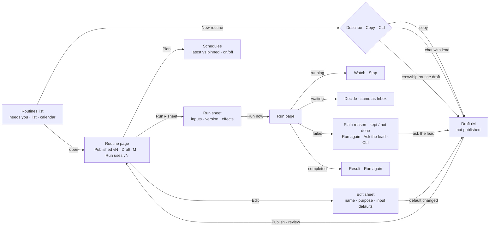

# Routines jako operátorská konzole — návrh UX, 15. září 2026

Stav k 15. 9. 2026: implementováno v otevřeném PR [#2562](https://github.com/crewship-ai/crewship/pull/2562)
a nasazeno a technicky ověřeno na DEV1. Nezávislé review a lidská přejímka zůstávají otevřené.
Aktuální opravy a důkazy shrnuje [závěrečný report](../prd/reports/routines-operator-recovery-2026-09-15.md).
Následující diagnóza a prototyp zachycují původní návrh; implementační dodatky popisují jeho vývoj. Navazuje na [ROUTINES-CLIENT-EXPERIENCE-PRD-2026-09-08](../prd/ROUTINES-CLIENT-EXPERIENCE-PRD-2026-09-08.md),
[ROUTINES-CLARITY-PRD-2026-09-15](../prd/ROUTINES-CLARITY-PRD-2026-09-15.md)
a [validační report z 15. 9.](../prd/reports/routines-clarity-validation-2026-09-15.md).

Prototyp: [`public/design/routines-operator-console-20260915.html`](../../public/design/routines-operator-console-20260915.html)
(otevřít lokálně v prohlížeči; desktop i přepínač „Phone 390 px“; každé simulované
chování je označené v horní liště). Snímky současného stavu z dev1 jsou v
[`assets/routines-diagnosis-2026-09-15/`](assets/routines-diagnosis-2026-09-15/).

## Co bylo ověřeno před návrhem

- Větev `feat/routines-clarity-release-1` = PR [#2556](https://github.com/crewship-ai/crewship/pull/2556),
  4 commity nad `main`, `MERGEABLE`, stav `BEHIND` (main se mezitím posunul).
  CI: Frontend, Frontend Test, Go Lint, Playwright, CodeQL, CodeRabbit zelené;
  Go/Go Race/Go Shuffle v okamžiku kontroly bez výsledku (běžely).
- dev1 běží `168d1f813` (build 2026-09-15T10:00Z, `dirty=false`), tj. větev bez
  posledního doc-only commitu `1cefe1001`; `/api/health` ok. Dnes ráno jsem na
  dev1/2/3 nasadil `bfa28fd87` (main); dev1 byl poté jinou relací přepnut na tuto
  větev, což odpovídá validačnímu reportu.
- Pracovní kopie v `crewship_1` je na této větvi; 16 netrackovaných souborů z dřívějška
  je zachováno, nic z nich se v tomto návrhu nemění.
- Prošel jsem `components/features/routines/` (61 souborů, 16,8 k řádků),
  `lib/routine-inputs.ts`, `lib/routine-behavior.ts`, `lib/routine-run-presentation.ts`,
  `internal/pipeline/behavior.go` a živé UI na dev1 v 1440 px i 390 px
  (přihlášený seed účet, vlastní běhy nad lokálními acceptance rutinami
  `work-order-*`, bez externích účinků).

## 0. Změna zadání a moje doporučení

Během práce zaznělo: frontend má lidem hlavně umožnit rutiny **spouštět a rozumět
jim**; **vytvářet** se budou přes CLI (později MCP), případně popisem („Describe
it“) a forkem; „Write it yourself“ ve webu nedává smysl, protože web nedokáže
nahrát pomocné skripty, Go skripty ani chování agentů.

Souhlasím, a řekl bych to ještě ostřeji:

1. **Editor je nejdražší a nejméně přesvědčivá část Routines.** `routine-create-dialog.tsx`
   má 2 194 řádků, čtyři pracovní plochy, přepínač Code, panel kroku Edit/Test,
   review publikace, draft CAS, ochranu historie prohlížeče (V2/V3 z 14. 9. stály
   tři kola oprav). A přesto nikdy nedokáže to, co rutina potřebuje: skript,
   tool, chování agenta, testovací data. Kdo umí tohle, umí i YAML v editoru a
   `crewship routine draft`. Kdo to neumí, potřebuje popis, ne formulář.
2. **Nechal bych ve webu tři věci, které nejsou autorování:** název a účel
   (dnes „Rename & description“), *výchozí hodnoty a popisky vstupů* (builder
   existuje) a plán. Změna defaultu vstupu je změna definice → vznikne draft →
   publikace. Tím zůstane jeden model verzí pro web i CLI.
3. **Publish zůstává ve webu.** Je to řídicí akce (kdo, kdy, co se změní, koho
   se to dotkne), ne autorování; manažer ji chce udělat z telefonu. Draft
   uložený z CLI se ve webu ukáže jako „Draft r2 · CLI · před 12 min“ s tlačítkem
   *Publish*. To také řeší otázku „je moje první rutina jen uložená, nebo už
   publikovaná?“ jednou větou v hlavičce.
4. **Nová rutina = Describe it (doporučeno) · Copy existing · Build it with the
   CLI.** Třetí dlaždice není mrtvá funkce ani lež: ukáže čtyři příkazy a řekne,
   že draft se objeví tady. „Describe it“ musí skončit odkazem na *draft*, nikdy
   živou rutinou.
5. **Oprava problému se přesune ze „Edit recipe“ na „Ask the lead to fix it“.**
   Z neúspěšného běhu se otevře chat s připnutým run ID a krokem; výsledkem je
   draft. Pro netechnického uživatele je to lepší cesta než editor a pro
   technického existuje CLI. To je jediné místo, kde návrh potřebuje novou
   schopnost agenta (chat s kontextem běhu) — viz §5.

Dvě doplnění ze stejné diskuse, která návrh respektuje:

- **Zachovat dnešní designový jazyk Routines.** Explorer s kbelíky stavu,
  sub-bar `Routines · N routines · M runs` s Import / New routine, karty
  detailu (`components/ui/detail`) a hlavně **vyskakovací okna uprostřed**
  (`CreateSurface` / `Dialog`) — New routine, Run, Publish i Edit zůstávají
  popupy, ne boční panely. Na telefonu popup zabírá celou obrazovku (tak to
  dělá `CreateSurface` už dnes). Prototyp to tak kreslí.
- **Ukázat soubory, které rutina spouští.** Klient má vidět, že rutina
  „Post to the ledger“ spouští `scripts/ledger-post.go`, s ikonou Go, co ten
  soubor dělá a který krok ho používá. Podklady existují: krok `script` má
  `path` pod `/crew/shared` a interpret podle přípony
  (`internal/pipeline/types.go:540`), soubory se nahrávají přes
  `crewship crew files save <crew> shared/scripts/x.py --file …` a
  `routine export` je balí (`cmd_routine_extra.go`), ikona podle přípony je
  v `getChatFileIcon` (`components/features/chat/chat-tree-row.tsx:57`).
  Chybí jen projekce na rutině — viz §5.

- **Sidebar (explorer) zůstává beze změny** — funguje dobře; prototyp ho jen
  přebírá včetně kbelíků stavu.
- **Styl Issues je vzor pro sjednocení frontendu.** Konkrétně: ikonové
  property-čipy (Backlog · No priority · Assignee · Project …) jako řádek
  vlastností v dialozích, dialog *New issue* (velký titulek, popis, čipy,
  patička `⌘↵ to create · Esc to cancel`, Cancel + primární tlačítko) jako
  předloha pro *Describe it*, hlavička detailu (název · meta · řádek pillů
  s ikonami) a filtrační čipy s počty (`All 31 · Backlog 5 · Todo 7`) pro
  kalendář. Prototyp to používá; v produkci jde o stejné komponenty
  (`CreateSurface`, `Pill`, `EntityChip`, lucide ikony).
- **Kalendář zůstává v Routines a je třeba ho dotáhnout na hustotu.** Dnes je
  měsíční buňka `max-h-52 overflow-y-auto` se všemi událostmi jako
  trojřádkovými odkazy (`routine-calendar.tsx:277`): den s 50 starty je
  208 px vysoký scrollovací box bez počtu a bez seskupení — zbytek prostě
  není vidět. Návrh v §3.

- **Co z dnešního UI zůstává beze změny, protože funguje:** karta *Last run*
  s podbarvenou hlavičkou podle výsledku (`LastRunCard`, červená/zelená),
  avatary agentů u kroků (`AgentAvatar` ve `routine-step-spine`), jednoduchá
  History, výběr ikony a barvy přímo z hlavičky (`CrewIconPopover`, 345 ikon,
  ukládá se hned přes `/appearance`, ne jako draft) a účel rutiny v Edit.
  Prototyp je všechny přebírá.

Riziko, které je třeba říct nahlas: pokud editor zmizí, přijde o web-cestu
`Versions → Use as draft → upravit → publikovat`. V návrhu zůstává jako
„Restore as draft“ (vytvoří draft z historické verze, bez editace) — což je
i dnes jediný případ, kdy je bezpečná.

Návrh níže je tedy **operátorská konzole**: seznam → rutina → spuštění → běh
(sledování, rozhodnutí, problém) → plán → publikace draftu. Autorování kroků je
mimo web.

## 1. Diagnóza: pět největších problémů dnešního UI

Konkrétní příklady jsou z dev1 (`168d1f813`), 15. 9. 2026.

| # | Problém | Konkrétní příklad |
|---|---|---|
| 1 | **Stav verze není nikde řečen jednou větou.** Uživatel nepozná, zda existuje draft, co spustí příští Run a zda je nová rutina publikovaná. | Hlavička: `Current recipe · v1`. Editor: `Unsaved draft · Save draft does not change live work` i hned po otevření beze změny; po uložení `Saved draft · Publish updates the live recipe`. Versions: `Version 1 · Current`. Běh: `recipe v2 ↗`. Plán: „New starts keep the published recipe version selected when scheduled“. Pět míst, pět slov (current / live / saved / published / head), žádné neříká „draft existuje, Run použije v2“. New routine ukazuje drafty jako `oponent-probe-0912 · r2` (slug + revize). |
| 2 | **Akce jsou roztroušené a nejednotné.** | Detail: `Edit` · `Run` · `Cancel` (trvale viditelný, skoro vždy disabled) · `⋯` s další položkou *Edit definition*; na mapě ještě `Edit recipe`. Běh: `Stop run` vs. detail `Cancel` — dvě slova pro totéž. Editor: `Publish` je vždy primární, i když je vše *Unchanged*; `Save draft` je malé tlačítko v samostatném pruhu vedle checkboxu *Approve capability changes for this publication*; `Test` v liště není vůbec — jen textový odkaz *Edit / Test* v panelu kroku. `New routine → Write it yourself` otevírá editor jako modal, `Edit` jako stránku (`presentation="page"` jen pro existující rutinu). |
| 3 | **Editor je jeden dlouhý dokument smíšených starostí.** | Identity → Purpose → Inputs (builder + „Preview the start form“) → Recipe steps → *Team, results and technical identity* → *Access, budget and technical details* → *Publication changes*. Na 390 px panel kroku nahradí seznam kroků a patička zabírá tři řádky (Save draft / checkbox / Cancel / Publish). Krok se edituje přes „Data source → Provided information → Message · string“ a pole „Transformation: `.`“ — jq výraz jako UI pole. |
| 4 | **Běh mluví jazykem enginu a opakuje se.** | Neúspěch: titulek *This run could not finish*, pod ním surová chyba `transform step "intentional_failure" input is not JSON and expression "error(\"…\")" requires JSON` — a totéž ještě jednou v řádku kroku. Následují tři odstavce (*Before repeating work…*, *If the recipe caused the problem…*), *No final result or saved files*, *Time and attempts*, teprve pak kroky. Explorer u čekajícího běhu tiká `awaiting approval · 6.41s`. Na 390 px je vysvětlení ve sloupci širokém ~180 px vedle ikony. Chybí vrstva „co se stalo lidsky, co je zachované, co nebylo provedeno“. |
| 5b | **Kalendář nezvládá hustotu.** | Měsíční buňka vykreslí každou událost jako tři řádky (čas, název, stav) v boxu `max-h-52 overflow-y-auto`; 50 naplánovaných startů = 208 px rolování uvnitř buňky, žádné „+47“, žádné seskupení podle rutiny, žádný souhrn dne. Filtr je jeden `<select>` (All / Planned starts / …) bez počtů. Rok ukazuje dvě ikonky a `+N`. |
| 5 | **Seznam a Plán neodpovídají na „co potřebuje mě / co bude dál“.** | KPI řádek `24 routines · 0 running · 15 failed last time · — next planned start` a vpravo znovu `24 routines`; každý řádek má pill *Failed* i text *Could not finish · 8d ago* a `Open →`; na mobilu 5řádková karta. Plán obsahuje Repeating schedules, One-time starts, Advanced execution settings, Webhooks, Automations, Access and budget — jen dvě z toho jsou plán. Nový plán má název předvyplněný slugem `work-order-inputs-mtvp2jz6 schedule`; použitá verze je jen ve větě prózy. Run dialog neříká, kterou verzi spustí; blok *What this run can do* opakuje kartu *Before you run*. |

Co naopak funguje a návrh zachovává: explorer se stavovými kbelíky; jeden
společný seznam kroků pro recept i běh (`routine-step-spine`); rozlišení
Stopped / Failed / Result failed / Waiting (`routine-run-presentation.ts`);
typované vstupy s chybami u polí a *Restore default* (#2556); rozhodnutí
sdílené s Inboxem; připnutí verze u jednorázových startů; review publikace
s výčtem změn; `DescribeBehavior` na serveru jako zdroj pravdy pro pravidla.

## 2. Uživatelský postup

## 3. Doporučené uspořádání obrazovek a akcí

### Slovník (UI anglicky)

| Pojem | Význam | Nahrazuje |
|---|---|---|
| **Routine** | věc v seznamu | recipe, pipeline, definition |
| **Published v3** | verze, kterou používá Run a plány „latest“ | current, live, head |
| **Draft r2 · CLI / Describe it / web** | rozpracovaná změna, nikdo ji nespouští | unsaved/saved draft, revision |
| **Run** | jedno provedení; má *vlastní* verzi | invocation, execution, trace |
| **Stop** | zastavení běhu (jedno slovo všude) | Cancel + Stop run |
| **Waiting for a person / Could not finish / Completed / Stopped** | čtyři stavy běhu pro lidi | waiting, failed, Result failed, cancelled, interrupted (technické stavy zůstávají v Technical details) |

Nepřidává se žádný nový pojem; „recipe“ zůstává jen v technických detailech.

### Obrazovky

1. **Routines** — explorer beze změny (plus sekce *Needs you*). Hlavní sloupec:
   tři dlaždice *Waiting for your decision · Could not finish last time · Next
   planned start* (klik otevře konkrétní běh/plán, ne obecný detail), pak
   seznam: název + účel, *Runs how*, *Last run* (jeden stav + čas), šipka.
   Draft je vidět v řádku (*Draft* / *Draft r2*). Prázdný stav vysvětlí, co
   rutina je, a nabídne tři cesty + kopii ukázky. Záložky Routines · Calendar ·
   Recent runs zůstávají.
1b. **Calendar** — stejné pohledy Day · 3 days · Week · Month · Year, ‹ Today ›,
   a místo `<select>` filtrační čipy s počty ve stylu Issues (*All 96 ·
   Planned 67 · Ran 29 · Waiting 1 · Failed 4*). Pravidla hustoty:
   - **≤ 3 položky v dni** → řádky `● 08:00 [ikona] Název` (modrý čas =
     plánováno, barva tečky = jak běh dopadl).
   - **> 3 položky** → **jeden řádek na rutinu** s počtem a rozsahem časů:
     `[CT] Classify support ticket ×38 · 08:00–17:15`, u proběhlých navíc
     `✓12 ✕1 ?1`; nejvýše 3 rutiny, pak `+N more routines`; dole tenký
     proužek hustoty a souhrn `41 planned · 2 ran · 1 failed`. Buňka má
     pevnou výšku, uvnitř se neroluje.
   - **Klik na den** otevře **denní agendu** (ne jen hodinovou mřížku): vpředu
     *Needs you*, pak skupiny podle rutiny — `Classify support ticket ×38 ·
     planned · 08:00–17:15 · every 15 min · one-time starts · pinned v2 · with:
     batch = …` s *Open routine* a *Show all 38* (rozbalí časy jako čipy);
     rutiny s 1–2 položkami jako běžné řádky s pillem *Planned / Completed /
     Could not finish / Waiting*. *+ Schedule a start* v hlavičce dne.
   - Hodinové pohledy (Day / 3 days / Week) drží mřížku, ale v hodině s více
     starty jedné rutiny je jeden čip `×4` místo čtyř řádků; rok má na dni
     značku hustoty místo dvou ikonek.
   - Na telefonu měsíc ukáže jen ikonu + `×N` na řádek, agenda zůstává plná.
   Přesun kalendáře do levého navigačního sidebaru zatím ne — nechal bych ho
   v Routines, dokud by tam nebylo co dalšího zobrazit (issues s termínem,
   soukromé položky).
2. **Routine page** — hlavička: ikona, název, **stavová věta**
   `Published v3 · Draft r2 · CLI · 12 min ago · Run uses v3`, účel; akce
   `▶ Run` (primární) · `Publish draft r2` (jen když draft je) · `Edit` · `⋯`.
   Pod hlavičkou banner živého běhu (*Decide* / *Watch*). Záložky Overview ·
   History · Versions · Plan (beze změny počtu).
   - *Overview*: karta **In one look** se šesti odpověďmi (What you get · What
     you provide · Who does the work · What is checked · When it needs you ·
     What it can touch) — vše odvozené z existujících dat (`inputs`,
     `DescribeBehavior`, `routineEffects`, manifest). Pak **How it works** —
     kroky s rolí (Agent / Checker / A person / Script / Notification),
     vykonavatelem, nástroji a rozbalitelnými detaily (*Produces, Rules,
     Effect, On a problem, File, Change it → CLI*); u kroku je čip souboru
     s ikonou jazyka (`ledger-post.go`). Pak karta **Files this routine
     runs** jako **strom** pod `/crew/shared/` (stejná kresba jako Files
     panel agenta: složky rozbalitelné, ikona podle přípony z
     `getChatFileIcon`, velikost vpravo), u souboru *který krok ho používá* a
     **Missing on the share**, když ho krok deklaruje a na svazku není.
     **Klik na soubor vysune zprava náhled kódu** do poloviny karty (jen ke
     čtení: cesta, počet znaků, *Open in Files ↗*, ✕) — znovu použít
     `FilePreview` a `CrewFilesScope` z `components/features/chat/files/`,
     jazyk pro zvýraznění z `getEditorLanguage`. Ukládání zatím ne. Složka
     s mnoha skripty (8 kontrol jedné služby) se ukazuje jako složka s
     počtem. Pak Last run + Plan v jedné řadě. Technical details sbaleno
     (slug, hash, přístup, rozpočet, webhooky).
   - **Složitá rutina zůstává čitelná** — ověřeno na modelu skutečné
     *Docs drift audit* z dev1 (10 kroků, 9 `needs`, script + 5 transformací +
     agent + notify + two `page.write` Crewship steps, guardrails, cost cap,
     concurrency), doplněné o `foreach`, checker a hooky. Pravidla, všechna
     odvozená z DSL, nic se nevymýšlí:
     1. **Fáze ze závislostí.** `needs` dává každému kroku úroveň
        (1 + max úroveň závislostí); seznam je členěný *First · Then · 5 in
        parallel*. Bez `needs` zůstává prosté číslování 1…n.
     2. **Pomocné transformace se skládají.** ≥ 3 po sobě jdoucí `transform`
        se stejnými `needs` a bez `if` = jeden řádek *5 data preparations from
        Scan* s rozbalením. (Docs drift audit má právě takových 5.)
     3. **`foreach` je vnořený blok** s počtem, paralelismem a odsazenými
        vnitřními kroky; v běhu se položky a pokusy počítají pod rodičem.
     4. **Hooky kolem běhu** (`before_all`, `after_all`, `on_failure`, krokové
        `before/after`) jako ztlumené řádky *Before the run / If the run fails*.
     5. **Čipy místo prózy:** `if` → *◐ Only when …*; `needs` → *after Scan* s
        názvy, ne ID; `validation`/`outcomes` → *✓ 3 rules · Vale*;
        `retry`/`on_fail` → *3 attempts*; `timeout_seconds` → *⏱ 10 min*;
        `script.path`/soubory → čip souboru; `agent_slug` → avatar.
     6. **Nejvýš 9 řádků, pak *Show all 17 rows***; v běhu jsou selhaný,
        čekající a aktuální krok vidět vždy (dnešní `importantIds`). Map
        zůstává jako druhý pohled na tytéž řádky.
     7. **Velké rutiny (> 12 kroků; ověřeno na 101 krocích = 8 služeb × 12
        kontrol):** výchozí pohled je **Map** — jeden sloupec na fázi, uzel
        s `×N` zastupuje N kroků jedné skupiny (skupina = společný prefix
        názvu / `foreach` / stejné `needs`), klik na uzel otevře tu fázi v
        seznamu. Seznam sbalí fázi s > 6 kroky do jednoho řádku *Then · 96
        steps in parallel · Script ×64 · Call a service ×32 · 8 groups*; po
        rozbalení ukáže skupiny (*Billing · 12 steps*) a teprve v nich
        jednotlivé kroky. Přepínač List/Map zůstává vždy; prahy 12 a 6 jsou
        návrh k ověření s lidmi.
     8. **Vše anglicky.** UI texty, názvy fází, čipy i chyby; česky mluví jen
        agenti podle nastavení workspace (`slash.label_cs` zůstává pro
        palety, ne pro chrome).
   - *History*: seznam běhů se stavem, verzí, dobou, u neúspěchu název kroku.
   - *Versions*: draft nahoře (Review and publish / Discard), pak verze s
     *Published · Run uses this*; *Restore as draft* místo rollbacku, který
     obcházel bránu (oponentura 12. 9.).
   - *Plan*: Repeating a One-time odděleně, u každého **Uses: latest published
     (now v3)** nebo **Pinned to v2**, vypínač, uložené odpovědi. Webhooky,
     automatizace a pravidla souběhu jsou v *Other ways this starts* (sbaleno).
3. **Run** (vyskakovací okno uprostřed jako dnes, na telefonu celá obrazovka):
   titulek *Run Invoice intake*, podtitulek **Uses v3 — the unpublished draft
   r2 is not used**; pole s nápovědou jen kde není zjevná; souhrn chyb nahoře +
   chyba u pole + fokus; *Changed from the recipe default (1500) · Restore
   default*; věta **This run will:** (odvozená z kroků + hodnot); patička
   `Cancel` · `▶ Run now`; text *nothing has started*.
4. **Run page** — hlavička s identitou rutiny, stavovým pillem, verzí
   (`recipe v2 (v3 is published now)`), dobou; akce podle stavu (viz matice).
   Pak **jeden** banner: Waiting → *Finance needs to decide* + proč + *Nothing
   has been posted yet*; Failed → *Stopped at step 2, „Check the extraction“*,
   lidský důvod, **Kept / Not done**; Completed → výsledek a co bylo/nebylo
   provedeno. U neúspěchu karta **What to do next** se třemi větvemi (špatný
   vstup → run again; přísné pravidlo → ask the lead / CLI; opakuje se →
   History). Pak kroky s tím, co se skutečně stalo (extrahované hodnoty,
   pravidla ✓/✕ s čísly, pokusy a modely, u agenta stručný log nástrojů).
   U skriptového kroku: *Ran `ledger-post.go` with `go run` · exit 0 · 1.2 s ·
   stdout ↗*. Vstupy běhu a technické detaily (run id, hash, cena, surová
   chyba, všechny pokusy, activity) sbaleno.
5. **Publish** (popup) — *Publish draft r2 as v4*: co se mění proti v3 (Inputs /
   Steps / People / Effects / Access), co bylo zkontrolováno (a že to není
   test run), **After publishing** (Run + schedule „latest“ přejdou na v4,
   připnutý start zůstává v2, čekající běh zůstává v3, v3 lze obnovit);
   `Discard draft` · `Not now` · `Publish v4`.
6. **Edit** (popup) — přesně to, co DSL (`internal/pipeline/types.go`) nechá
   změnit bez souborů, v pěti záložkách (čipy jako v Issues):
   - *Identity*: ikona + barva (`/appearance`, hned), název (`display_name`),
     účel (`description`) — hned, nemění chování.
   - *Inputs*: `InputSpec` — label, hint (`description`), default, required,
     choices (`options`, `allow_custom`), meze (`min`/`max`); technické `name`
     a `type` zůstávají (kroky se na ně odkazují). Změna = draft.
   - *Agent prompts*: `prompt` každého `agent_run` kroku (i uvnitř `foreach`)
     jako textové pole se jménem agenta, nástroji a checkerem; placeholdery
     `{{ inputs.x }}` zůstávají. Změna = draft. Agent sám, nástroje a skills
     se mění v CLI. (Ponecháno ve webu podle rozhodnutí 15. 9.)
   - *Limits* — **zatím nástřel**, není rozhodnuto, co z toho patří do webu:
     `max_cost_usd`, `concurrency_key`/`max_concurrent` (jako *Unlimited /
     One at a time*), `execution_tier` preferred → fallback,
     `guardrails.input.prompt_injection.action` (*Block / Clean / Log*),
     `estimated_cost_usd` a `estimated_duration_seconds` jako odhady. Draft.
   - *Slash command*: `slash.enabled`, `label`. Draft.
   - *Steps & files*: jen ke čtení — kroky, checks, hooky, skripty a prompty
     agentů se mění CLI / leadem; seznam souborů a odkaz *Show me how*.
   Patička říká, co se stane: *Identity applies at once; definition changes
   become a draft rN, published vN keeps running*.
7. **New routine** (popup, jako dnes) — *Describe it* (doporučeno), *Copy an
   existing routine* (draft s novým názvem), *Build it with the CLI* (příkazy
   včetně `crew files save` pro skripty). *Continue a draft* ukazuje názvy,
   ne slugy. **Describe it** má rozvržení *New issue*: velký titulek „Routine
   name“, popis „What should happen, for whom, and when? …“, odkaz na šablonu
   briefu, řádek čipů (Crew · Schedule · Inputs · Needs approval · Labels),
   patička `⌘↵ to create · Esc to cancel` a *Create draft with the lead*;
   teprve pak pokračuje chat s leadem a končí odkazem *Open the draft*.

### Tlačítka

| Tlačítko | Kde | Kdy je dostupné | Co udělá | Co uživatel uvidí | Chyba / neuložené změny |
|---|---|---|---|---|---|
| **New routine** | horní lišta, prázdný stav | vždy (role CREATE) | otevře panel se třemi cestami | Describe → chat → *Open the draft*; Copy → draft; CLI → příkazy | nic nevzniká, dokud lead/CLI neuloží draft; zavření bez otázky |
| **Edit** | hlavička rutiny | MANAGER+ | otevře Edit sheet (název, účel, defaulty vstupů) | Save → toast; změna defaultu → *Saved as draft r3 · publish to make it live*, hlavička ukáže draft | Cancel s neuloženou změnou → „Discard changes?“; kroky jsou read-only s odkazem na CLI |
| **Save draft** | Edit sheet (jen když se mění definice), CLI | vždy | uloží revizi draftu; nic nespouští, nic neplánuje | stavová věta `Draft rN · web/CLI · just now`, Publish draft v hlavičce | konflikt revizí (409) → „Someone saved r3 meanwhile — open it / keep mine as r4“; obě strany zůstanou |
| **Test** | *není samostatné tlačítko ve webu*; Publish sheet ukazuje výsledek statické kontroly | — | kontrola parsování, referencí, kompatibility presetů (existující `test_run`) | v Publish sheetu *Checked …* + věta, že neběžel žádný agent | chyba → Publish disabled, konkrétní pole/krok; testy kroků se vzorky zůstávají v CLI (`fixture-test`, `step-run`) |
| **Publish** | hlavička (jen s draftem), Versions | MANAGER+ a existuje draft | otevře review; potvrzení vytvoří vN+1 | toast *Published v4 · Run and the weekday schedule now use it*; hlavička bez draftu | neplatný preset plánu → odmítnuto s odkazem na plán (existuje); nic se nespouští |
| **Run** | hlavička rutiny; *Run again* na běhu | publikovaná verze existuje, rutina není disabled | otevře Run sheet s verzí a vstupy | po *Run now* přechod na stránku běhu, kroky se plní | neplatné pole → chyba u pole + souhrn + fokus, nic nestartuje; 422 (chybí credential/integrace) → věta a odkaz; draft se nikdy nespouští |
| **Stop** | stránka běhu (running/waiting), banner živého běhu | běh aktivní, MANAGER+ | potvrzení → cancel | pill *Stopped*, věta *what already happened is not undone*, zachované výsledky | po skončení: *Could not stop — it already finished* |
| **Approve / Reject** | stránka běhu (waiting), Inbox | oprávněný rozhodovatel | odešle jediný verdikt | pill Completed/Stopped, řádek *Approved by you* | druhý verdikt → 409 „already decided in Inbox by …“ |

## 4. Prototyp

`public/design/routines-operator-console-20260915.html` — jeden HTML soubor bez
knihoven, světlé i tmavé téma podle `app/globals.css`, Open Sans, sub-bar,
explorer s kbelíky stavu a vyskakovací okna jako v aplikaci. Přepínač
*Phone 390 px* přepne rozvržení přes container query (explorer jako drawer,
akce přes celou šířku, okna přes celou obrazovku). Umožňuje:

- vytvořit nový draft přes New routine (Describe it — skriptovaná odpověď leada
  s odkazem na draft; Copy an existing routine; Build it with the CLI),
- otevřít rutinu přes Edit a změnit výchozí hodnotu vstupu → vznikne draft,
- projít publikací draftu uloženého „z CLI“ (review, After publishing, Publish v4),
- vyplnit Run sheet včetně neplatných hodnot (limit 9000, relativní cesta),
- zobrazit běh živý (kroky postupují), čekající na člověka (Approve/Reject),
  neúspěšný (lidský důvod, Kept / Not done, What to do next) i dokončený,
- upravit nebo vypnout plán (latest vs pinned, vypínač, odstranit jednorázový start),
- přečíst, které soubory rutina spouští (Go, Python, TypeScript, YAML) a který
  krok je používá, včetně chybějícího souboru na sdíleném svazku,
- projít kalendář (září 2026, dnes 15.): filtrační čipy, den s 39 naplánovanými
  starty seskupený podle rutiny, denní agenda s *Show all 38*.

Simulace je označená v horní liště pro každou obrazovku. Změna kroků není v
prototypu záměrně — podle §0 patří do CLI / Describe it.

## 5. Současné chování → navržené chování

| Současné chování | Navržené chování | Důvod | Technická změna |
|---|---|---|---|
| Verze: `Current recipe · v1`, `live recipe`, `Saved recipe`, `recipe v2 ↗` | Jedna stavová věta v hlavičce: `Published v3 · Draft r2 · CLI · 12 min ago · Run uses v3`; v seznamu pill *Draft* | úloha „je jen uložená, nebo publikovaná?“ a „co spustí Run?“ | **API**: list + detail rutiny vrátí `draft: {revision, updated_at, author, via}` (drafts store existuje: `GET …/pipelines/drafts`, `…/{slug}/draft`; dnes se list a draft skládají ve frontendu jen v New routine). Aditivní pole, bez migrace. |
| Cancel (detail) / Stop run (běh) | *Stop* všude; na detailu jen v banneru živého běhu | jedno slovo, tlačítko jen když má smysl | frontend |
| Publish vždy primární, Save draft v pruhu s checkboxem *Approve capability changes* | Publish jen když existuje draft; capability approval je otázka uvnitř review (a jen když se capability mění) | priorita hlavní akce; technický pojem mimo hlavní cestu | frontend (`publication.ApproveRisk` zůstává v payloadu) |
| Editor kroků ve webu (Recipe/Code, panel Edit/Test) | Edit dialog v pěti záložkách: Identity (hned) · Inputs · Limits · Slash command (draft) · Steps & files (jen čtení + CLI); drafty vznikají z CLI / leada / Edit dialogu | §0 — web nedokáže nést skripty a chování agentů; jeden model verzí; každé pole odpovídá existujícímu poli DSL | frontend: nahradit `RoutineCreateDialog` (2 194 ř.) Edit dialogem (~400 ř.; `RoutineInputFormBuilder` a `CrewIconPopover` zůstávají) a New dialogem; **zachovat** endpointy save/draft/test_run pro CLI; smazání nic z API neodstraňuje |
| Seznam kroků složité rutiny: 10 plochých řádků, *Depends on: scan, scan_state, …* jako ID, 5 transformací jako 5 plných řádků | Fáze z `needs`, složené pomocné transformace, vnořený `foreach`, hooky kolem běhu, čipy pro `if`/`needs`/checks/retry/timeout, limit 9 řádků + *Show all* | Docs drift audit má 10 kroků a 9 závislostí a dnes je to jedna dlouhá zeď; návrh neinventuje pořadí, jen zobrazuje deklarované | frontend (`routine-step-spine.tsx`: `levelsOf(needs)`, fold pravidlo, nested foreach; `describeStep` už dává názvy). Žádné API. Pro `foreach` v běhu zůstává dnešní počítání položek pod rodičem |
| New: Describe / Fork / Write it yourself (modal editor) | Describe (draft z chatu, odkaz *Open the draft*) / Copy / Build it with the CLI | pravdivé cesty; žádná falešná funkce | **Agent**: Describe it musí vracet slug draftu (PRD §5.4 to vyžaduje; ověřit, že lead ukládá přes `POST …/pipelines/drafts`, ne `save`) |
| Neúspěch: surová `error_message` jako titulek, dvakrát | Banner: *Stopped at step N „název“* + lidský důvod + **Kept / Not done**; surová chyba v Technical details | úloha „najdi příčinu a další krok“ | **API**: projekce `failure: {step_id, step_name, kind, summary, kept: [step ids with outputs], not_done: [step ids]}` na běhu; `kind` z klasifikace známých tříd (checker rejected po N tierech, transform input not JSON, timeout, cancelled, missing credential, HTTP status). `summary` je šablona podle `kind` s dosazenými čísly — **ne** generovaný text modelem. `kept/not_done` z execution záznamů, které už jsou. |
| „If the recipe caused the problem, review it in Edit recipe“ | *Ask the lead to fix it* (chat s připnutým run ID a krokem → draft) a *Build it with the CLI* | oprava bez editoru; výsledek je vždy draft | **Agent/Chat**: vstup do chatu s kontextem `run_id + step_id` (dnes existuje jen `handleDescribe` bez kontextu); lead ukládá draft |
| Kroky v běhu: stav + „Recorded response“ | Krok ukazuje, co se stalo lidsky: extrahované hodnoty, pravidla ✓/✕ s hodnotami, pokusy a modely, u agenta log nástrojů (`pdf-read`, `ocr`) | „co to provolává, jak se agenti chovají, jaké nástroje mají“ | **API**: `executions` doplnit `tools_used: []` a `tier`/`model` per attempt (journal to má — `sub_spans`/tool events; jde o projekci); checker verdikt per kritérium (`outcomes` grader dnes vrací verdict + feedback — potřeba per-criterion výsledek, pokud ho grader neposkytuje, ukázat jen celkový) |
| Run dialog bez verze, blok *What this run can do* | Run dialog s *Uses v3 — draft r2 is not used*, věta *This run will…*, souhrn chyb + fokus | úloha „vyplň vstupy a pochop důsledky“ | frontend; verze z detailu; efekty z `routineEffects` |
| Soubory rutiny nejsou vidět; krok `script` ukáže jen `path` v Technical details | Karta *Files this routine runs* (ikona jazyka, cesta, co dělá, který krok, velikost, poslední změna, *Missing on the share*) + čip souboru u kroku + v běhu *Ran … · exit 0* | „ať klienti vidí, co to vlastně spouští“ | **API**: detail rutiny vrátí `files: [{path, language, interpreter, step_ids, description, size, updated_at, present}]` — cesty z `steps[].script.path` (+ soubory, na které se odkazují argumenty/env), existence a velikost přes proxy_files autorské crew (stejná cesta jako `routine export --scripts`), `description` z hlavičkového komentáře souboru (první řádky `//`, `#`, `/** */`) nebo z metadat draftu. **CLI**: `routine draft`/`save` volitelně nahraje soubory vedle definice (`--with-files`), aby draft r2 a jeho skript vznikly najednou; `crew files save` zůstává. **FE**: znovu použít `getChatFileIcon`. |
| Plán: 6 sekcí, název plánu ze slugu, verze v próze | Repeating / One-time s **Uses latest (now v3)** / **Pinned to v2** a vypínačem; ostatní pod *Other ways this starts* | úloha „nastav/vypni plán a poznej použitou verzi“ | **API**: schedule list vrátí `effective_version` (odvozeno: `target_pipeline_version ?? head`) — aditivní; název plánu generovat z popisu („Weekdays at 08:00“), ne ze slugu (frontend) |
| Seznam: KPI řádek s `—`, pill + text stavu, `Open →` | *Needs you* dlaždice (klik na konkrétní běh), jeden stav na řádek, šipka | priorita „co potřebuje mě“ | frontend (`useActiveRoutineRuns`, schedules už jsou načtené) |
| Kalendář: každá událost = 3 řádky, buňka `max-h-52 overflow-y-auto`, filtr `<select>` | Buňka s pevnou výškou: ≤ 3 položky jako řádky, jinak jeden řádek na rutinu s `×N`, rozsahem časů a `✓/✕/?` počty, `+N more routines`, proužek hustoty a souhrn dne; klik = denní agenda seskupená podle rutiny; filtrační čipy s počty | 50 startů v jednom dni musí být čitelných na první pohled | frontend (`routine-calendar.tsx`: `byDay` už existuje; přidat `groupBy(slug)` a agendu). **API**: kalendářní endpoint dnes vrací jednotlivé události — pro měsíc s tisíci starty přidat parametr `?summary=day` vracející `{day, planned, ran, failed, waiting, by_routine:[{slug, count, first, last}]}`, jednotlivé položky až po otevření dne |
| Explorer tiká `awaiting approval · 6.41s` | *Waiting for your decision · 4 min ago* | šum | frontend (`routines-explorer.tsx`, `useTick`) |
| Versions: rollback / re-enable obchází bránu (oponentura 12. 9.) | *Restore as draft* → publikace přes review | jedna cesta ke změně živé verze | **API**: rollback ponechat pro CLI, ve webu nepoužívat; nebo rollback přes stejnou publikační bránu (samostatný issue) |
| Editor modal (New) vs. stránka (Edit) | vše jsou vyskakovací okna (`CreateSurface`/`Dialog`) / celá obrazovka na telefonu | konzistence s aplikací, mobil | frontend |

Nic z výše uvedeného nevyžaduje DB migraci; všechna API rozšíření jsou
aditivní pole na existujících odpovědích. Odstranění editoru z webu nemění
kontrakt CLI, manifestů ani AI autorování.

## 6. Implementační plán

Seřazeno podle hodnoty ÷ náročnosti. Každý krok je samostatný PR s vlastním
ověřením; žádný nevyžaduje předchozí kromě vyznačených závislostí.

| # | Krok | Hodnota | Náročnost | Ověření |
|---|---|---|---|---|
| 1 | **Stavová věta verze** v hlavičce + pill Draft v seznamu/exploreru; `draft` v list/detail API | vysoká (obě autorské úlohy z §7) | S (Go: 1 dotaz do drafts + pole; FE: hlavička, řádek) | Go test list/detail s draftem i bez; Vitest hlavičky; browser: uložit draft CLI → věta se změní bez reloadu (WS `pipeline.draft.*` existuje?) — pokud ne, refresh po fokusu |
| 2 | **Stop** místo Cancel, banner živého běhu, *Needs you* dlaždice, explorer bez tikání | střední | S | Vitest; Playwright PR subset (existující `routines-*` spec rozšířit) |
| 3 | **Run sheet** (verze, *This run will*, souhrn chyb) místo dialogu | vysoká (úloha „změnit vstup a spustit“) | M | přenést `e2e/routines-clarity.mjs` na sheet; 1440 + 390; klávesnice: fokus na první chybu, Esc zavře bez startu |
| 4 | **Failure projekce** `failure{kind, summary, kept, not_done}` + banner + What to do next; surová chyba do Technical details | vysoká (úloha „najít chybu“) | M (Go: klasifikace 6 tříd + testy; FE: banner) | table-driven Go test na každou třídu incl. neznámou (fallback = surová zpráva, nikdy prázdno); browser nad `work-order-failure` |
| 5 | **Plan**: Uses latest / Pinned, vypínač, název z popisu, ostatní sbaleno; `effective_version` | střední (úloha „změnit plán“) | S–M | Go test schedule list; browser: vytvořit, vypnout, připnout, publikovat → věta u „latest“ se změní, u pinned ne |
| 5a | **Kalendář — hustota**: seskupení po rutině v měsíční buňce, souhrn dne, denní agenda, filtrační čipy; `?summary=day` na API | vysoká (dnes 50 startů = neviditelné) | M (FE 1–2 dny; Go: agregace nad existujícím dotazem) | Vitest: buňka s 1, 3, 4 a 50 událostmi (řádky vs. skupiny, `+N`), agenda *Show all*; browser na dev1 s 50 jednorázovými starty přes API (a jejich úklid) v 1440 i 390 px; Go test agregace |
| 5b | **Files this routine runs**: `files` projekce na detailu + karta + čip u kroku + řádek v běhu; CLI `--with-files` | vysoká („co to vlastně spouští“) | M (Go: sběr cest + stat přes proxy_files + hlavičkový komentář; FE: karta s `getChatFileIcon`) | Go test: rutina se 2 skripty, jeden chybí → `present=false`; browser na dev1 nad rutinou se `script` krokem; CLI acceptance: `routine draft --with-files` → soubor na share + karta |
| 6 | **Publish sheet** z draftu (bez editoru): review + After publishing + Discard | vysoká | M (review komponenta existuje, `routinePublicationChanges`) | browser: draft z CLI → Publish ve webu → `versions` má vN+1, čekající běh zůstal na vN (existující regresní test snapshotu) |
| 6b | **Seznam kroků pro složité rutiny**: fáze z `needs`, fold transformací, vnořený foreach, hooky, čipy; **velké rutiny**: Map výchozí nad 12 kroků, sbalené fáze a skupiny v seznamu | vysoká pro reálné rutiny (Docs drift audit, CI triage) i budoucí stovky kroků | M (`routine-step-spine.tsx` + `routine-definition-canvas` pro seskupené uzly) | Vitest: rutina bez `needs` (číslování), Docs drift audit (fáze 1/5/1/2/1, fold 5), foreach s 2 vnořenými, hooky, 101 kroků (fáze 1/2/96/1/1, 8 skupin); browser na dev1 nad `docs-drift-audit` a fixture 100 kroků v 1440 i 390 px |
| 5c | **Strom souborů s náhledem**: `files[]` projekce + strom + `FilePreview` vpravo (jen čtení) | vysoká („ať klienti vidí, co to vlastně spouští“) | M (FE: znovupoužití Files panelu; Go: `files[]` z §5) | Vitest: strom ze 4 cest ve 3 složkách, chybějící soubor, otevření/zavření náhledu; browser na dev1 nad `docs-drift-audit` (`scripts/docs_audit.sh` skutečně na share crew) |
| 7 | **Edit dialog** (Identity · Inputs · Limits · Slash · Steps & files) a **New dialog** (Describe / Copy / CLI); odstranit `RoutineCreateDialog` z webu | vysoká (−2 000 řádků, −3 CI-citlivé testovací sady) | L (hlavně mazání + 2 nové dialogy; builder vstupů a icon picker zůstávají) | Vitest obou dialogů; smoke, že `routine draft/save` z CLI funguje beze změny; Playwright: Describe → draft → Publish; Edit → změna defaultu → draft rN → Publish → v(N+1) |
| 8 | **Kroky běhu s nástroji a tiery** (`tools_used`, `model` per attempt, per-criterion verdikt kde existuje) | střední–vysoká („jak se agenti chovají“) | M–L (závisí na tom, co journal skutečně ukládá — inventura první) | Go test projekce; browser nad rutinou s agentem na dev1 (placený model — jen jednou, po dohodě) |
| 9 | **Ask the lead to fix it** (chat s kontextem běhu → draft) | střední | M (agent + chat vstup) | end-to-end na dev1 se skutečným leadem; kritérium: výsledek je draft, ne save |
| 10 | Restore as draft místo rollbacku ve webu | nízká–střední | S | existující testy rollbacku; nový test, že web už rollback nevolá |

Kroky 1–3 se dají udělat v jednom týdnu a už samy zvednou úlohy 2, 6 a 7 z §7.
Krok 7 je jediný, který něco ubírá; doporučuji ho až po 6 (aby Publish měl kam
jít) a s explicitním souhlasem, protože mění strategii produktu.

## 7. Jak poznáme, že je to lepší

Úlohy z původní přejímky (cíl: 4 z 5 reprezentativních uživatelů bez nápovědy),
plus dvě autorské:

| Úloha | Co uživatel udělá | Kde to prototyp ukazuje |
|---|---|---|
| 1 Vysvětlit recept | vlastními slovy řekne, co dostane, co dodá, kdo pracuje, co se kontroluje, kdy bude potřeba | Routine page → In one look, How it works |
| 2 Změnit vstup a spustit | změní limit, uvidí chybu u 9000, opraví, spustí, ve History najde odeslanou hodnotu | Run sheet → Run page → Inputs used |
| 3 Najít chybu | řekne, ve kterém kroku a proč, co je zachované a co neproběhlo | Run · problem |
| 4 Vyřešit rozhodnutí | rozhodne z Routines, pozná, že je to totéž jako v Inboxu | Run · live / decision |
| 5 Změnit plán | vypne/zapne, změní čas, řekne, jakou verzi plán použije | Plan → Edit |
| 6 **Vytvořit první rutinu a poznat, zda je jen uložená, nebo publikovaná** | Describe it → Open the draft → přečte *Not published · Run uses nothing yet* → Publish | New routine → Contract renewal check → Publish sheet |
| 7 **Upravit existující rutinu a určit, jakou verzi spustí další Run** | Edit → změní default → *Saved as draft r3* → přečte *Run uses v3* → publikuje → *Run uses v4* | Edit sheet → hlavička → Publish sheet |

Protokol: 5 lidí mimo tým, každý všech 7 úloh na prototypu (desktop) a úlohy
3–5 znovu na telefonu; zapisovat první kliknutí, dokončení bez nápovědy a
citace, kde se zastavili. Teprve po tomto kole přepisovat produkční UI.

## 8. Hranice, které návrh dodržuje

- Test není Run: web nemá samostatný Test; statická kontrola je součást
  publikace a říká, že nespustila agenty, skripty ani služby.
- Nový běh není pokračování: *Run again* je vždy nový běh s viditelnou verzí.
- Stop nevrací účinky: banner i potvrzení to říkají; *Kept / Not done* je
  odvozeno ze záznamů, ne odhad.
- Formát cesty ≠ existence souboru: nápověda u pole to říká.
- Nakonfigurovaná kontrola ≠ prošlá kontrola: v Overview „4 rules … required“,
  v běhu ✓/✕ per pravidlo jen tam, kde grader per-criterion výsledek dává;
  jinak jen celkový verdikt (viz krok 8).
- Engine nevynucuje strukturální kontroly u ne-agentních živých kroků:
  Overview zobrazí text z `DescribeBehavior` beze změny.
- Částečná historie: seznamy zůstávají stránkované; *Time and attempts* jen
  z načtených dat (beze změny z #2556).
- `max_iterations` = strop tierů, ne smyčka: texty „at most 2 more times“
  jsou odvozené ze stejného pole.
- Profily autonomie, obecné breakpointy/resume a autorizované file/credential
  pickery v návrhu nejsou; cesta zůstává textové pole s lexikální kontrolou.
- Seznam souborů říká, co recept deklaruje a zda soubor na svazku je; není to
  důkaz, že kód dělá to, co popis tvrdí, ani že má potřebná oprávnění.

## 9. Co bylo nakonec implementováno jinak (PR #2562, 15. 9. 2026)

Po průchodu s vlastníkem se od návrhu výše liší:

- **Overview není seznam ani dlaždice, ale dashboard** postavený z komponent
  `/dashboard` (`AttentionStrip`, `OutcomeKpis`, `RunVolumeChart`, `UpNext`,
  `DashboardCard`): lišta „Needs your attention“ (rozhodnutí · neúspěchy ·
  další start · drafty), KPI za 7 dní, *Latest results* vlevo, *Routines
  running now* + *Up next* + *Drafts to publish* vpravo, graf **výsledků po
  dnech** (completed / could not finish / stopped / still going) přes celou
  šířku. Katalog rutin je jen v exploreru; záložka *Recent runs* zmizela —
  běhy jsou v Activity (lens *Routines*), odkaz je v liště záložek.
- **Kalendář**: měsíční buňka ukazuje dvě nejdřívější položky dne a `+N
  later`; klik na buňku otevře denní pohled (hodinovou mřížku). Seskupená
  agenda zůstala dostupná z ročního pohledu a z čipu v hodinové mřížce.
  Buňky se přizpůsobují šířce mřížky (container query), ne oknu.
- **Explorer**: jeden řádek na rutinu (bez popisu), živý běh jako čip
  *Running / Waiting* vpravo, bez stopek.
- **Files**: náhled je editor z Files panelu agenta (CodeMirror, jen čtení);
  stav souboru je trojí — present / missing / unverified.
- **Copy** vytváří draft, ne živou rutinu; slug jen s draftem se otevře jako
  stránka rutiny s *Publish draft r1*.
- **Edit** ukládá proti revizi, na které byl otevřen (CAS), a má záložku
  *Agent prompts*; *Limits* jsou označené jako nástřel.
